# Changelog

All notable changes to Farworks are recorded here.

The format follows [Keep a Changelog](https://keepachangelog.com/en/1.1.0/) and the project uses
[Semantic Versioning](https://semver.org/) as described in [README.md](README.md#versioning).

---

## [1.63.0] - 2026-09-09

**Rivets, and the first machine in this game that can hold two materials at once.**

Reinforced Plate spent one release being made of iron plate and nothing else, and that was honest
about the constraint rather than good: a plate made of plates is a plate. It took exactly what an
Airframe Panel takes, at the same bench, for the same four seconds — two recipes with the same
input, the same time and the same machine are one recipe wearing two hats.

So the second ingredient is back and it is the right one. A **rivet** is what plate is actually
joined with; it comes off the rod line rather than the plate line, so the recipe pulls on both
halves of the iron chain instead of one; and a machine makes four at a time from a single rod, so
the eight a plate needs are a belt rather than a chore. Reinforced Plate is three plates and eight
rivets, which is four iron bars — exactly what it has cost all along.

Rivets stack five hundred to a box, because a rivet is not a thing anybody counts. It is the first
item here whose unit is *a supply of* rather than *one*, and the stack size is where that gets said.

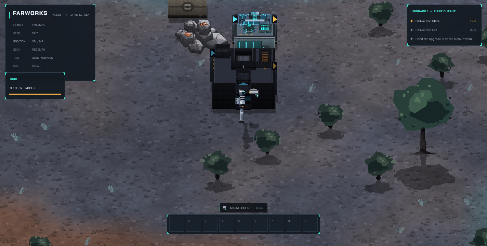

**The Assembler.** Two inputs meant no machine could run the recipe — a machine had one input box,
and that rule at the top of the recipe list is why every recipe a machine could run named exactly
one material. This is the machine that lifts it, and it is a whole building rather than a flag
because that is what the second box is worth: everything a base can make out of two things at once.

Three by three, two hoppers, one press, ninety kilowatts. Its inlets are on the west and the south
and its outfeed on the east — three ports on three sides, because two lines that come from different
places should arrive from different places. Both hoppers on one flank would be a knot at every
assembler on the base.

**A belt does not choose a box and neither do you.** The recipe already says which ingredient is
which, so the item says where it goes: hand an assembler an iron plate and it lands in the plate
box, hand it a rivet and it lands in the rivet box, hand it copper ore and it is refused. That is
the whole of the sorting rule and there is deliberately nothing else to it.

**And the station can still do it by hand**, from the moment the recipe arrives. That ordering is
the point rather than a gap: a patient player can hand-press every plate the Steam Plant needs
before the Assembler exists, and the Assembler is the thing that stops them having to — which is
what every machine in this game has always been.

### Added

- `ItemId.Rivet` and the `rivet` recipe: one rod into four, at the Main Station or a crafter.
- `StructureKind.Assembler`, `Workbench.Assembler`, and `BuildingDef.InputBoxes`.
- **Two Things At Once**, the fourth task of The Works: sixty rivets, thirty plate and twenty
  concrete, and it hands back enough to stand one up. It asks for the thing the task before it
  unlocked, which is the shortest way to teach what a rivet is.
- The `crafter` scene stands an assembler up, loads both boxes, steps the world and asserts what
  it consumed: three plate for every eight rivets, which is the recipe. It also asserts a one-box
  crafter is *not* offered a two-material recipe, because a machine that could never satisfy one
  would sit at `LOAD IRON PLATE` for ever.

### Changed

- `Machine` holds as many boxes as its building has, checks every one of them, consumes every one
  of them, and names the box that is actually at fault — "load iron plate" while the plate box is
  full and the rivet box is empty sends the player to the wrong belt.
- Taking a machine apart hands back every box. With one box that was always the same thing; with
  two it would have quietly binned half of what was inside.
- `BuildingSave.Input2`, absent from older saves and empty in them, which is correct: nothing in
  them had a second box.

### Fixed

- The `burner` scene asserted that cutting a bush raised the *planet's* count of tiles owed a
  plant by one. The planet is putting bushes back the whole time, so in a run where an earlier
  scene had built over some greenery, one coming back during the same settle cancelled the cut out
  and the check failed for a reason that had nothing to do with cutting. It asks about the tile,
  which was always the claim.

## [1.62.0] - 2026-09-09

**Reinforced Plate no longer burns coal to exist, and a machine can finally make it.** Two faults,
and they were the same fault.

Coal is fuel. Its whole identity is a thing you burn, whose worth is a number of kilojoules and
whose point is that it comes out of the ground where a drill can stand on it. Spending it as a
crafting material made it compete with itself: every lump in a plate is a lump not in a boiler,
which is not an interesting tension — it is a tax on the one job coal already has.

And naming three inputs meant **no machine could run the recipe**. A machine has one input box, so a
three-part recipe is a recipe only a pair of hands can make. That put twenty hand-pressed plates in
front of the Steam Plant, inside the milestone whose entire subject is a base that works while you
are somewhere else. The coal is what forced the third input, so removing it fixes both.

It is four iron plates now, and a Simple Crafter can run it. Four rather than three because three
is what an Airframe Panel takes, at the same bench for the same four seconds — two recipes with the
same input, the same time and the same machine are one recipe wearing two hats, and a flight coupon
and a structural plate should not be the same press. Four is also exactly the iron the old recipe
cost, so the plant is no cheaper for having lost its coal: twenty-four plates for the task and
twenty for the machine is a hundred and seventy-six iron plate, or three hundred and fifty-two ore.

**Coal is now purely fuel.** Nothing in the game consumes it as a material, which is the cleaner
statement and the one its whole design was written around.

### Changed

- `reinforced-plate` is `4 × Iron Plate → 1`, offered by the Main Station and the Crafter.
- The `milestones` scene checks a crafter can actually run it. The recipe existing was never the
  claim worth making; the claim is that the plant is not twenty hand-pressed plates away.
- `Factory > Recipes` counts what a material is *built into*, not only what it is cooked into. It
  said "Feeds: nothing yet" about reinforced plate while twenty of them stood up a Steam Plant.

## [1.61.0] - 2026-09-09

A window that draws every recipe in the game with the icons on — and the bug it found within a
minute of existing.

**You could build four power poles, ever.** A pole costs two rods and one cable; the objective set
that unlocks poles hands over four poles' worth of both, so the grid goes up, spreads out and works
exactly as intended. **The recipe for cable was never handed out by anything.** Not by an objective
set, not by a milestone, and not from the start — it sat in the recipe list, available, marked as
craftable at the Main Station and the Crafter, and unreachable for the whole run.

So the fifth pole is the one that cannot be built, an hour past the screen that would have explained
why, in front of a build menu offering a building made of a material the game never taught you to
make. The set that unlocks poles hands out the cable recipe now — it is the set whose whole subject
is the cable, and whose hand-in prompt is *"deliver the wire the grid will be strung with"*.

Nothing caught it because nothing could. The capture pass builds poles by adding their cost straight
to the pack, which is the right thing for a scene about grids and exactly what hides this.

**`Factory > Recipes`** draws the lot: what goes in, what comes out, and the real icons of both,
grouped by the machine that makes them, searchable, with craft times. Beside each line it answers
the two questions a recipe list cannot answer about itself — **where it is unlocked**, walked out of
the objective sets and the milestone tasks, and **what its output goes on to feed**, which is how
you tell whether a material is earning its place in the game at all.

And it checks three things, one of which was already false:

- a recipe that is available and that nothing ever unlocks — the cable;
- a recipe offered by no bench, so nothing can make it;
- a recipe wanting an input that nothing makes, no ore drops and no bush gives.

`Copy as text` puts the lot on the clipboard, and
`-executeMethod Factory.EditorTools.RecipeWindow.DumpFromCommandLine` runs the same checks with no
screen at all.

### Added

- `Factory > Recipes`, and `RecipeWindow.DumpFromCommandLine` beside it.

### Fixed

- The `grid` objective set hands out the cable recipe. Without it a run had exactly four power
  poles in it and no way to make a fifth.

## [1.61.0] - 2026-09-09

A window that draws every recipe in the game with the icons on — and the bug it found within a
minute of existing.

**You could build four power poles, ever.** A pole costs two rods and one cable; the objective set
that unlocks poles hands over four poles' worth of both, so the grid goes up, spreads out and works
exactly as intended. **The recipe for cable was never handed out by anything.** Not by an objective
set, not by a milestone, and not from the start — it sat in the recipe list, available, marked as
craftable at the Main Station and the Crafter, and unreachable for the whole run.

So the fifth pole is the one that cannot be built, an hour past the screen that would have explained
why, in front of a build menu offering a building made of a material the game never taught you to
make. The set that unlocks poles hands out the cable recipe now — it is the set whose whole subject
is the cable, and whose hand-in prompt is *"deliver the wire the grid will be strung with"*.

Nothing caught it because nothing could. The capture pass builds poles by adding their cost straight
to the pack, which is the right thing for a scene about grids and exactly what hides this.

**`Factory > Recipes`** draws the lot: what goes in, what comes out, and the real icons of both,
grouped by the machine that makes them, searchable, with craft times. Beside each line it answers
the two questions a recipe list cannot answer about itself — **where it is unlocked**, walked out of
the objective sets and the milestone tasks, and **what its output goes on to feed**, which is how
you tell whether a material is earning its place in the game at all.

And it checks three things, one of which was already false:

- a recipe that is available and that nothing ever unlocks — the cable;
- a recipe offered by no bench, so nothing can make it;
- a recipe wanting an input that nothing makes, no ore drops and no bush gives.

`Copy as text` puts the lot on the clipboard, and
`-executeMethod Factory.EditorTools.RecipeWindow.DumpFromCommandLine` runs the same checks with no
screen at all.

### Added

- `Factory > Recipes`, and `RecipeWindow.DumpFromCommandLine` beside it.

### Fixed

- The `grid` objective set hands out the cable recipe. Without it a run had exactly four power
  poles in it and no way to make a fifth.

## [1.60.0] - 2026-09-09

Coal is worth less, the shell of a base is earned later, and there is a window that draws the whole
progression and tells you when it is broken.

**A lump of coal was five leaves. It is two.** Five was too much of a good thing: one lump ran a
burner for twenty-five seconds and a full box for the better part of an hour and a half, which made
the fuel line something a base solved once and then stopped thinking about. A pocketful covered
anything a player was likely to build, and the belt that was supposed to bring coal in was a
convenience rather than a supply line.

At twenty-four hundred kilojoules a lump is ten seconds of a burner and six of a steam plant running
flat out. A row of five plants at their rating burns most of a coal drill's whole output, arriving
steadily, on a belt. That is the shape a fuel line is meant to have.

The step over a leaf is deliberately modest now, because it was never the point. Both stack to two
hundred, so a box of coal is two boxes of leaves and no more. What a lump actually buys is that a
drill can stand on the seam and a belt can bring it in; a leaf will always be a walk to a bush.
Nothing about the early game moves — a leaf is worth what it always was and the burner runs at what
it always did.

**Building Blocks and Upstairs move to The Works.** The first milestone was called Shelter and four
of its six tasks were about building one; the shell of a base is now something the second milestone
opens, and the first is about not doing everything by hand. It is called **Footing**: somewhere to
put things, a deeper pack, a fire that runs while you are elsewhere, and the three parts that gate
what comes next.

**The two recipes those tasks were carrying stayed behind**, and that is the whole of the care this
needed. Airframe Panel came with the blocks and Signal Loom with the roof — and the task that asks
for all three is in the first milestone. Moving them as they were would have put two thirds of a
gate on the far side of itself: a run nobody could finish. They are paid out by the store task and
the fire task now, so the rule the gate rests on is untouched — each of the three by a different
task of the same milestone.

Task ids are unchanged, so a save in progress keeps everything it had finished. `shelter-blocks` is
still called that wherever it lives.

**And a window to see it in.** `Factory > Milestones` draws the whole ladder — every task, what it
asks for, and every building, recipe, ore, ability, hand-out and cargo slot it pays back — and then
checks it. The checks are the point rather than the list: the near-miss above is one line in its
Problems pane, and it was written by re-introducing that mistake and watching it appear.

It asks whether anything is wanted before it can be had — a part whose recipe is unlocked later, an
item whose ore has not come up, leaves before foraging — whether two tasks grant the same thing, and
whether the words a task shows the player still match what it hands over. `Copy as text` puts the
lot on the clipboard, and `-executeMethod Factory.EditorTools.MilestoneWindow.DumpFromCommandLine`
runs the same checks with no screen at all.

### Changed

- `ItemId.Coal` is 2400 kJ, down from 6000.
- The first milestone is `Footing`; The Works opens with Building Blocks and Upstairs.
- `shelter-stores` pays out Airframe Panel and `shelter-fire` pays out Signal Loom.
- The `milestones` scene takes the block task wherever it now lives, and runs after `stores` — the
  order is load-bearing, because reaching the block task finishes the milestone the store task is
  in and a task cannot be handed in twice.
- The `milestones` scene asserts the step from leaves by the lump rather than by the box. Coal and
  leaves stack to the same two hundred, so the box had nothing of its own to say.

### Fixed

- `savewrite` put its storage box three tiles east of the player and hoped. That scene rolls a
  random seed, so three tiles east is a rock or a river often enough to matter — and when it was,
  the box never went down, the writing scene said nothing, and the failure surfaced in the *next
  process* as a save that had come back without its store. It looks for clear ground now, and says
  so on the spot if it cannot find any. A check that reports somebody else's problem is worse than
  no check.

## [1.59.0] - 2026-09-09

The Steam Plant. Coal in one side, water in the other, and only as much power out as is being taken.

**It follows the load, and that is the whole machine.** The fire is handed the kilowatts its grid
actually has to do with — what the machines on it are asking for, plus room in any store — and makes
the smaller of that and its rating. Fuel goes at the pace of what it makes, so an idle base costs a
trickle of coal and a busy one costs the lot.

The burner in the same position makes its full two hundred and forty and throws the difference away.
That waste was written into it deliberately, from the day it landed, as the argument for building
this — and the argument is now measurable: with nothing on its grid but a pump asking for thirty
kilowatts, the plant makes thirty. Put a flat cell beside it and the same plant goes to its rating,
because **a store with room is load without a ceiling**: a generator that only followed the machines
would leave every accumulator on the base flat, which is the opposite of what one is for.

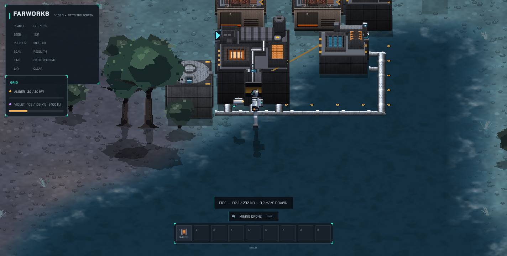

**Four hundred kilowatts, which is not quite two burners, and the smallness is the decision.** A
plant is a block of power rather than an answer to it. It was rated at nine hundred first, where one
of them carried five machine chains — and at that rating the entire system it costs was a formality
after the first one. The lake, the run, the coal belt: all paid for once and then never thought
about again.

At four hundred a base of any size wants a **row** of them, and a row wants coal arriving on a belt
and enough water to keep every one of them wet. **The grid follows the factory:** build another
block of machines and you are short again, and being short is a thing you fix by laying something
out on the map rather than by clicking a bigger building.

What the plant buys over a burner was never the rating anyway. It is that it burns what is used, and
that the coal comes out of the ground where a drill can stand on it.

**One pump keeps three plants wet**, so twelve hundred kilowatts is one lake frontage. The fourth
plant needs a second pump, which means a second stretch of shore and a second run in from it.

**And coal has to be found.** Seams are thinned to under half the sites the sweep would otherwise
lay down, because what a power station costs has to include finding the fuel for it. Seed 1337 went
from fifty-one seams to seventeen, on a map seven hundred tiles across: that is a survey rather than
a stroll.

The thinning **removes** sites and never moves one — the roll is taken after everything that decides
where a site would be, so the survivors are a subset of the tiles this sweep has always produced. A
seam is either still where it was or gone, which is the one thing a world generator must not do to a
save. Iron is untouched, at seventy-seven deposits on that seed exactly as before.

Water gains about a hundred tiles out of half a million, because it refuses ground within two tiles
of a deposit and there are fewer deposits to refuse around. None of it is anywhere a base is likely
to be: seams near the landing site were already excluded from it.

It is worth being straight about which end of the coal binds. Once a drill is standing on a seam the
quantity is not the constraint — one drill outruns a yard full of plants. What is scarce is a seam
near enough to belt from, and that is on purpose: this is a question about the map, not about the
arithmetic.

**Water is a second kind of thing going into a building**, and it is drawn as one. `PortKind.Fluid`
is a new kind rather than a flag on the two that existed, because it is a different substance moving
by different rules: an item arrives on a belt, one at a time, aimed at a tile; water arrives through
a tube that only has to touch. So a fluid port is not drawn like an item port — a square throat with
an arrow in it is a hopper, and a round flange with a bore and water standing in it is an inlet. A
belt aimed at a water inlet and a pipe aimed at a hopper are the two mistakes that drawing exists to
prevent.

The plant's two lines arrive on two different sides on purpose. Coal comes in at the west on the top
row, cut exactly as every machine in the game is, so a plant takes a belt of coal off the same lane
a smelter takes its ore from. Water comes up from the south, because it comes from somewhere else
entirely and a pipe and a conveyor arguing over the same tiles would be a base nobody could lay out.

**And the socket is where the pipe goes.** Water goes into a *vessel* anywhere — a pipe and a tank
are all surface — and into a *machine* only at its inlet, which is the rule ore has always followed
into a smelter's hopper. The pump got an outlet in the same pass, so a run leaves it where the
rising main is drawn, and the rotate key is how you point that at the shore you are running to.

It costs the player nothing, and that is the only reason it is allowed to be strict: the run tool
aims its ends at exactly these tiles, the way a belt's tail snaps to a hopper.

**Without water it stops** and says `NO WATER`, which is deliberately not the same word as an empty
fuel box: both halt the machine and they send you to opposite ends of the base. It is asked after
whether anything wanted the power at all, because a fire with nothing to power is banked rather than
dry — being out of water is only a fault when somebody wanted the power.

### Added

- **A Proper Power Station**, the third task of The Works: twenty-four reinforced plate, forty iron
  plate and forty concrete. It is the first thing in the game that has ever needed reinforced plate,
  which is what the coal task switched on and what the coal task was for.
- `PortKind.Fluid`, `BuildingDef.Fluids` and `Building.PlumbedAt` — the socket, and the rule that
  both halves of a joint have to agree to it.
- `BuildingDef.Throttles`, `MachineStatus.Dry` and `OreDef.Scarcity`.
- The `fluids` scene now raises steam: that it follows the load, that a flat cell brings it to
  rating, that its inlet is binding, and that cutting the water halts it with its coal untouched.

### Changed

- `Burner.Tick` takes kilowatts rather than a yes or a no, and `Burner.Output` is what it made
  rather than what it is rated for. A boiler with a governor and a firebox with none are the same
  class with one flag between them — a second class would have hidden that.
- A machine's screen shows what its plumbing is holding beside what its grid is getting.
- The interact prompt asks whether there is anything to open rather than whether the building is
  plumbed, so the plant offers its screen instead of its water level.

### Fixed

- The capture pass named the thing it had just put down by asking for the first of its kind on the
  planet, which in a run where an earlier scene had already built one was a different building
  forty tiles away on another grid. It reported, correctly, that the pump had not come onto that
  fire's grid. Four places did it; all four now ask what is standing on the tile they built on.

## [1.58.0] - 2026-09-09

Pipes are drawn as runs, there is something to keep water in, and a length of pipe finally looks
like a length of pipe.

**Two clicks, the same as a belt.** Picking a pipe out of the build menu now starts the run tool:
click where it begins, click where it ends, and the ghost shows the L it would lay with the price
under it before anything is committed to. The turn key flips which way round the L goes, the tail
snaps onto the hull of a pump or a tank, and the whole thing goes down as one act — one price, one
flight of material out to it, one notice.

That was the piece of the last release that was worse than it should be. Laying a run a tile at a
time is fine for a wall and absurd for something you lay thirty of between two machines.

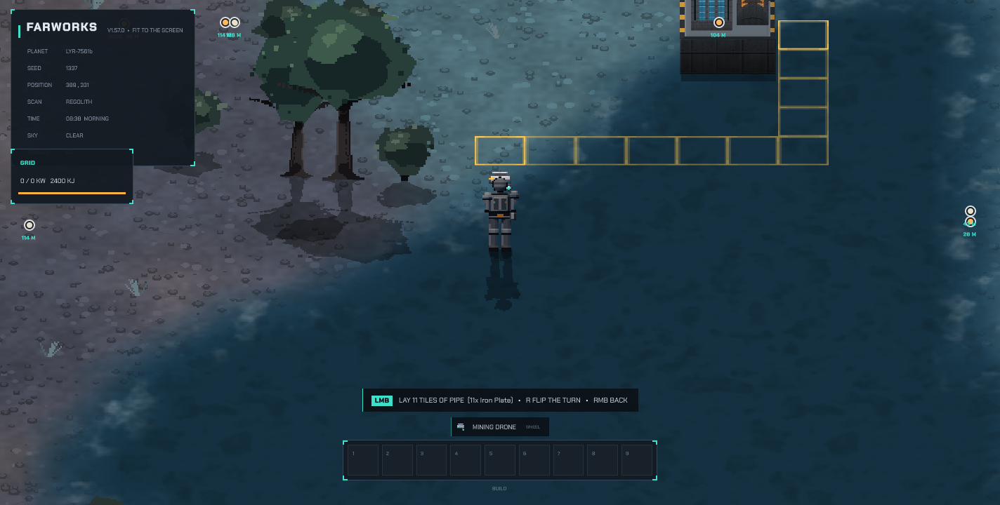

**What the two runs share, and what they do not.** Everything the player touches is one tool now —
`RunPlacer` — and what each kind may do with the path it is handed is its own business:

- A belt is flat, so where the ground steps `BeltPlan` cuts the run in two and drops a lift between
  the halves.
- **Water does not care about height**, so `PipePlan` does nothing at all about a step. A run that
  walks up a cliff is a length at the bottom and a length at the top, touching, and touching is
  already one network.

That is the no-pressure decision paying for itself a second time. It was made to avoid simulating
anything, and what it actually bought was a whole class of machinery that never had to be written.

**The Water Tank.** Two hundred cubic metres on four tiles, which is a hundred tiles of pipe and
costs rather less than a hundred tiles of pipe. That bargain is deliberate: a long run is a buffer
you get for free by taking the scenic route, and the tank is the one you build on purpose when the
scenic route is not long enough. It joins a run by standing against it, like everything else, and
reads its network the way a pipe does.

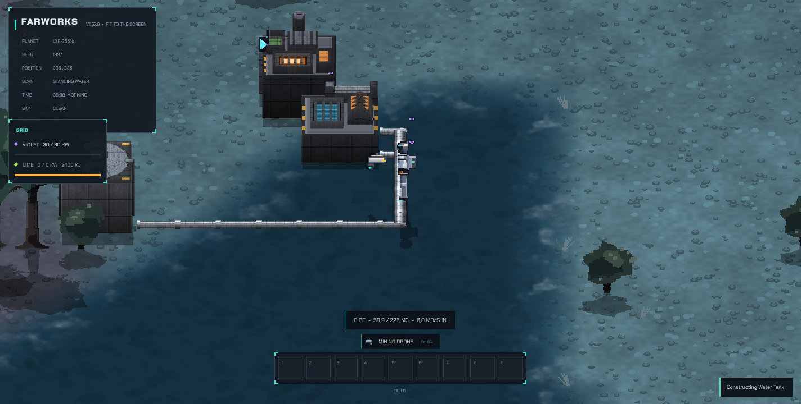

**And the pipes look like pipes.** The first pass came out as a guardrail: a pale band nearly the
width of the tile, a dark rib at every boundary, and a quarter tile of flank with a shadow under it.
Three things were wrong and all three are worth writing down, because each is a rule about drawing
anything round in this game.

It was too wide. A tube has to be narrow enough that the ground shows either side of it or there is
nothing for the eye to read the roundness against — a quarter of a tile, not two thirds.

Its section was symmetrical, so it read as a strip of tape. What says *round* is the highlight
sitting a third of the way in from the lit edge with a long fall away behind it, and the shaded edge
going much darker than the lit one ever does. That cannot come from the form shading, which works
off the silhouette — and the silhouette of a straight length is two parallel lines whatever shape is
between them. So the section is painted into the plan.

And it had a height, which is what actually made it a wall: a hull with one gets a flank extruded
down to the ground and a shadow thrown the length of it. Both are right for a thing standing up. A
pipe lies down, and so it has no height at all, exactly as a belt has none.

### Added

- `IRunPlan` and `RunPlan`: what a drawn path is allowed to be, and the parts every kind of run
  answers the same way. `BeltPlan` implements it and `PipePlan` is new.
- `StructureKind.WaterTank`, unlocked by **Draw From the Lake** along with the pump and the pipe.
- `ProceduralArt.PipeSection`, the cross section every cylinder in the game is now painted from —
  the pipe, its menu tile, and the tank's.
- The art dump writes all sixteen joins of a pipe, the same way it writes a wall's.

### Changed

- `BeltPlacer` is `RunPlacer`, `GameRoot.Belts` is `GameRoot.Runs`, and `ActionKind.LayBelt` is
  `LayRun` with the kind riding in `Structure`. An action that names nothing is a belt, which is
  what every run was until there were two.
- A pipe is no longer refused for being under your feet. It is stepped over, so standing on one is
  a thing you do rather than a thing that stops you — and a run drawn through where you happen to
  be standing was being refused for a reason nothing on the screen could explain.

## [1.57.0] - 2026-09-09

Water, and the pipes it moves through.

**A network is one tank.** Every length of pipe on a run and every vessel joined to it is a share of
one body of water, and there is no upstream, no pressure and no travel time. That is the decision
the whole system rests on, and it is the right one because a pipe is opaque: nothing is travelling
for anybody to watch, so a queue of invisible parcels inside a tube buys nothing a pool does not.

What the fluid model is, then, is `PowerNetwork` in different units — and it is written beside it on
purpose, `FluidNetwork` next to the one it copies. The behaviour that was asked for falls out of the
capacity rather than being written: **a full network stops its pumps** because there is no room, so
the push is capped at nothing. Which is the same thing a belt does when the far end will not take
another plate, arrived at by subtraction.

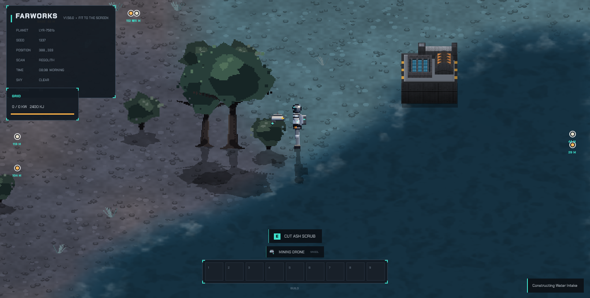

**The Water Intake** stands in standing water and nowhere else — a river is the one piece of terrain
crossed on foot, and a base grown across a ford takes away the only thing a river is for. It pumps
six cubic metres a second, which is two steam plants with a little over, and one per base is the
intended shape: the interesting decision is where the lake is relative to everything else, and it
stops being interesting the moment the answer is "build four more pumps".

It draws thirty kilowatts, so the base's water is downstream of the base's power and a grid that
falls over stops the boilers twice. It also **stops asking for power the moment its run is full**,
which is the same sentence as a smelter with nothing left to melt: a machine with nowhere to put
what it makes asks the grid for nothing.

**Pipes are joined by touching.** Two things whose footprints share an edge are on the same network,
and a pipe is what you lay to make two distant things touch. Corners do not count. That is
deliberately not what a power grid does — a grid is poles reaching across open ground because the
interesting decision there is where a mast goes, and there is no interesting decision about a tube.

**Length is volume.** Two cubic metres a tile, so a generous run between a pump and a plant is a
buffer that rides out a hiccup, and a short one is not. That gives pipe length a meaning without a
line of pressure arithmetic, and it is why a tile of pipe costs one plate: a run priced to be
thought about is a run nobody lays generously.

They span any water, like a slab, so a run reaches a moored pump without a causeway laid under every
tile of it. And they are walked over rather than round, like a belt — a run of tube that fenced a
base in half would be the reason nobody ever laid one through it. Which does mean a run laid across
a lake can be walked along. That is a pipe bridge, and it is what one looks like.

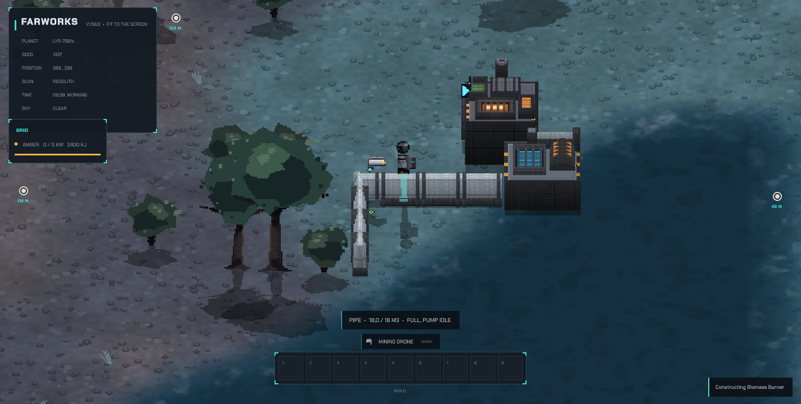

**And you can read one.** Stand at a length of pipe and it says what its run is holding and what is
happening to it, with no key beside it, because there is nothing to press. It reports the whole
network rather than its own share — that is the model rather than a dodge: a network is one tank, so
"the water in this pipe" and "the water on this run" are the same quantity asked about from two
places.

Anything you can actually use beats a readout when the game decides what you are standing at, so a
pipe threaded past a machine never takes the prompt off the machine. That was the thing worth
getting right: an inspection that stole the prompt off the plant you were standing at would be worse
than no inspection at all.

**One thing here is worse than it should be.** A pipe is laid a tile at a time, like a wall, rather
than drawn as a run like a belt. The two-click tool is the better fit and it is not a small change —
it plans lifts, cliff crossings and the ports at either end — so it is a job of its own rather than
one done badly on the way past. It is the next thing.

### Added

- `FluidNetwork` and `IFluidNode` in `Items`, `FluidGrid` in `Interaction`. One tank, one flood
  fill, one tick, deliberately shaped like the power pair beside them.
- **Draw From the Lake**, the second task of The Works: thirty plate, twenty wire and thirty
  concrete for the pump, the pipe, and the plate to reach the water with. It asks for nothing coal
  can make, on purpose — the tasks in a milestone are chosen rather than queued, and a task that
  quietly required another one first would make that choice a lie.
- `IInteractable.JustLooking`, for a thing with something to tell you and nothing to do.
- The `fluids` scene: a pump moored, a run laid ashore, a fire lit beside it, and the six claims
  the model rests on — including that taking a length out of the middle of a run splits the network
  in two, and that the water stays where it physically was.

### Changed

- `BuildingDef` carries `Volume`, `Drain`, `Thirst` and `IsPipe`; `BuildingSave` carries `Water`,
  absent from older saves and read as an empty pipe.
- A pipe finishing does not announce itself. Twenty notices for twenty tiles would teach the player
  to stop reading them, which is what the belt has always understood.

## [1.56.0] - 2026-09-09

The second milestone opens, and it opens on coal.

**Something Better to Burn.** Every coal seam this planet was built with has been reserved and
dormant since the day it was rolled; the first task of The Works brings them up. One lump is
twenty-five seconds of a burner against five for a handful of leaves, and a full box is an hour and
a half rather than a quarter of an hour — but the step that matters is not the number. Coal comes
out of the ground, where a drill can stand on it and a belt can fetch it, and the visit stops being
yours at all.

**It is paid for in leaves,** which is the joke and the point: a hundred and fifty of them is a
proper walk, and it is the last one this particular errand ever asks for.

It also switches on **Reinforced Plate**, which has been sitting in the recipe list unavailable
since it was written, because the one thing it needs is coal.

**A late ore no longer moves the ore before it.** This is the part worth reading. Ores added after
the field was designed are laid down by a second sweep, so that adding one never shifts a deposit
an existing save is standing on — and that sweep picked from a weighted pool of *all* late ores. It
protected the first pass and did the very thing it exists to prevent to itself: with limestone alone
in the pool every eligible cell was limestone, and adding coal made a share of those cells roll coal
instead. Limestone beds would have moved out from under bases built on them.

It is one sweep per ore now, each with a salt of its own, in the order the ores appear in the table.
A later ore only lands where the earlier ones left a gap. The first late ore keeps the salt the
single sweep used and is offered a pool of exactly itself, so its beds come out on precisely the
tiles they always have.

Measured on three seeds including a real save's, before and after: surfaced deposits identical
(77 / 78 / 71), dormant sites rising as the coal is reserved (100 → 151, 114 → 167, 120 → 179).
Water retreats very slightly, because it refuses any tile within two of a deposit — and it can only
ever retreat, so ground somebody has built on stays ground.

**And you can build out over water.** A foundation or a roof goes down on a lake or a river now:
a slab is what you lay to make somewhere to stand, and the place that most needs one is the place
there is none. It is also how a base will reach the lake it is going to draw from.

Nothing else stands in water, and nothing at all stands in a river — that is the one piece of
terrain crossed on foot, and a base grown across a ford takes away the only thing a river is for.
What may go where is a property of the building rather than of the ground, so the intake that comes
with the pipes will simply say it belongs in a lake.

### Added

- `MilestoneTask.RewardOres`. The objective sets have been able to hand over an ore since copper;
  the milestones could not, and unlocking one is the largest thing a task can pay out — the reward
  is not a line in a menu, it is the map changing.
- `BuildingDef.Water`, saying what water a building may be put down in: none, any, or standing
  water only.
- The `terrain` scene checks a slab may be laid on both kinds of water and that something wanting
  dry land may be laid on neither; the `milestones` scene checks the coal task brings seams up, that
  coal is a real step over leaves, and that Reinforced Plate came with it.

### Changed

- `works-stock` is gone. It asked for parts and paid back parts, and served neither the milestone
  it was in nor the player.

## [1.55.0] - 2026-09-09

**Eight item icons redrawn, and the fault they shared was one fault.** Iron Bar, Iron Plate,
Reinforced Plate, Scrap Metal, Hull Plating and Concrete were all the same rounded rectangle in six
greys and tans, with a light band across the top and a dot or two. At the size a slot actually is,
against a dark panel, that is one item six times over.

The rule that comes out of it: **a silhouette belongs to one item, and colour is not a difference.**
Colour still tells iron from copper and quartz from titanium, which is right — those genuinely are
the same object in another material. It cannot be what tells a sheet from a lump.

So the cheap distinctions got spent before any detail did. A plate is drawn on the tilt and is two
pixels thick, because it is a sheet you could bend; an ingot has a top face and a mould lip, because
it is a lump you could not. Concrete is a cube with three faces at three values. Cable is a ring,
which is the most distinctive outline available and there is now exactly one of them.

**Three of them needed no invention at all — only reading their own description.** Hull Plating has
said *"ablative panel, scorched on one side"* since the pod was written and was drawn as clean
plate; it is charred down one edge now, with the burn bitten back into the outline. Reinforced Plate
has said *"braced and bonded"* and was plate in a darker grey; it has the brace on it. Scrap Metal
has said *"torn alloy"* and was drawn as a cast ingot; it is torn.

**And the cable's hole had never been cut.** It opened the middle of its coil by painting with a
fully transparent colour, which does nothing at all — `Pixels.Blend` returns early on an alpha of
zero. The ring stayed solid and a coil of cable read as a leather pouch for as long as anybody
looked at it. The same mistake had already been made once in the foliage.

### Added

- `Pixels.EraseDisc`, the round counterpart to `Erase`. Painting with transparent takes nothing
  away; these two are what do.
- `docs/design/icons.md` — the silhouette rule, the axes worth spending before detail, and the
  transparent-paint trap.
- Three icon shapes split out of ones they were borrowing: `Scrap`, `Ablative` and `Braced`.

### Changed

- Leaves are lifted out of the dark. They were the lowest-value thing in the list and read as a
  smudge; they read as leaves now.

## [1.54.1] - 2026-09-09

**The three gated parts are flight stock, not components.** They shipped an hour ago as a Pipe
Section, a Turbine Rotor and a Field Coil, and that was the wrong call: those are all parts with an
obvious job, and a part with an obvious job is one the player looks at and asks where it goes. The
honest answer was nowhere, which is a bad thing for a pipe to have to say about itself.

They are an **Airframe Panel**, a **Truss Spar** and a **Signal Loom** now — made to a standard only
somewhere with no ground under it needs. A panel pressed straighter than any wall requires, a spar
bored out to save a weight nothing here has to lift, a loom with every strand tagged when there is
nothing yet with anything to say. The question they raise is not where does this go but what is this
for, and that one has an answer: they are the first rung of the ladder this game ends on, and the
last rung of it is a rocket.

Same recipes, same inputs, same gate, same three tasks paying them out. What changed is what they
are, what they are called and what they look like — the panel in particular, which was a grey
rectangle beside the grey rectangle it is pressed from, and two grey rectangles in one inventory are
one item as far as the eye is concerned.

Nobody had these in a save: 1.54.0 was cut minutes before, so the three item numbers are reused
rather than retired.

### Added

- `docs/design/flight.md` — what this line is for, why nothing in a base ever wants any of it, the
  rule that every tier is made from the tier below, and the multi-input machine that tier two is
  waiting on.

## [1.54.0] - 2026-09-09

**Three parts your hands cannot make, and a door they open.** Every recipe in this game until now
has been offered by the Main Station as well as by a machine, which made the factory a convenience
rather than a requirement: a patient enough player could hand-build the entire thing. The Pipe
Section, the Turbine Rotor and the Field Coil are offered by the Simple Crafter and by nothing
else.

They gate the second milestone, and the gate is deliberately the machine rather than the material.
The milestone they open is about a base that keeps running while you are elsewhere, and it would be
a strange thing to be let into by hand.

**One input each, off three different lines.** A machine has one input box, so a recipe a machine
offers can name exactly one kind of thing — and that falls out well here. Pipe comes off the plate
line, rotor off the rod line, coil off the copper line, so the gate asks you to have all three of
your production lines actually running rather than one crafter fed by hand.

**Each recipe is paid out by a different task of the first milestone**, so the other five tasks are
the way in, whatever order they are taken. A player who picks the gate first is not stuck — they
simply cannot make what it asks for yet, and the tiles behind them say why.

For now that is all these three do. They are each a part of something the factory is about to want,
none of which exists yet, and their descriptions say so rather than pretending otherwise.

### Added

- **Pipe Section** (3 iron plate), **Turbine Rotor** (4 iron rod) and **Field Coil** (5 copper
  wire), each made at a Simple Crafter and nowhere else.
- **Nothing By Hand**, the sixth task of Shelter: 16 pipe sections, 12 rotors, 12 coils. Its reward
  is being let through.
- The art dump writes every item icon and every build-menu tile. Those were the one piece of art in
  the game with no cheap way to look at it — thirty-two pixel squares that could only be seen by
  building a player and opening a panel.
- The `milestones` scene checks the gate really is one: that none of the three can be made by hand,
  that all three can be made by a crafter, that the gate asks for them, and that three different
  tasks pay them out.
- The `saveread` scene checks that every finished milestone task has actually handed over what it
  authorises.

### Fixed

- **A milestone reward paid into a full hold vanished.** No toast, nothing on the floor, from the
  one screen whose whole purpose is handing things over. The remainder is laid at your feet now,
  which is what emptying the delivery boxes has always done with the same problem.
- **A task finished before its reward existed never paid it.** A save records which tasks are done
  and, separately, what you know how to make; the two agree until a task is given something new to
  hand over. A run that had already finished two of the three tasks now carrying these recipes
  would have come back unable ever to make what the gate asks for. Loading re-applies what a
  finished task authorises — recipes, buildings and screens, never material or cargo slots.

## [1.53.0] - 2026-09-09

Consolidation rather than content: the first two things a technical audit of the project asked for,
both measured before and after.

**A whole world now fits comfortably in one message.** Joining a game is being sent the host's save,
and that save travels inside a single message with a ceiling on it — Valve's is half a megabyte, and
a send over it does not fail loudly, it simply does not happen. It is the one message in the game
that grows with how long somebody has played.

It is deflated now, the same way the fog-of-war record inside a save already was. Measured over two
real processes joining each other: 2801 characters of planet squeezed to 1300 and opened back to
2801 on the other side. On a real base of a hundred and sixty buildings the offline figure is
**eleven and a half times smaller** — the ceiling moves from about two thousand buildings to a
number nobody will reach.

Worth being plain: **nothing was breaking.** The measurement that prompted this said a base of 163
buildings sends 43 kB of a 512 kB allowance. This is a cheap way of making sure it never can break,
not a rescue — and it is not a substitute for fragmenting the message the day something other than a
save needs sending.

*A joiner running 1.52.1 or older cannot read a snapshot from a 1.53.0 host.* The reverse works: a
1.53.0 joiner reads an older host's uncompressed snapshot, because JSON starts with a brace and
base64 never does. There has never been a version handshake, so mixed-version co-op was undefined
before this too.

**The code is in two assemblies instead of one.** `Factory.Runtime` holds the game, `Factory.Editor`
holds the tools, is compiled for the editor only, and references the runtime rather than the other
way round. `Assembly-CSharp` is gone. Nothing now keeps editor-only code out of the shipped player
by convention alone, a change to a build tool no longer recompiles the game, and there is somewhere
to put tests the day they are wanted.

The capture pass deliberately stays in the runtime assembly. Its whole value is that it is the
shipped player driving itself, and `GameRoot` reaches for it — giving it an assembly of its own
means inverting that dependency first, which is a job rather than a file move.

### Added

- `Net/Snapshot.cs` — deflate and base64 for the one message that grows, with an opener that hands
  back an already-plain snapshot untouched so an older peer still works.
- The `savewrite` scene asserts the whole round trip: that a packed save opens back to exactly what
  went in, that it still parses as a save, that an uncompressed one survives the opener, and that
  the message is inside the transport's ceiling — with the ratio in the log, so a growing base can
  be watched growing.
- `docs/PROJECT-AUDIT.md` and `docs/PROJECT-AUDIT-REVIEW.md`, the audit and the reply to it.

### Fixed

- `tools/compile-check.sh` referenced the project's own freshly built assemblies while compiling
  their sources, which defined every type twice and buried real output under `CS0436`. It reads the
  names to skip out of the assembly definitions now, so a third assembly cannot bring it back.

## [1.52.1] - 2026-09-09

Nothing here changes the game. It is the capture pass — the scripted playthrough that takes the
screenshots and asserts that the whole loop still connects — learning to arrange a base on a planet
it did not choose.

**The pass built its base from wherever the player happened to be standing**, which is wherever the
scene before it finished. It now measures from the Main Station, and stands the player beside it
first: the station is on the landing pad, and the pad is guaranteed to be one terrace of buildable
ground, so it is the one piece of the map known to be flat. Standing the player there is the other
half rather than a nicety — a placement is judged at the storey the ghost is on, which is the
storey the player is on.

Seed 1341 went from four failures to none; 1337 and 7 are clean too. Seed 2026 still fails, at a
different and older cause, which is written down rather than chased.

### Added

- `docs/PROJECT-AUDIT.md` — a working document on the state of the project, its known risks and a
  recommended order of priority, shared between the humans and the agents working on it.

### Fixed

- The capture pass arranging its base relative to the player rather than to the station.
- A capture scene asserting a bush prompt while standing against a smelter, which offers the
  smelter's screen — rightly, and the scene was testing the wrong thing.

## [1.52.0] - 2026-09-08

**You land on open plains. Always.** The pod used to come down at the middle of the map whatever
was there, and on a planet whose middle is cut up by terraces that is a run which begins by refusing
to build the first thing the tutorial asks for — a footprint straddling a cliff edge has no height
to be at, so there was simply nowhere to put a station, with nothing on screen explaining why.

**The middle is still tried first, and taken when it works.** That matters more than it looks: a
planet that already offered flat ground there comes out bit for bit as it did before any of this
existed, so every seed that was never broken is untouched. Seven of ten sampled seeds did not move
at all; the rest found open ground one to five tiles away.

Failing that, the landing site spirals outward for a naturally flat pad — nothing is rewritten, you
simply land where the planet is already open. Only if a sixty-tile search finds nothing at all does
the ground get levelled by hand, which is the guarantee. None of the seeds sampled needed it.

**Your existing worlds are safe, and now permanently so.** A save records where it landed and hands
it back, so nothing is searched for on a load and no future change to that search can move a planet
somebody has already built on. A save written before this lands at the middle of the map, which is
where those runs landed — verified by loading a real 161-building save on both binaries and getting
the identical pod tile, storey and position.

**And the placement check knew about one floor.** `AimPlacement` asked whether a building could go
down on the *ground* floor whatever floor it was aiming at. On a low-country landing site those are
the same question; on a spawn up on the third terrace it is never true anywhere, which is the other
half of why seed 1341 could not stand a station on a landing pad with nothing on it.

### Added

- The `terrain` scene checks the landing pad: one terrace, no ramps through the middle, every tile
  buildable, and room for a Main Station. Ten seeds pass, including the one that used to fail.
- `SaveGame.SpawnX` / `SpawnY` / `SpawnLevelled`, so a planet is arranged the same way every time
  it is loaded. Absent from older saves, which read as the middle of the map and no levelling.

### Fixed

- A landing site on ground too broken to build on.
- `AimPlacement` judging every placement against storey zero rather than the one being aimed at.

## [1.51.2] - 2026-09-08

**A bush gives three to ten leaves instead of four to eight.** It was always a roll rather than a
fixed number — `Random.Range(DropMin, DropMax + 1)`, thrown fresh at every cut by whoever holds the
world — but a range of five reads as a fixed number with a bit of noise on it. A range of eight is
a bush that was worth stopping for and a bush that was not.

The average barely moves, which is the point: filling a burner is still a walk of about thirty of
them. What changed is that you notice which thirty.

### Changed

- Ash scrub yield: 4–8 leaves → 3–10.

## [1.51.1] - 2026-09-08

**The Biomass Burner carries a whole first base.** It shipped at 90 kW yesterday, on the argument
that a burner should be worth one machine and that a second block of machines should cost a second
burner. That is a tidy rule and it was the wrong one.

A miner, a smelter and a crafter draw 180 kW between them. At 90 the reward for finishing the first
milestone was a grid that could no longer run the base you already had — and the only answer to
that is to go and stand at the wheel again, which is the exact thing this machine exists to end. A
machine whose whole point is buying your afternoon back must not be the thing you have to stand
over.

So it makes **240 kW**, which is exactly what a treadwheel makes when somebody is turning it
properly. It clears the whole chain with sixty spare to bank.

The rate was never what separated it from anything, and now it does not pretend to be. **From the
wheel:** the wheel is free forever and wants you standing on it; this wants feeding and lets you
go. **From the coal burner still to come:** the fuel, which is the one axis this system actually
models — coal will run at the same rate on far better fuel, so the walk comes round far less often.

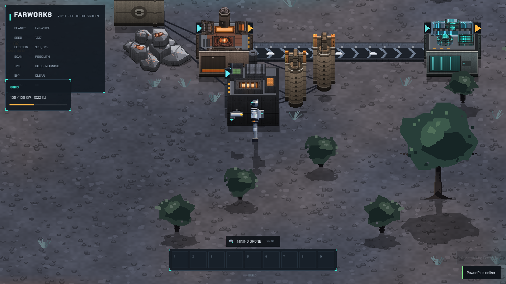

**And the errand did not get longer with it.** A leaf went from 450 kJ to 1200 alongside the rate,
so it is still five seconds of burner: a bush is still half a minute, filling a box is still a walk
of about thirty of them, and a full box is still a quarter of an hour — of the whole base running
now, rather than of one machine.

### Changed

- Biomass Burner: 90 kW → 240 kW.
- Leaves: 450 kJ → 1200 kJ, so seconds-per-leaf is unchanged.

### Added

- The `burner` capture scene runs a smelter *and* a crafter off one fire, and checks separately
  that one burner's supply clears a miner, a smelter and a crafter with at least 20% to spare —
  a fact about four numbers in the database, which should fail the day one of them moves rather
  than the day somebody plays it.

## [1.51.0] - 2026-09-08

**Something to Burn — the last task of the first milestone, and the first power that works while
you are somewhere else.** Every machine in the base has run on a wheel somebody had to be standing
at. This is the rung that was missing from the ladder out of doing it by hand: it arrives with the
first milestone, well before there is any ore worth burning, and what it costs you is a walk
instead of your afternoon.

**The Biomass Burner.** A firebox with a boiler over it and a dynamo on the back. Two tiles square,
one box for fuel, no output, a port on the west edge so a belt can eventually feed it, and its own
pole — so the first one put down works standing alone beside the machine it is there to run.

It is deliberately worse than the wheel at everything except the one thing that matters. The wheel
makes 240 kW on demand and never runs out; this makes 90 and has to be fed. Ninety is one machine's
worth and deliberately not two — a smelter is 60 and a crafter 45 — so a first base of both is two
burners, which is the intended answer rather than a shortfall.

It is crude in three ways, each on purpose. It does not follow load: a fire is not a throttle, so
whether the grid wants five kilowatts or ninety it burns at the same pace and the difference is
thrown away. It stops when there is nothing at all to power, because wasteful is a design goal and
punishing is not. And its fuel box is one stack, so you come back to it.

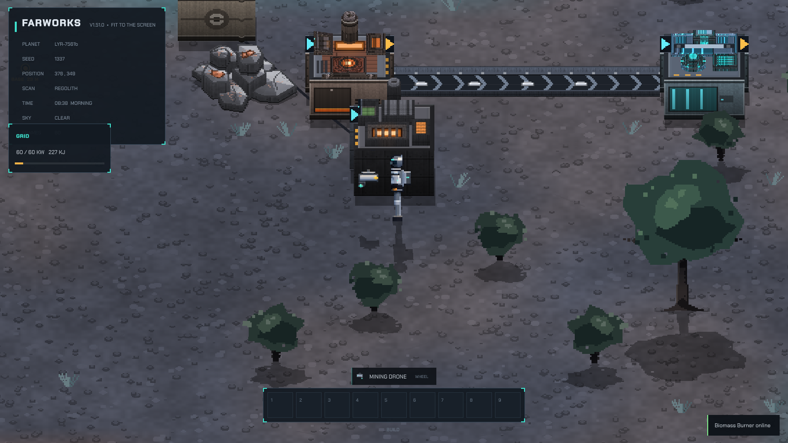

**Leaves, cut off the bushes that were already everywhere.** Walk into an ash scrub, hold the
interact key, and it gives up four to eight leaves. No tool, and no new verb: a prompt on a plant is
the same gesture as a prompt on a machine, and the game has exactly one of those.

Every plant on the planet is offered by a single entry in the interactable register — the one within
arm's reach, worked out on demand — because registering tens of thousands of bushes would be the
most expensive thing in the game in order to say something about one of them.

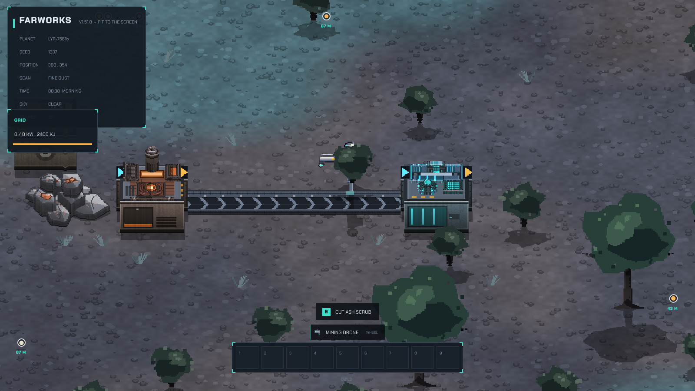

**Fuel quality is duration, and only duration.** What an item is worth on a fire is a number of
kilojoules, and the only thing a better fuel buys is a longer time between visits. Keeping the rate
fixed is what makes a grid's supply a fact about the machines on it rather than about whatever is
in a box this minute.

Leaves are the poorest fuel there will ever be, and the figure everything after them is judged
against: a full stack is about a quarter of an hour of one machine turning. Long enough to walk off
and build something and forget about it; short enough that a base run on leaves alone is a base you
keep having to come back to. The burner says how long it has left on its screen and on the prompt
you read walking past, and it says so out loud once — the moment it goes out.

**A cut bush grows back.** Four minutes, on the same tile. Flora is not in the save — it is laid out
from the seed like the rest of the planet — so what is written down instead is the short list of
tiles the player has interfered with, and the wood around them is still free.

Building over a bush is the same event as cutting one, which is what makes the awkward case fall
out rather than needing a rule of its own: a foundation poured over a bush is a tile whose clock
runs down underneath it and whose plant cannot come back because the ground is taken. Take the
foundation up and the bush returns on the next sweep. Nothing had to notice the building going
away.

Only the bush comes back. A wood growing back through a base would be a base at war with the
planet, and the planet arranging itself — the bare landing pad, the trees drowned when the rivers
fill, the scrub cleared off a deposit as it surfaces — is not remembered at all.

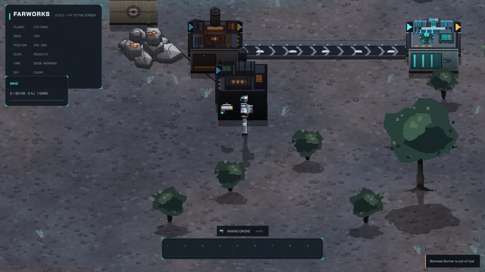

### Added

- **Biomass Burner**, 2×2: 90 kW while it is burning, one stack of fuel, an input port on the west
  edge, and a pole of its own. Unlocked by *Something to Burn*, the fifth task of the Shelter
  milestone, which also issues one and enough leaves to light it.
- **Leaves**, cut from ash scrub. 450 kJ each, stacks of 200.
- **Foraging**, an unlockable ability rather than a thing you hold: a bush within reach offers a
  prompt, and holding the key cuts it.
- **Regrowth.** Ash scrub returns to its own tile after four minutes, unless something is standing
  on it — and then as soon as that thing is taken up.
- A `burner` capture scene: the prompt at a bush, the leaves off one, a smelter carried by a fire
  with every wheel cold, the smelter going dark when the fire does, and a slab laid over a bush and
  taken up again four minutes later.
- The save round trip now carries a cut bush and a half-burnt grate, and asserts both come back.

### Changed

- A machine's boxes are found through the building rather than through its machine, so anything
  with an input and no machine — a burner — can be loaded by hand and by belt. The miner's output
  could not be dragged out of before this either.
- The interactable register asks how far away a candidate is before it asks anything else, because
  for one of them that is the question which decides what the other two are about.
- `MachineStatus` gained `NoDemand`: a generator that is fuelled and idle, which is a halt that
  belongs to a generator rather than to a consumer.

## [1.50.0] - 2026-09-08

**Somebody who logs off lies down where they stood, and their pack can be tipped out.** The pod
scatters exactly the Main Station recipe, no more and no less, so one player pocketing a stack of
iron and going to bed used to end the opening for everybody still standing there. Their character
was never deleted — a pack has somebody's afternoon in it — but it stopped being drawn, and nothing
in the game could reach what it was carrying.

Now it is drawn, asleep. That is its own picture rather than the standing one dimmed: every
character here is a drawing stood up to face the camera, and a person lying down is seen from
above, so a sleeper on a billboard would be a body floating upright with its eyes shut. It lies
flat with the pools and the shadows, keeps a heading in the world, and the camera walks around it.

Walk up to one, hold the key, and what they were carrying is on the floor beside them — thrown the
way the wreck throws its salvage, so every machine spawns the same stacks in the same places. It
refuses a sleeper who is awake, on another floor, out of reach, carrying nothing, or who is you.

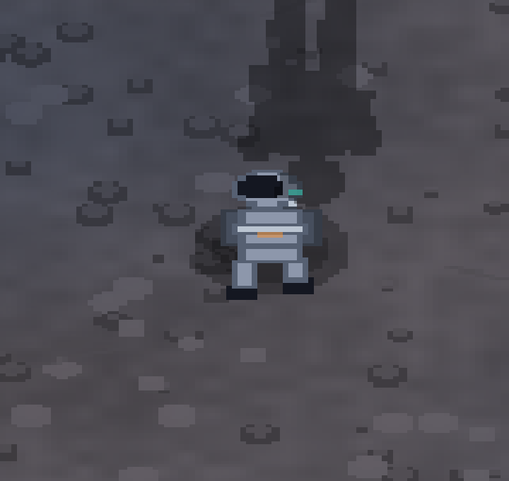

**Mute, kick and ban — and who is allowed to say so.** The host, always, and anybody the host hands
the rights to. The host can never be muted, kicked or banned: not by a moderator, not by another
moderator, and not by themselves, which is the case somebody finds by accident and then cannot
undo. A moderator may not act on another moderator either — only the host can — because two friends
locking each other out of somebody else's world is a fight the host should not have to referee.

All of it is keyed on the person rather than on their seat, since a seat lasts as long as the
session, and all of it is written into the save with the world: a ban that is forgotten when the
host makes a cup of tea is not a ban, and a ban on this factory is not a ban on a different one.

Two ways to reach it. `/mute /unmute /kick /ban /unban /mod /unmod`, and `/mods` to see who has
them — typing a slash lists the ones you may actually use, which for somebody with no rights is
nothing at all. Or right-click a player: the same commands, offered as a menu on the person you are
pointing at, listing only what would be allowed.

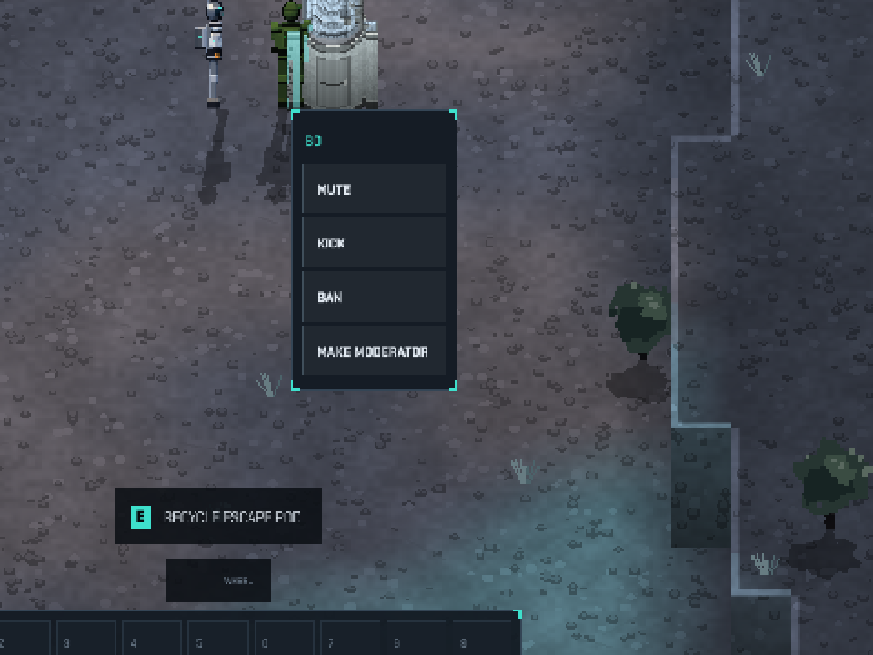

**And the chat is a panel like everything else.** It was the one screen nobody had designed: loose
white text on the dirt and a grey box to type in, under an interface made of dark panels with thin
borders and a tick in each corner. It has the ground, the border and the corners now; a line is the
speaker in the accent and the sentence in plain text, so the eye can find who said what down a
column; and the game talking about itself — somebody arriving, a pack going on the floor — is
dimmed, because a room full of comings and goings should not read as loudly as a conversation.

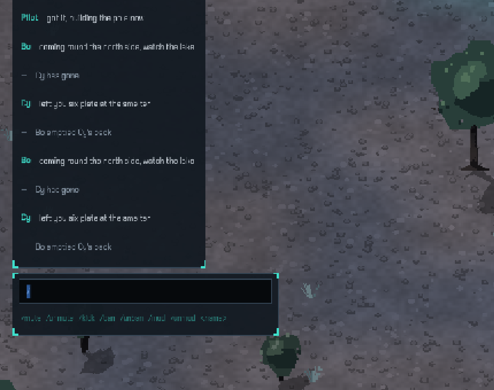

---

## [1.49.1] - 2026-09-08

**The store's readout comes down two rows.** It was drawn at the top of the door — which on the
storage container reads as a panel mounted high, and on the box, whose whole elevation is
twenty-two pixels, reads as jammed under the coping with a single row of daylight above it. The
door pulls come down with it: they sit two rows under the readout and the strip is wide enough to
cross them, so moving one without the other would have drawn the readout straight through the
handles rather than above them.

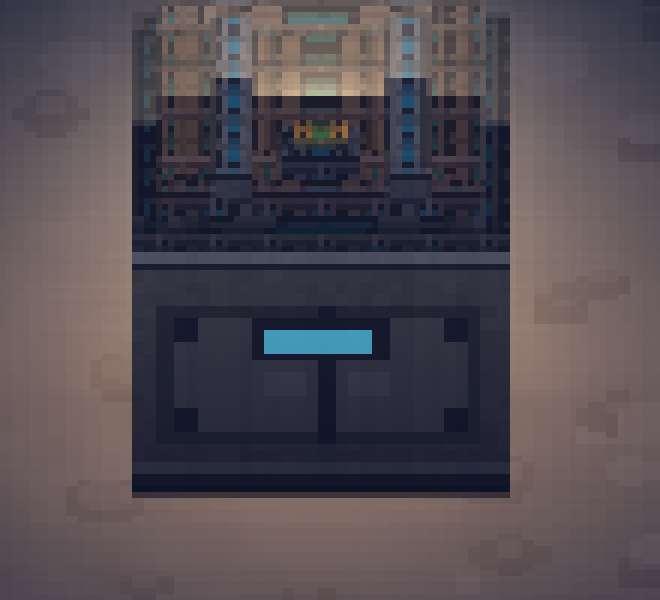

---

## [1.49.0] - 2026-09-08

**The build menu opens on the kinds of thing there are.** Two screens now: the kinds, then the
things. The grid that replaced the ring held the whole list at once, on the argument that choosing
what to build should never cost two presses — but the whole list on one screen is not one press, it
is one press and a search. Two dozen tiles under six headings are read by finding the heading
first, which the eye was doing anyway. Made a press, the second screen holds four or five things
and can be taken in whole.

The press is refundable at both ends. Escape steps back out of a drawer before it closes the menu,
so opening the wrong one costs nothing, and a lone drawer opens itself — for the whole of the
opening the build list is a station and a bench, and a screen holding a single tile marked STATIONS
is a press asking to be got out of the way. Kinds with nothing in them yet are left out rather than
greyed: early on most of them are empty, and six locked doors is a worse first impression than the
two that open.

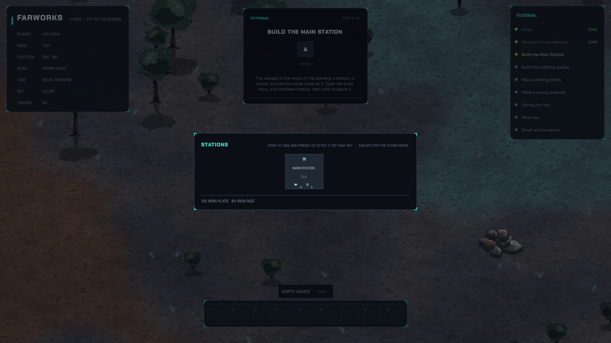

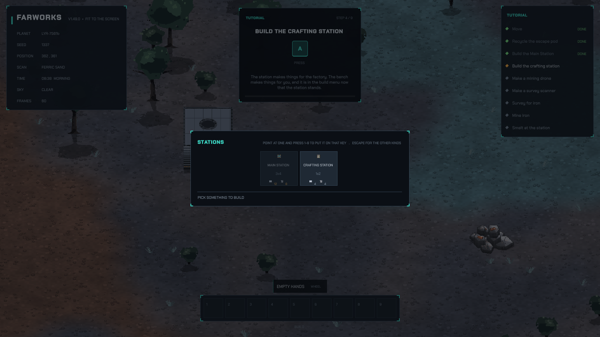

**Cable.** Three copper wire, bundled and sheathed, made at the station or the crafter. A power pole
costs two iron rods and one of these instead of the three loose wires it used to. It closes the one
place in the game where a part went from the drawing bench straight into a building without ever
becoming a thing — and the span between two poles is the most visible piece of made material on the
map, so it ought to be something somebody made.

**Nothing grows in a lake any more.** The generator plants the woods before it fills the rivers and
the water takes back whatever it covered afterwards, which has been right about rivers all along and
wrong about lakes since the pass was written. Ground says whether it can be built on, that flag
defaults to yes, the river overrode it and the lake never did — nothing noticed, because building
refuses solid ground on its own account and a lake is solid. Then the drowning pass asked the
buildable question without asking the solid one, believed the answer, and left a wood standing in
the water. Fifty-six thousand tiles of water on the standard seed, and a count that says none of
them are planted runs on every capture from here.

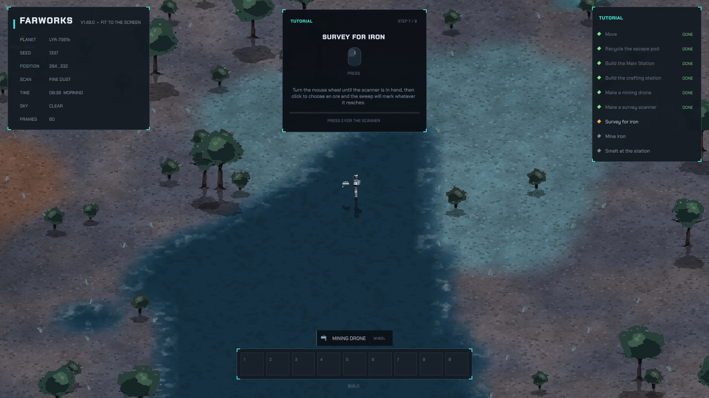

**And a lamp lights what is standing in it rather than replacing it.** The pool a building throws
was composited as a maximum in 1.46.1 — the brighter of itself and what was already there — to stop
a packed base summing its pools into a hole cut in the planet. It does stop that, and it cannot be
used: a pool is drawn over the whole pile rather than only over the floor, because it sits above the
wash that makes it night. Hulls write depth so the light is rejected over them, but sprites do not,
so it lands on the character — and a maximum replaces them with flat lamp colour. Walking into a
pool of light rubbed you out. It adds again, which brightens instead; what holds the density down
now is that a pool is sized off the building throwing it, so a crate lights four tiles where the
station lights seven.

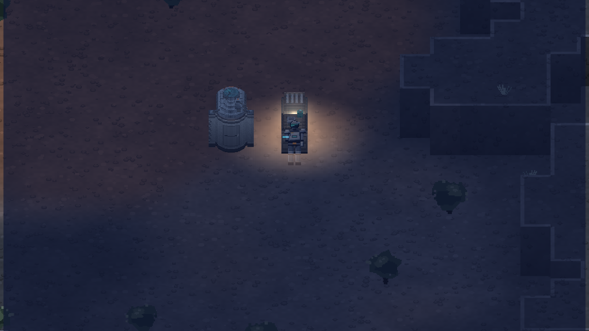

---

## [1.48.1] - 2026-09-08

**The work light has a switch.** `L`, listed on the controls page with everything else and
rebindable like the rest. It comes up with the hour regardless, so the key is not what turns the
light on — it is what lets you keep it off. A lamp held a metre from the character is the brightest
thing on your own screen, and a base laid out in pools of its own light is worth being allowed to
look at without one.

It says so out loud when pressed. At noon there is nothing to see — the lamp is only ever as far up
as the hour calls for — so a key pressed in daylight would otherwise appear to do nothing at all.

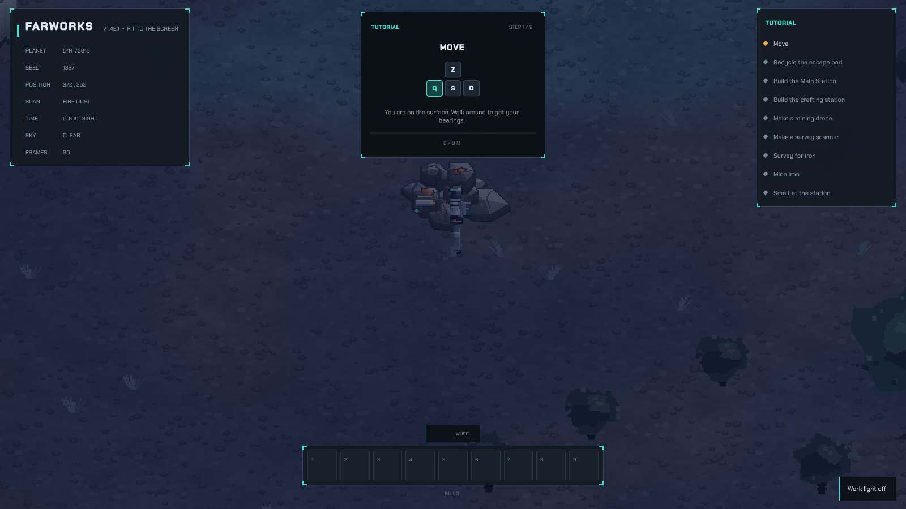

**And the download is eleven megabytes lighter.** The package that lets a running Editor be driven
from the command line was shipping inside the players, along with the Roslyn compiler and the IL
interpreter it pulls in — a game carrying a C# compiler it never calls. It is held back for the
length of a player build and put straight back afterwards, so the Editor keeps it and the download
does not. Windows 98 MB to 87, Linux 92 to 81.

---

## [1.48.0] - 2026-09-08

**The drone carries a light.** Every lamp in the game so far is bolted to a building and lights the
ground that building was put down on. The cutter is the one thing that moves, so it is the one thing
that can carry a light out to where there isn't one: it hangs off the aim, sweeps as you turn, and
travels with you across a planet that is otherwise pitch dark between bases. Walking out to a
deposit at midnight was walking into a black screen with a status panel in the corner.

It is the same two pieces a building gets -- a pool on the floor it is flying over, and the source
on the hull -- but the pool cannot be hung on the drone. The drone wears a billboard so it can face
the camera, and a child of a billboard is a pool stood up on its edge; it hangs off the character
instead, and is put where it belongs each frame from the storey its own shadow is already being
thrown onto.

**Cold, where a base is warm**, so the two are never confused at a distance and the one that moves
is the one that is yours. It began as the suit's own cyan, which on dark ground came out mint --
the colour this game paints its interface in -- and a pool of mint on the floor reads as something
selected rather than as something lit. A cold white with a blue cast reads as a lamp.

It goes out faster than a building's, at a third of a second against four fifths. This one is
switched by the cutter being sent out and called back as much as by the hour, and a light that takes
the best part of a second to die stays hanging in the air after the machine holding it has gone.

Underneath it, the hour and the weather now come from one figure -- `Lighting.Lamplight` -- rather
than from a curve living inside the buildings. Everything in the game that burns reads it, which is
what lets a thing that is not a building come on with the rest of them, and what will let all of
them be retuned at once.

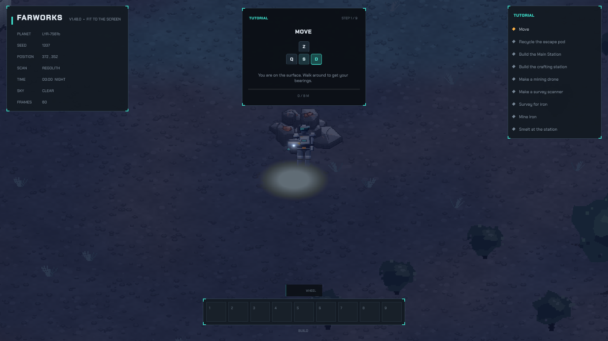

---

## [1.47.3] - 2026-09-08

**A machine between jobs is not a machine that has lost power.** The lamps on a building asked
`HasPower`, and a network gives power only to whoever asks for it — so a drill with a full stack
and a smelter with nothing left to melt were both marked unpowered and went dark. A yard where the
two idle machines are black and the rest are lit reads as a fault, and there is none; it reads as
one precisely because a dark building is how this game says a grid has gone down. A building is lit
now if it needs no power, or is being given power, or is asking for nothing while standing on a
grid that could have answered. What stays dark is the machine that asked and was refused, which is
the brownout — the one thing here worth seeing from across the map.

**Two fittings that were too small to be anything.** The store's readout was a single lit pixel and
the drill's work lamp was two. The store carries a framed readout strip over the seam of its doors,
readable across a dark yard without opening anything, and the drill has a lamp housing with a lens
in it, high on the frame and clear of the ram. Nothing cuts rock in the dark by feel.

**The editor-only guard was looking for the wrong half of its own rule.** `check-ui-fields.sh`
shipped in 1.47.2 hunting for UI elements built in MonoBehaviour field initializers, because that
is how the trap had bitten twice. Opening the editor found a third instance the same afternoon,
which the guard had been running green over: `LoadingView` drew its tip with `Random.Range` in a
field. Not an element at all — a field initializer is part of the constructor, and Unity forbids
much of its own API there, not just UI Toolkit.

So it is `tools/check-mono-fields.sh` now, and it looks for the rule rather than the one symptom:
constructing an element, or reaching `Random`, `Resources`, `Instantiate`, `new GameObject`,
`Find*`, `Camera.main`, `Shader.Find`, `SceneManager`, `Physics`, `Time`, `Application`, `Screen`,
the input devices, `AddComponent` or `GetComponent`, from a field at a MonoBehaviour's own brace
depth. `const` and `static` are skipped, neither running in the instance constructor, and so is
`=>`, which is a property body or a lambda and runs when called. The list of entry points is
curated and Unity does not publish the real one, so it is a net rather than a proof — pressing Play
is still the check, and the script says so. Both historical bugs were put back to confirm it names
them.

The loading screen picks its tip in `Begin` now, which is still the call that makes the component.

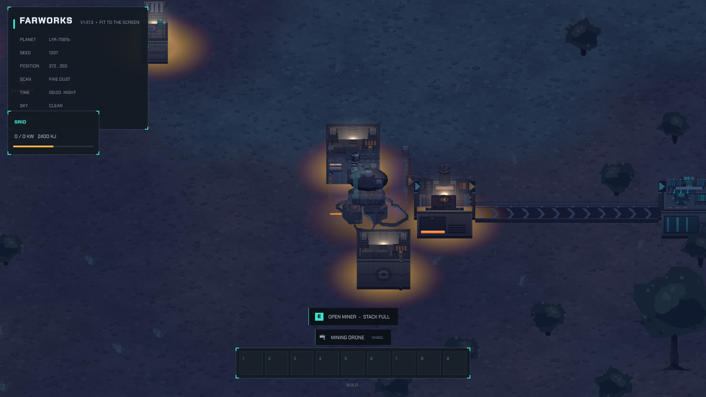

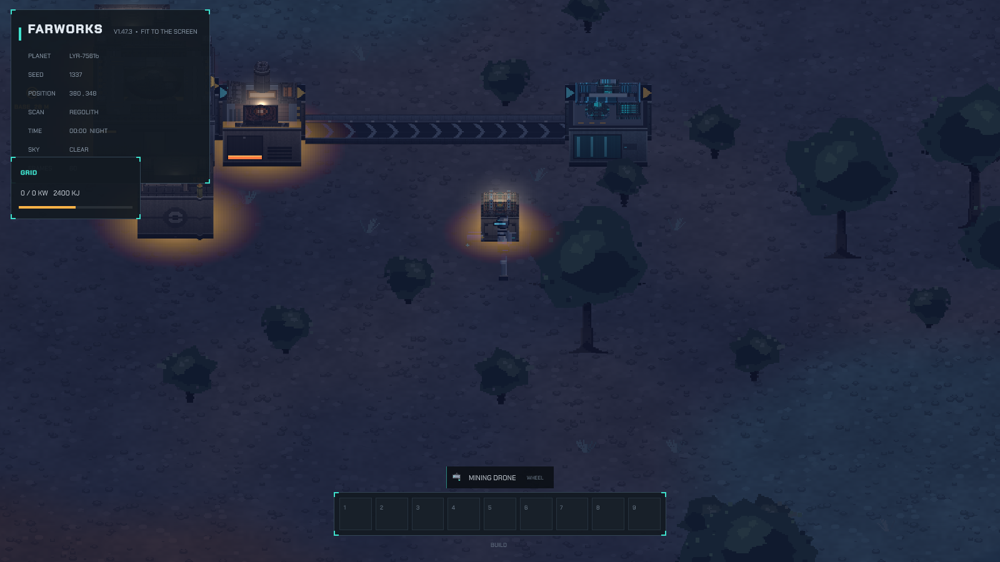

---

## [1.47.2] - 2026-09-08

**The main menu came up dead in the editor.** Its join page built a text field and a note in
MonoBehaviour field initializers, and UI Toolkit refuses that: a field initializer is part of the
constructor, so it threw there, left both fields null, and then threw again from `BuildJoinPage`
the moment anything read them. The main menu is the first screen, so the world generated behind it
and nothing else worked.

**Nothing shipped to anyone was affected.** The refusal is compiled into the editor and not into a
player, so a built player ran the same code perfectly. That is also why it lasted: it went in on
2026-09-05 and rode out four releases with a green capture pass behind every one of them, because
the capture pass is a player driving itself and a player cannot see this. Only pressing Play shows
it.

**So it is checked now.** `tools/check-ui-fields.sh` looks for any MonoBehaviour field that builds
a UI Toolkit element, and `tools/compile-check.sh` runs it, which puts it in the eight-second check
rather than in somebody's memory. It counts brace depth, so building an element inside a method or
a nested type is left alone, and it collects the project's own `VisualElement` subclasses off the
source rather than from a list, so a new element class is covered the day it is written. It covers
a MonoBehaviour's own fields; a field holding a plain class that builds elements in *its*
initializers would still get through, and pressing Play remains the real check.

Three lines under the two offending fields was a comment explaining this exact rule, left behind
when the same bug was fixed for a different field in 0.23.0. A comment is not a check.

---

## [1.47.1] - 2026-09-08

**A lit building is a building with power, and now something says so.** The crafter carries more on
its side that is a light than anything else in the game -- a window with the rollers turning behind
it -- and nothing had ever photographed it after dark. It is also standing, at the point in the
game where it is first built, on no grid at all, and that turned out to be the more useful half of
the picture: the shot was written asserting the windows were burning, and it failed, correctly,
because an unpowered machine is dark.

So the scene asks both questions in a row. At midnight with no grid the crafter has no power and
its windows read nought; then the treadwheel goes up beside it, the way a crafter is actually run
at that point, and they come to one. The rule that a base going dark is a grid that has gone down
was written into the lamps from the start and had never been tested.

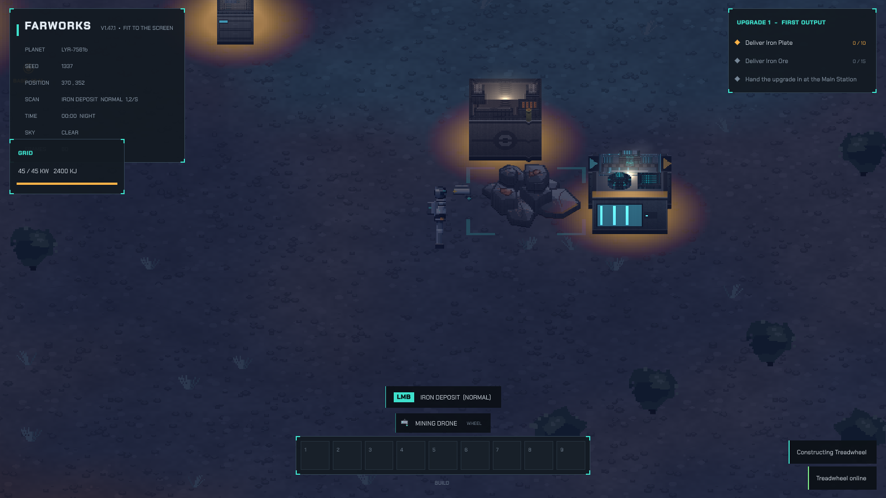

---

## [1.47.0] - 2026-09-08

**The build menu was a ring you had to aim at.** Sectors cut out of an annulus, picked by the
angle and distance of the cursor from the middle -- which is a fine control for four things and a
skill test for eleven. It also ran out of room at about nine options before the labels began
overlapping, and the answer to that was drawers: a ring of five categories, each opening a ring of
its own, so reaching a wall cost two presses and a guess about which drawer it lived in.

**It is a grid now.** Tiles in rows, grouped under Stations, Machines, Power, Logistics and
Building, the whole list on one page. A tile is a rectangle and the cursor is a point, so pointing
is what the layout already does rather than something computed from an angle -- and a grid does not
run out of room until the panel does, so the drawers are gone with the ring. The survey menu is the
same control, because it always was.

**The bar along the bottom is yours to fill.** It used to be four equipment slots, which is a
picture of a container nobody rearranges in the field -- two of them empty all game, taking the
width of the screen to say which of two tools was out. It is nine keys now, each holding whatever
building you put on it: point at something in the build menu, press a digit, and that digit builds
it from anywhere from then on. One key per building, so binding it to 2 takes it off 1, and the
menu stays up while you do it -- laying out a row is one gesture repeated, not a reopen each time.
The row starts empty, because what belongs on it is a question only the person playing can answer.
It is saved with the run.

**Equipment moved onto the mouse wheel**, with one line above the row saying what is in hand. The
wheel steps over the slots that have something in them rather than all four, so somebody carrying
a pistol and a scanner gets the other one on one notch instead of one in four. Zoom is `Ctrl` and
the wheel.

The capture pass measured the old ring for being drawn around its own hub and for answering when
pointed at. It asks the grid the two things a grid can get wrong instead: whether any tile hangs
off the side of the panel, and whether any tile cannot be clicked. It also binds a key, checks the
building came off whatever key held it before, checks the cursor is still on the tile it was on,
and then presses the key to see a ghost come up.

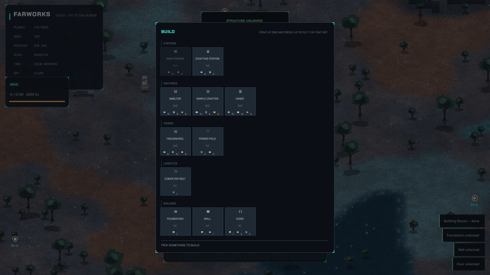

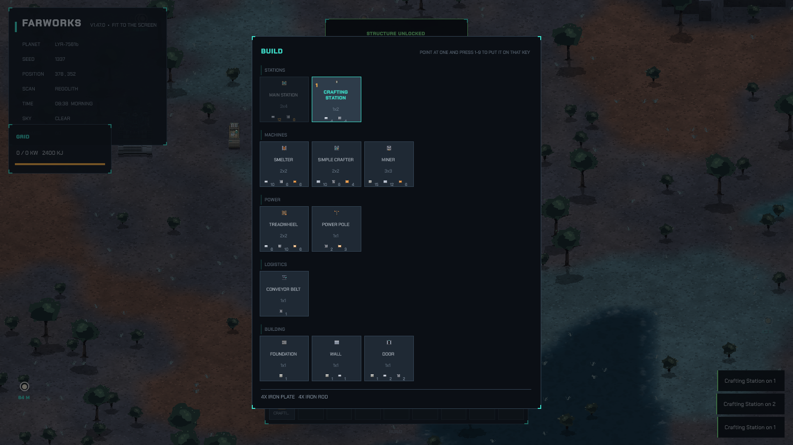

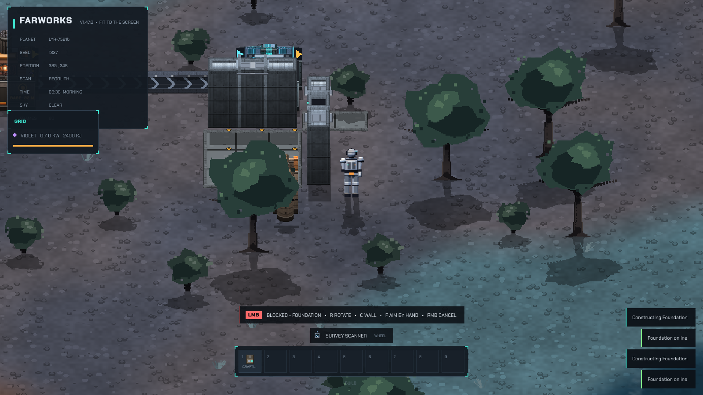

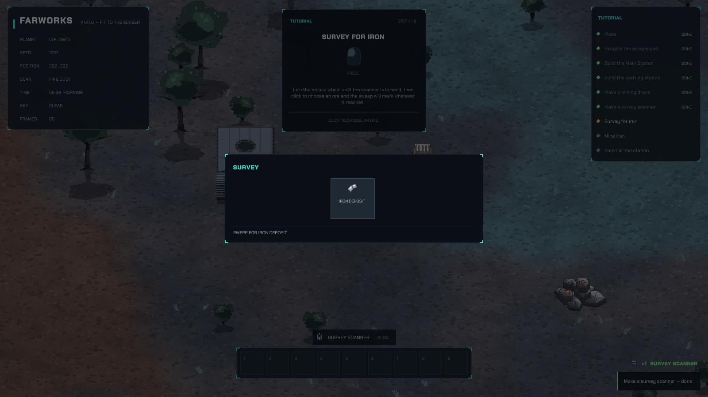

---

## [1.46.1] - 2026-09-08

**A base built shoulder to shoulder is as bright as one lamp.** Sixteen storage boxes on sixteen
tiles at midnight came to about seven times white -- eleven thousand pixels of ground clipped to
255,255,255, a hole cut in the planet where a dense base should have been. One building on its own
was fine, which is why it shipped.

**A crate is not a shed.** A pool was the building's footprint plus a flat six tiles, on the
argument that light carries the same distance off a shed as off a station. It does. But a box
standing on one tile was lighting a clearing seven across, the same clearing the main station
lights, so packing sixteen of them landed sixteen full pools on the same ground. A pool is part the
building's own size now and part spill: a box lights four tiles, a smelter five and a half, the
station seven, and how bright it is falls with the size of the thing throwing it.

**And lit ground is not the sum of the lamps over it.** Sizing alone only moves the number, because
the pools were being *added* -- which is right for a source and wrong for a floor. Two lamps hanging
side by side are twice the lamp; a floor under two lamps is lit floor, not twice as lit. So a pool
now takes the brighter of itself and what is already there. A packed base is exactly as bright as
one lamp, and the constant that says how bright means that, rather than meaning how bright one of
however many -- it can be tuned by looking at a single building and trusted for a base of forty.

The lamp over each roof still adds, because it is a source. Nothing changed in daylight: a maximum
is blind to coverage, so the pool writes its own alpha into its colour, and a lamp at nought writes
black and leaves the ground exactly as it found it.

Eleven thousand clipped pixels to none, with the single building unchanged at eleven -- the lamp's
own core, which is meant to be blown. The packed base is a capture shot of its own now, so the next
change to a lamp is measured against it rather than argued about.

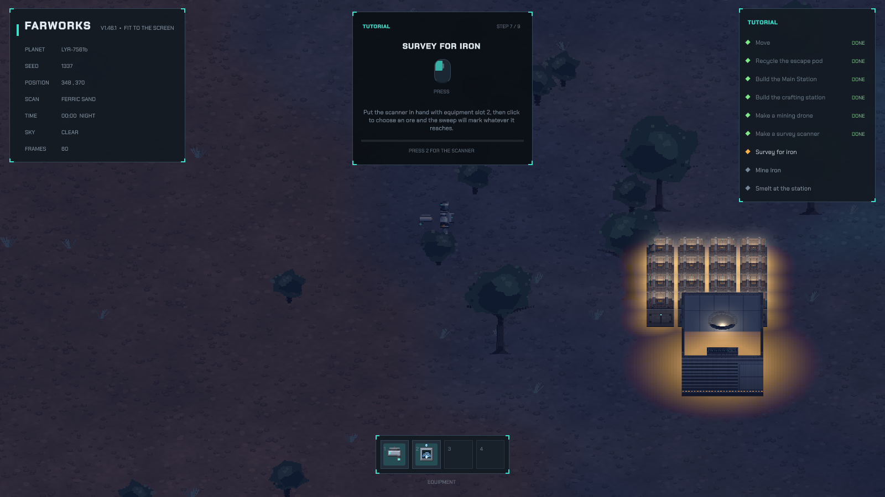

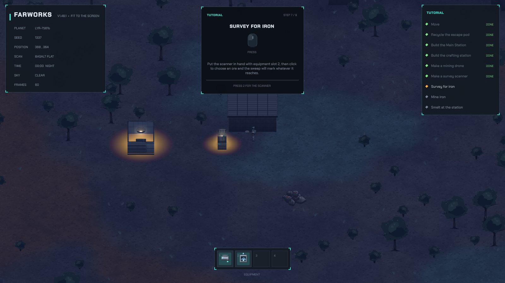

---

## [1.46.0] - 2026-09-08

**A machine's own fittings stay lit after dark.** Its side is drawn -- a fire under the smelter's
door, the window a crafter's rollers turn behind, the hazard band along the foot of the station --
and every one of those was paint. Paint at midnight is paint with a dark wash over it, so the one
hour those fittings ought to be the only thing left of a building was the hour they went out with
everything around them. The lamps put a base in a pool of its own light and hung a source over each
roof, which is what a base at night is from across the map. Up close it was still a shed.

**The same rectangle is drawn twice now: once as paint, once as the shape of a light.** As an
elevation is built, whatever on it is a light goes down on a second sheet as well, so the two
cannot drift apart -- a fitting that moves takes its own glow with it. The outside walls are then
raised a second time as geometry carrying nothing but that sheet, added to the wall rather than
covering it, and laid on over the wash rather than under it. That pass is flat white: a window is a
source and not a lit surface, so the dark side of a machine is exactly as bright as its sunny side.

**Which fittings are lights is a judgement about the machine and not about the colour.** The fire
in a smelter's throat is lit; the highlight along the top of its door is the same paint catching
the sky. Three machines had nothing lit drawn on them at all and now have one honest thing each: a
console on the crafting bench, a status pip on a store, a work lamp on the miner's housing. A pole,
a treadwheel, a ladder and a wrecked capsule stay dark, because they have no lights.

They burn off the same figure as the lamps -- the same hour, the same weather, the same grid -- and
they go out with the wall when the cutaway fades it. A machine whose windows answered one of those
while its lamp answered another would read as two buildings standing in the same place.

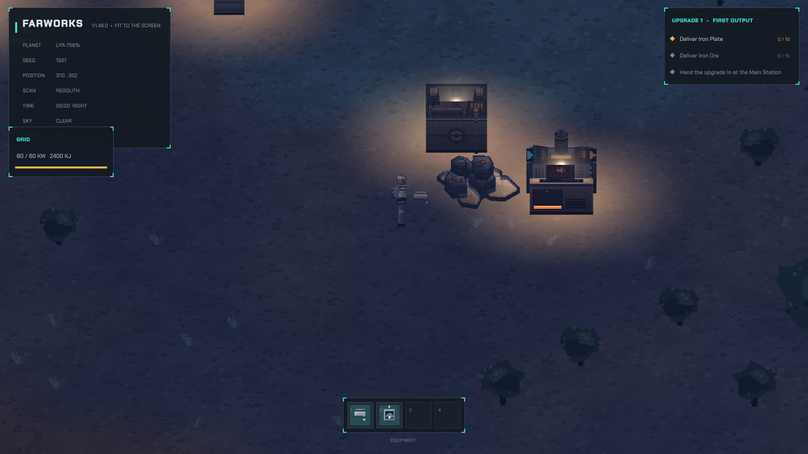

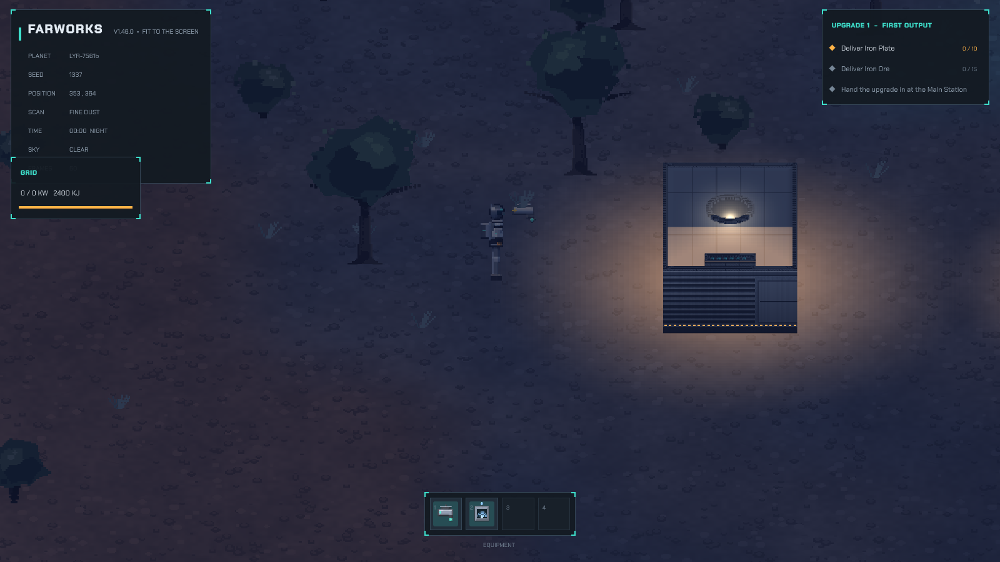

---

## [1.45.1] - 2026-09-08

**The lamps on a building light the ground it stands on now, instead of the floor underneath it.**
They went in with the weather and shipped throwing their light where nobody could see it: the pool
used the same soft disc as the lamp itself, and that disc has a falloff of `(1-d)^2.6` -- right for
a point of light seen from a distance, and exactly wrong for a circle laid on the dirt, because the
only part of a pool anybody ever sees is the part outside the walls. At half its radius it is down
to a sixth, and the margin it was given past the footprint was 1.3 tiles, well inside the dead part
of the curve. So every building bigger than the crafting bench threw the whole of its pool onto the
tiles it was standing on, where the hull sits on top of it, and a base at midnight was a dark field
with a bright dot on one roof.

**A pool is a different shape from a lamp.** It has its own sprite now: flat through the middle and
then a long soft edge with something still in it three quarters of the way out. That makes the
spill mean what it says, so it is six tiles rather than two and a half -- full brightness across the
footprint and fading over the three tiles beyond the wall. The lamp over the roofline is wider and
brighter to match, and a building stands in a clearing of its own light rather than on a dark plain.

Nothing about when they come on has changed: still off the daylight rather than the clock, so the
same lamps still come up at midday under a storm, and still out with the grid.

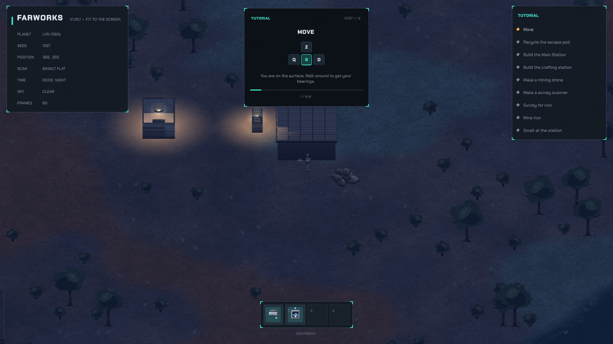

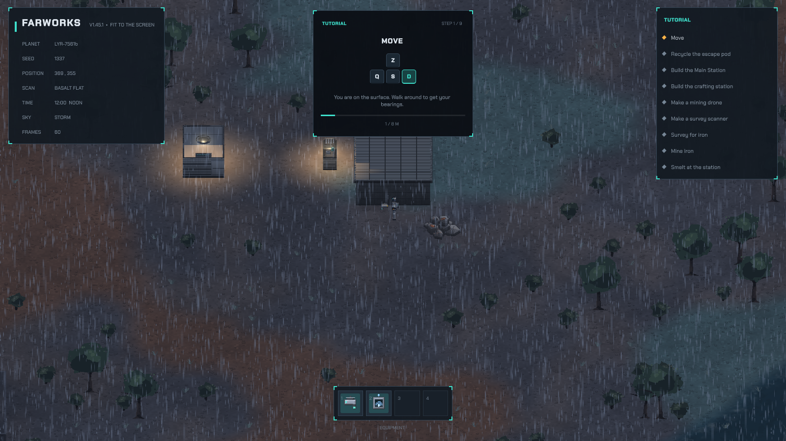

---

## [1.45.0] - 2026-09-08

**There is wind on this planet, and until now the only things that knew were the clouds and the
rain.** A storm slanted the rain across the view, dragged the cloud shadows over the base and left
every tree on the map standing perfectly still, which reads as weather drawn over a photograph.
What grows here bends in it now: barely, on a clear afternoon, and hard enough in a storm to be
the loudest thing on the screen after the lightning.

**A plant bends, it does not lean.** A tree hinged at its roots is a signpost in a gale, because
the whole of it goes over together. What actually happens is that the foot holds, the trunk gives
a little and the crown does nearly all of the travelling -- and how loose a plant is turns out not
to be a fact about how tall it is. An ironbark is ten times the height of a rime bristle and
nothing like ten times as loose. So each kind now says how far its top travels in a full gust and
how much of that bend is held out of its base: all of it for a trunk, almost none for a tuft,
which goes over whole the way grass does.

**The gust is a wave crossing the map rather than a clock every plant reads on its own.** Three
waves at three wavelengths, two running along the wind and one across it, so what goes through a
wood is a front -- the near trees go over, then the ones behind them, and no two plants are quite
in step without a single one of them being told anything. It costs nothing per plant: a plant asks
where it is standing and that is its place in the wave, which is what keeps a couple of hundred of
them on screen at the price they were before.

**And the shadows bend with them.** Flora lays a real silhouette on the ground, and a tree waving
over a tree-shaped hole that never moved would have been worse than not moving at all. A shadow is
its plant laid flat along the light, so it takes the part of the travel that runs across the ground
rather than across the screen, and it asks the wave about the patch of dirt its trunk is standing
on rather than the one its crown is lying over.

How hard it blows comes off the same three figures everything else downstream of the sky reads,
weighted the way somebody standing out in it would weight them: cloud a little, rain most of it,
thunder the rest. A clear day is a quarter of a gale rather than nothing at all -- still air is as
unnatural as a hurricane, and reads as the feature being switched off -- and a storm is nearly five
times a clear day. The wind only shows as far as it is blowing across the view, which is the rule
the rain has always followed: a picture stood up to face you can only move sideways, so turning the
camera a quarter turns a wood leaning to the right into a wood blowing towards you, and it goes
quiet.

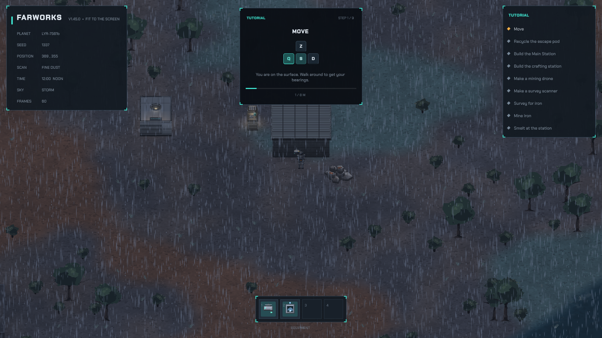

---

## [1.44.0] - 2026-09-08

**The loading screen is a panel now, not four words adrift in the dark.** It was the one screen in
the game nobody had designed: a title, a phase and a three pixel line, centred in a black rectangle
with nothing else on it at all. It now wears the boot screen's own panel -- same padding, same thin
border, same accent ticked into the four corners -- because it is the screen immediately after that
one and the two ought to look like the same program. The faint console grid the machine panels are
drawn on goes down behind it, so the ground reads as a screen rather than as a window that failed
to draw.

**It names the planet for the whole of the wait.** The designation used to arrive on the last frame
before the screen was taken away, because it was read off the finished world -- which meant the
thing the screen is about was on it for sixteen milliseconds. A designation is a property of the
seed rather than of the terrain, and the seed is settled before generation starts, so the name is
up before the first tile is laid, with the seed and the size of the map under the bar. That is the
line to copy down when a planet is worth handing to somebody else.

**And a line of advice per load.** Eighteen of them, one drawn at random, each a rule that is
written nowhere on the screen it applies to: that a belt is two clicks rather than a footprint,
that a bench stops the moment you walk off it while a machine does not, that every machine takes in
on its west edge and puts out on its east and that this is why a row of them facing one way needs
no corner in the belt. The wait is a second and a half and it was previously spent looking at
nothing.

The bar itself is unchanged in what it knows -- it still moves because a phase finished rather than
because a timer said it should -- but it now says the figure out loud beside the phase.

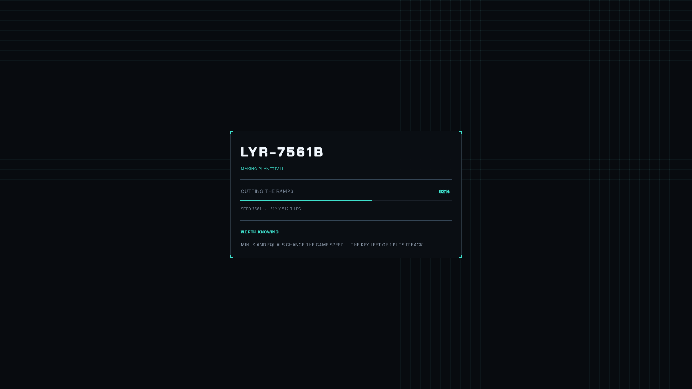

---

## [1.43.2] - 2026-09-08

Everything else that stands up and turns to face you gets what the character got in 1.43.1.

**The drone is a hull now, not a plate with a fan on it.** The same treatment: a relief painted
alongside the drawing, and the light reading that instead of the outline. One roll from keel to
spine does the whole chassis, dark border and lit face together -- that border was never a line
drawn round the machine, it is the hull turning away, and giving it the falling edge the paint
already implies is what says so. The fan cowl is a disc seen edge on, so it is thinner than the body
it sits over and set back accordingly, which is what puts a seam along the top of the chassis where
before the two were one flat mass. And the cutting head stands proud of the arm carrying it and
drops its own shadow across the mount: on a machine twenty-four pixels across, that single dark
pixel is the difference between a head slung under a nose and a circle painted on a bracket.

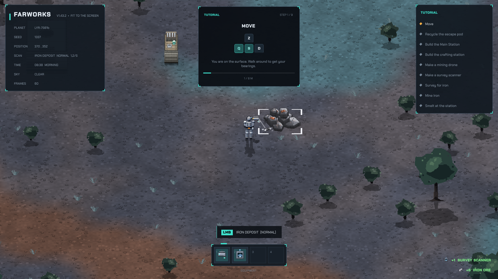

**A crown standing on its trunk rather than beside it.** Flora is the last billboard and it does not
want the relief model -- a canopy is not a stack of plate, and the lighting it already carries was
arrived at by looking at trees rather than by lighting a surface. What it was missing was never
shading. It is the most obvious thing a crown does, which is stand between the sun and the trunk
holding it up: timber the same value in the open as it is under two tons of leaves reads as a crown
placed beside a trunk rather than grown on top of one, and no amount of work on either piece says
otherwise, because what is absent is the relation between them. So the crown throws, and the shadow
falls off down the timber rather than stopping on a line. It goes cold as it goes dark, which is the
same two lights the character is lit by with one of them taken away.

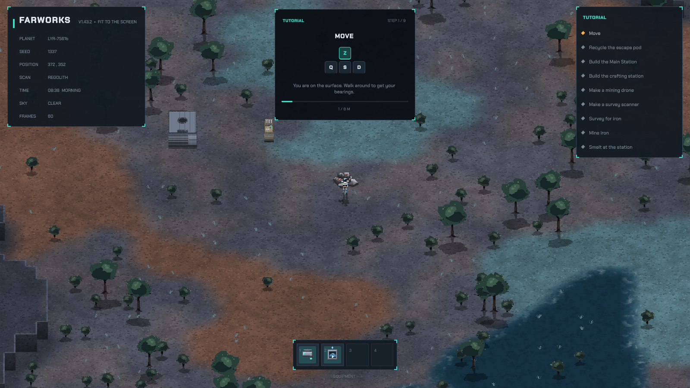

Which pixels are crown is not painted alongside the drawing the way a figure's relief is. A canopy
is a hundred overlapping blobs with a broken edge, and any description of it that is not the drawing
itself is a second drawing to keep in step -- so the cell is copied before the crown goes on and
compared after, and whatever changed is the crown.

**Also:** `Pixels.Roll` takes an axis, because a chassis is a limb a quarter turn round. And the art
dump writes the drone and every plant, and writes a sprite's own rectangle rather than the whole
texture it sits on -- which it could get away with while every sprite had a texture to itself, and
could not once the flora sheet had nine of them side by side.

---

## [1.43.1] - 2026-09-08

The character had shape and no depth. The light knows what is in front of what now.

**A figure is not its own silhouette.** The suit was lit off its outline, and the only shape an
outline can suggest is a pillow -- one lump, highest wherever the picture is thickest. Run deep
enough to be felt that swells a hard suit into a bar of soap, so it was run at a sixth and the
character stayed flat. But a figure is a helmet in front of a collar in front of a chest plate in
front of a torso, with arms hanging outside all of it, and none of that is in the outline. So it is
drawn twice over in the one pass: once in colour, and once in how far toward the eye each part of it
stands. The depths are a stacking order before they are a measurement, and what was authored is the
gaps between them -- a part a pixel proud of its neighbour is a part that can drop a pixel of shadow
onto it.

**Contact shadow is what reads as depth at forty-eight pixels.** A march toward the light finds
whatever stands in the way: under the jaw, under a shoulder plate, down the side of the pack, along
the arm that crosses the chest in profile. A crease term closes the joins the sun cannot reach --
the gap an arm hangs in, the seam between two legs -- because a crease is dark whichever way the
light happens to be. And the surface normal taken off the relief rounds each part on its own axis,
so the helmet is a sphere and an arm is a cylinder, instead of both being swellings of one lump.

**It is lit by two lights, because out of doors there are two.** Shading by multiplying one grey by
another leaves a lit face and a shaded face the same colour at two brightnesses, which reads as a
printed picture rather than as a surface however much contrast is put between them. A warm sun and a
cold sky, multiplied over the paint rather than blended toward it, so the warning lamps shift with
the light instead of being washed out by it; the pair average to white on every channel, so this
tilts the light without dimming it. Whatever faces up takes a little sky, and a thin bounce off the
ground runs down the shaded edge, which is the oldest trick there is for making something look
round. The whole is then cut into eleven levels, for the reason a dome is terraced: left smooth, a
figure this size gets a different value in every pixel and reads as a photograph of a model rather
than as a drawing.

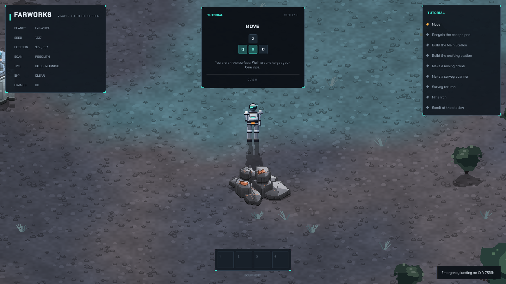

The suit still has to be legible against dark rock, so the mean value is within four of where the
painting put it. What has changed is the range, which was 21 to 247 and is now 9 to 255.

**Also:** the art dump writes every frame of the walk rather than the standing pose alone. A figure
posed off its phase never goes wrong on the frame you would have thought to ask for.

---

## [1.43.0] - 2026-09-08

The sky does something, and the base lights up when it stops giving light.

**Weather.** Seven spells -- clear, fair, overcast, drizzle, rain, a downpour and a storm -- picked
off a chain that never steps more than a place or two, so the sky walks from one to the next rather
than cutting between them. Each spell settles three figures: how much cloud is over the sky, how
hard it is raining and how electric it is. They ease over about half a minute, so a downpour is
something you watch arrive. It is stepped beside the clock rather than drawn, which means a host
with no screen has weather, everybody on one planet stands in the same shower, and a save left in
the rain comes back to it. And it is rolled off the planet's own seed, so the same seed gets the
same afternoons in the same order on any machine, with nothing passing between them.

**Cloud shadows, on the ground.** There is no sky in this game -- the camera looks down and the top
of the picture is more planet -- so cloud can only be known by what it takes away. Slow, faint dark
patches cross the base, anchored to the map and not to the view: the shader follows each corner of
one full-screen quad down the line of sight until it meets the ground and reads the cloud field
*there*, which is exact rather than approximate because an orthographic camera has one line of
sight for every pixel. Two layers at different sizes and speeds, so it never repeats. Strongest on
a fair day with cloud crossing it, and weakest under a solid overcast, where there is no beam left
to interrupt.

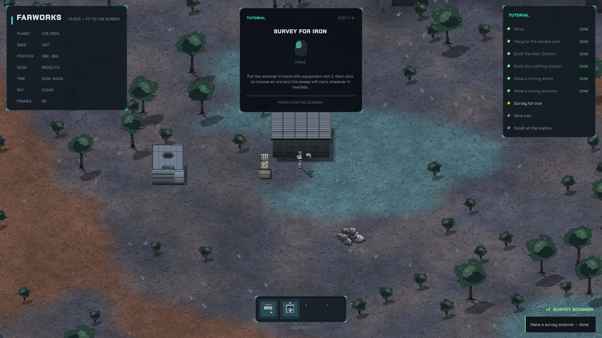

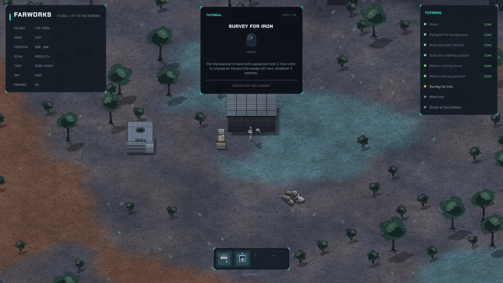

**Rain at three weights.** Three sheets of streaks between the eye and the world at different sizes
and speeds, and the sheets come in one at a time as it gets heavier -- so drizzle is genuinely a
handful of drops with the planet showing between them and a downpour is four times as many, rather
than the same rain painted more opaquely. It slants with the wind, which is the same wind that
carries the cloud shadows, so turning the camera a quarter leans the rain the other way. And it
lands: rings open and fade on whatever surface is actually under them.

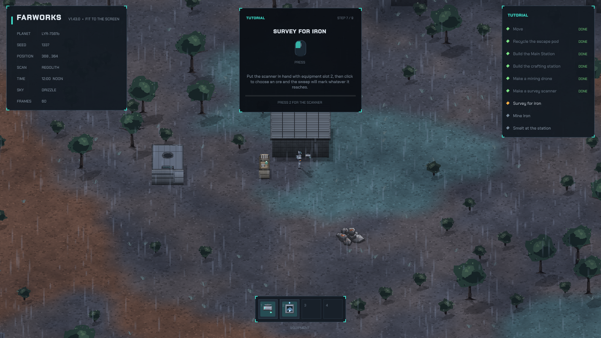

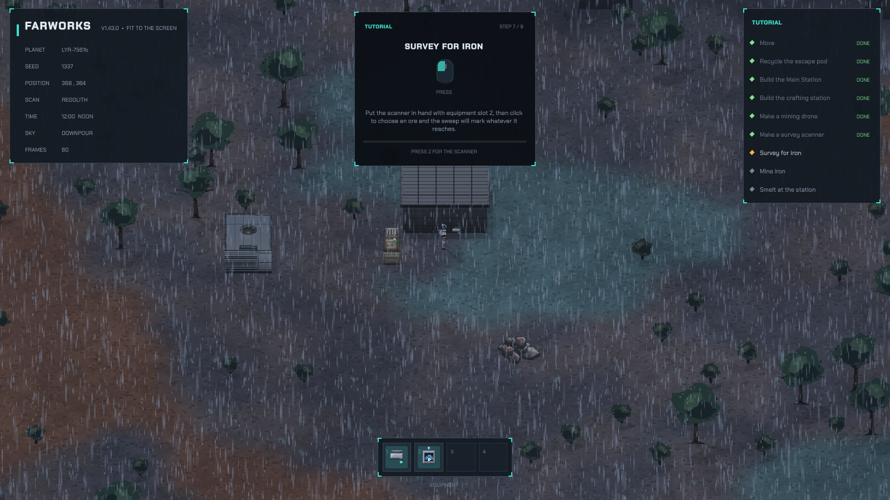

**It does not fall indoors.** The rain is one sheet across the whole screen and knows nothing about
where it is, so every roof on the map stamps its own shape into the stencil buffer and the sheet
draws where the stencil is still clear. That comes out geometrically exact for nothing: the dry
patch is the room, in perspective, whatever shape somebody built. It holds when the cutaway fades
that roof away to show the room underneath -- which is precisely the moment anybody would notice
rain falling on their head indoors -- and no splash is started on a floor with a lid over it.

**Storms are heavy rain with the sky going off over it.** Same cloud, same rain, same dark, plus
lightning: a hard stab and a weaker return stroke behind it, over the whole screen, above the wash
that says what time of day it is, because a bolt lights the night rather than being dimmed by it.
The thunder follows its own flash by however far off the strike was. When a strike happens is world
state and everybody sees the same one; what it looks like runs on real time, so a storm at four
times speed has four times the lightning in it and each bolt still lasts as long as a bolt lasts.

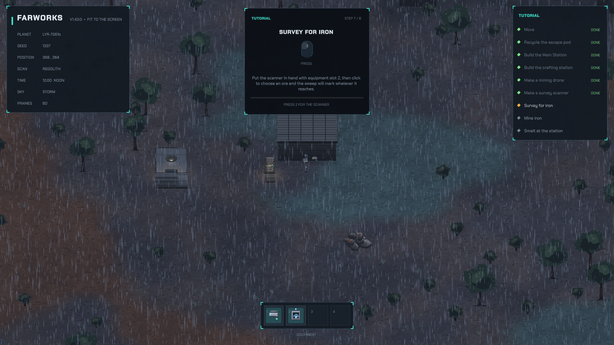

**A bad sky keeps the daylight.** One multiply, in the one place every cue in the game already went
through: shadows soften and go out, the wash over the world thickens and cools, and a storm at
midday comes down to about a fifth of the light a clear one has. Nothing else had to be told that
weather exists.

**And the base burns lamps.** Every building that is not fabric -- not a wall, a floor or a flight
of steps -- throws a warm pool on the ground it stands on and carries a light over its roofline.
They are added to what is behind them rather than drawn over it, and they are laid on over the
darkness rather than under it, which is the whole difference between a lamp and a picture of one.
They come up off the daylight rather than off the clock, so the same lamps that come on at dusk
come on at midday under a storm, and they go out with the grid: a base going dark is a grid that
has gone down, seen from across the map without opening a panel.

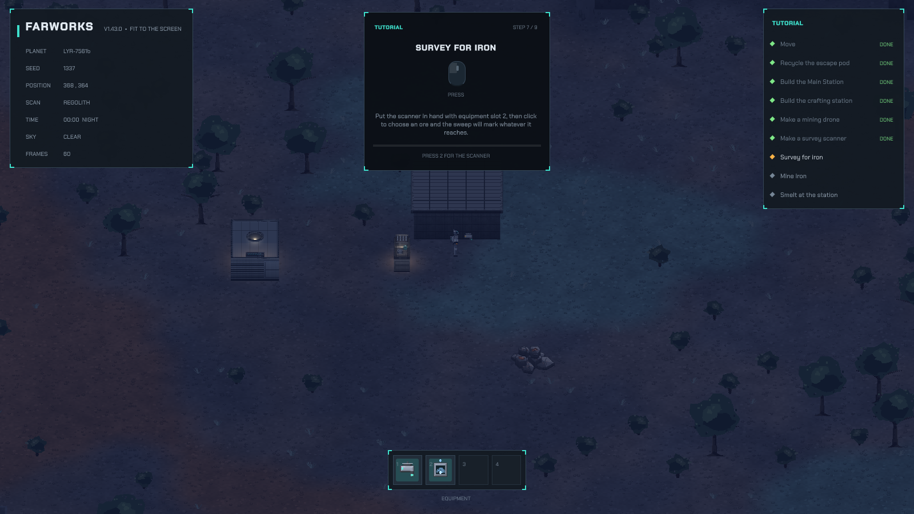

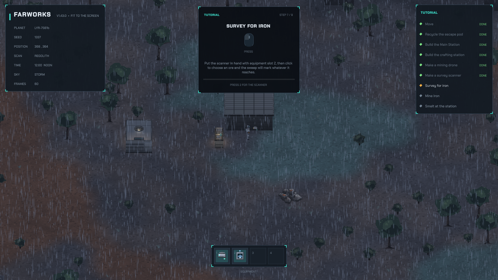

**Also.** The readout carries a SKY line beside the clock. The cheat page has a WEATHER row that
pins a spell and stops the sky running, because a storm that gets rained off twenty seconds after
somebody asked for it is not a cheat. Saves carry the spell and how far through it they were. Two
cues are named and waiting for a recording, `Rain` and `Thunder`. And there is a `weather` capture
scene, which shoots the seven skies and asserts the chain of consequences behind them -- that a
worse sky is gloomier, that gloom is what puts the lamps up, that rain is only drawn while it is
raining, that it lands, that no roof lets it through, and that a storm actually throws lightning
rather than merely being darker.

---

## [1.42.0] - 2026-09-08

The trees grew up, and started standing on the ground.

**A tree is twice a person now, because that is what it always said it was.** The flora sheet is
painted to a height in real tiles and cut at the same pixel scale as the ground, the character and
every machine on the planet. It used to be a small cell scaled up at placement, and that one
decision was two faults at once: an ironbark came out *shorter* than the character it is supposed
to be twice the height of, and it was made of pixels twice the size of the dirt it stood on. Chunky
foliage on crisp ground reads as a sticker, and repainting the sticker does not fix it. Size lives
in the drawing now, so the number that claims how big a plant is, is the number that draws it.

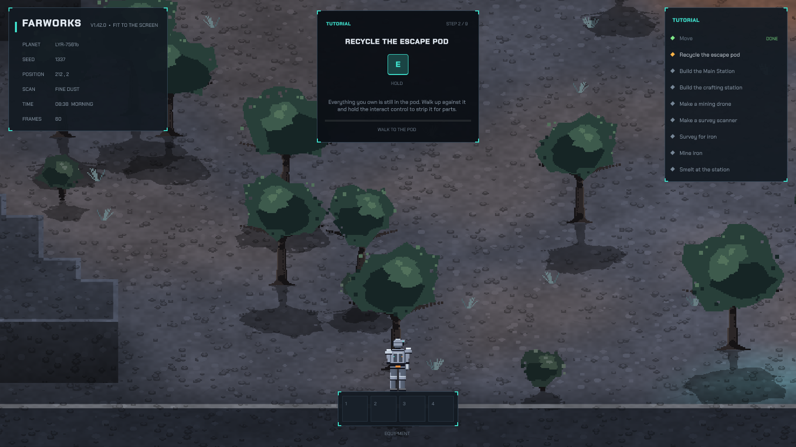

**They throw real shadows.** Laid over from the roots the way the character's is, swinging round
and lengthening through the day, in place of a contact diamond painted into the sheet that nobody
could see. What they do not do is join the shadow field -- that list is walked in full by every
sprite that asks whether it is in shade, and a wood in front of the camera is a couple of hundred
plants, so letting them in would turn a handful of distance tests into tens of thousands of them
every frame. A wood casts. It does not answer questions. Walking under a tree does not darken you,
and that is a small price for a wood that sits on the planet rather than floating over it.

**A crown is one silhouette with the light painted onto it, not a bunch of clumps.** The first
attempt at this drew clumps with dark rims so they would read separately, and what that actually
draws is a rank of cabbages: six rimmed discs in a ring with every seam picked out in black.
Foliage does not separate by outline, it separates by light -- so the mass goes down as one ragged
shape, the underside goes dark, and five unequal patches of sun land on the half of it facing the
light. Along the way: the bites out of every crown's edge had been painted in a transparent colour
since they were written, which does nothing at all, so foliage had been added to and never cut.
That is the one construction guaranteed to come out convex.

**The palette is measured against the planet rather than against itself.** Every ground on this
world sits between about 0.13 and 0.39 in value and all of them are cold; the old foliage was
near-pure mint at two thirds brightness, three times the value of the dirt and the most saturated
thing on the screen. The mass of a plant is darker than the ground it grows out of now, and only
its lit face comes up past it. A canopy is a hole in the sky with a bright edge, not a lamp.

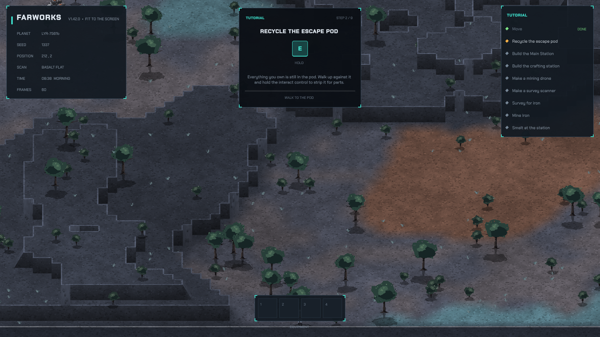

Trunks got the same going over: the light on this planet comes from up and to the left, so the
**left** of a trunk is its lit edge, which it had backwards for its whole life. Roots are two short
uneven wedges spreading out of the base rather than a swell in the column -- swelling the column
draws a cone, and a cone under a pole is a lamp post on a base plate. And the outer boughs reach
past the crown's own outline, because a bough entirely inside the leaves is a bough nobody sees.

Ash scrub and rime bristle went through the same palette and the same construction, since three
plants drawn from one sheet in two different languages is just moving the mismatch around. The
tuft alone throws nothing: it is four times thicker on the ground than anything else, and its
shadow is eight pixels nobody would ever pick out of the speckle on the dirt.

The method is written up in [docs/design/flora.md](docs/design/flora.md), beside the hull notes,
including the thing that cost the most to learn -- that the two zooms disagree. The first tree that
read well standing next to it was a row of cabbages seen from across the valley.

---

## [1.41.0] - 2026-09-07

A floor is one floor, and a wall gets out of the way by ducking.

**A block is drawn for what it has joined onto.** Walls have been since they existed -- sixteen
pieces, one per set of neighbours, so a run of wall meets itself at every tile boundary. Floors
were not: every slab and every deck plate drew its own full edge, kerb, score and all, so a room
seen from above was a rack of trays rather than a floor and a roofed base was a grid of separate
lids. They ask the same question now. A side with more of the same floor flush against it keeps
the score at the tile boundary and loses everything else: no kerb, no pins, no lit rim, no step in
the relief and no side face. The line stays because it is the one thing on a floor worth keeping
-- it says how big the floor is and where a machine will land -- and the kerb goes because a thing
standing off the surface between two slabs that are flush against each other is a ridge through
the middle of one floor.

**And the geometry between them goes with it.** Two tiles flush against each other each raised the
face on the boundary they share: two identical quads in the same plane, and which of them was
drawn changed with the camera, so the floor of a base crawled as you walked round it. Each piece
now knows which of its four sides face another piece of itself and raises the rest.

**A wall under a floor is flat on top.** The rails along the top of a wall are the top of the wall,
and they stand a seventh of a tile above the storey plane -- which is exactly where the next floor
is laid. Every wall carrying a deck had its coping standing through the deck it was carrying. A
wall with a floor over its head is capped instead, and a door's jambs, which stand higher still,
go the same way.

**A wall between you and the camera ducks rather than dissolves.** The cutaway had one answer for
both ways of being in the way, and fading is only the right one for a ceiling: there is no shorter
version of a floor. A wall has a height, and the top of it is the whole of what is in the way. So
it stands down to about a third while somebody is behind it and comes back up when they are not --
visually, and only visually; nothing walks through a stooped wall that could not walk through it
standing up.

**A hull being seen through no longer stamps the depth buffer.** A hull is solid geometry, and it
went on writing depth while the cutaway had turned it to glass -- so the room behind it was
rejected in patches, and which patches depended on how two renderers happened to be sorted that
frame. It flickered, and it flickered hardest stood right behind a wall, which is the one moment
the cutaway exists for. A hull that is not opaque is drawn as transparent geometry now.

**A deck's thickness hangs under it.** The lip that says a floor is above the ground rather than on
it was standing up instead: the plan was drawn at the storey and the mesh went up from there, so
every roof tile was a shallow tray with its own floor sunk a lip below its rim, and anyone walking
on one waded through the edges of it. Sides hang from the plan now, which is where they already
were for everything except this.

**A shadow of a floor meets the shadow of the floor next to it.** Every caster's silhouette is
squashed along the light so it lies down, and spread a little for each storey it falls, both
measured from the caster's own middle -- right for a smelter and wrong for a tile of something
bigger. A slab squashed to four fifths about its own centre leaves a fifth of a tile of daylight
between its shadow and its neighbour's, so a roofed base laid a shadow with its own tiles ruled
across it in gaps. A piece that tiles throws its silhouette at its own size, and the union of them
is the building.

**A stair on a foundation can be taken apart.** A tile can carry two buildings -- that is what a
floor is for -- and it answered with whichever was built first, which is always the floor. So a
flight laid on a slab could not be pointed at at all: the teardown cursor named the foundation,
and holding the key took the slab up from under the flight. The floor answers last now.

Four claims here are ones a picture cannot settle, so the capture pass makes them instead: which
of the sixteen a deck tile in the middle of a span has chosen, which one at its corner has, that a
wall under a deck is capped, and that the teardown cursor over a stair on a foundation finds the
stair.

---

## [1.40.1] - 2026-09-07

Sound put in its place: where a noise comes from, and how far it carries.

**The ear stands where the view is looking**, on the ground, and it is turned exactly as the camera
is turned. The turn is the whole of the panning. The view can be spun a quarter at a time, and an ear
left pointing north would have put a machine on the right of the screen into the left ear the moment
somebody turned the camera -- which is worse than no panning at all.

**Panning is geometry rather than a fudge.** A sound is panned by the angle between it and where the
ear points, never by how far off it is, so an ear lying flat on the ground hears everything due east
at ninety degrees to the right whether it is one tile away or thirty: a smelter you are standing
beside would be entirely in one ear. The ear therefore stands back off the ground along the line of
sight, by a third of half the width of the view, and the angle then falls out of the distance for
free. A tile to your right is a few degrees off centre and barely panned; the edge of the screen is
past seventy degrees and firmly to the right; everything between slides across as you walk past it.
A fraction of the view rather than a distance, so it holds at every zoom.

**Earshot is measured in screens, not in metres.** The falloff curve is written out rather than left
to the engine's linear or logarithmic modes, because neither can say the thing this game needs to
say: everything on screen is clearly audible, and everything off it fades quickly. Its axis is
normalised to the corner of the screen and half again, recomputed every frame from the camera -- so a
sound underfoot is at 0.91, one at the corner of the picture is at 0.50, and one a screen beyond it
is gone. Zoom out over the whole base and the whole base is audible; zoom in on one smelter and the
factory behind you drops away.

A little spread takes the edge off the extremes, because a sound entirely in one ear is fine in a
game where turning your head is the answer and unpleasant in one looked at from overhead.

None of this can be judged by ear yet -- there are still no clips -- so the capture pass checks the
arithmetic instead, at both ends of the zoom: that the ear is turned within a degree of the camera,
that a sound at the corner of the screen comes back well clear of silence, and that one a screen
past it comes back at nothing.

---

## [1.40.0] - 2026-09-07

Everything a sound needs except the sounds.

**Escape, then OPTIONS, then SOUND.** A volume for each of four channels -- music, ambience,
effects and the interface -- and a master over them, in steps of ten percent, on the same page in
both menus for the same reason the graphics page is: speakers belong to the room the machine is in
rather than to the planet. Arrows rather than a slider, like every other setting in the game, and a
channel stops at silence instead of wrapping round to full, because a volume that answers one more
notch of quiet with the loudest thing in the game is a volume that does it through headphones.

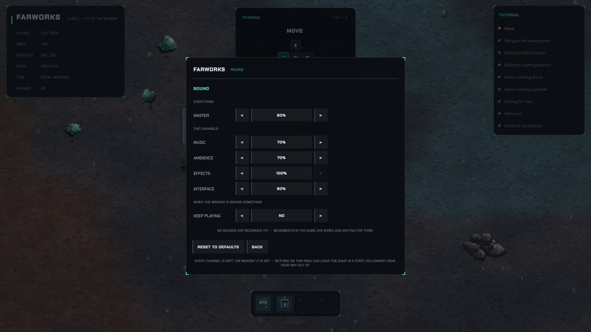

**The game does not ship with any sounds yet, and the page says so.** That is the whole shape of
this release: what has been built is everything *around* a sound -- the channels, the settings, the
mixer, the ear, and forty-nine moments in the game that already ask to be heard. Every button in
both menus, pressed and hovered. Panels and rings opening. A placement, a run of belt, a
disassembly, a bite out of an outcrop, a stack lifted and put down, one burned. A machine starting,
stopping, and each item out of it. Construction finishing. The wheel, while somebody is turning it.
The sweep going out and each deposit it finds. Footfalls, taken off the walk cycle rather than a
timer, so they land with the legs at any speed. A grid going dark. Somebody arriving, leaving, or
saying something.

**Adding a sound is a file.** Drop `build-placed.wav` into `Assets/_Factory/Resources/Sound` and
that is the entire job -- no prefab, no inspector, no reference to wire. The name comes from the cue
itself, so a clip can never be looking for a file called something else, and numbered variants
(`tool-hit-1`, `-2`, `-3`) are picked between at random for anything that repeats. A cue with no
clip is silence and nothing else: no warning, no cost, which is exactly why all forty-nine call
sites could go in before a single sound existed. The game keeps the list of what has been asked for
and had nothing to play -- the work left to do, counted by the game rather than by hand.

**Sound cannot reach the simulation**, which was the one thing worth being careful about. A headless
host makes none at all. Pitch variation and clip choice come from the director's own random stream
rather than the shared one, so a machine that happened to hear something cannot pull a number out
from under a co-op run. The cues that belong to a machine's state are raised from the drawing half
rather than the simulated half. And the other side of that rule is free: cues are raised where
actions are applied, and every machine applies everybody's actions -- so a mate building something
across the base is heard from across the base, with no networking of its own.

**The ear is on the player, not on the camera.** It was on the camera in the scene, which was right
while the camera looked straight down from above and wrong the moment the view was tilted: the
camera now stands tens of units back and above what is in the middle of its picture. Sixteen voices,
oldest taken when they are all busy -- a mixing limit rather than a memory one -- and loops get a
source of their own and a handle back, so a machine that is taken down stops its own hum.

The game also goes quiet when its window is put behind something else, unless you say otherwise on
the page. The opposite of what the engine does on its own, and the right way round for a game played
alongside a browser for hours.

See `docs/design/sound.md` for the channels, the rules and what is deliberately still missing --
belt ambience, ducking, and footsteps that know what they are landing on.

---

## [1.39.0] - 2026-09-07

A cheat page, in the pause menu of every run.

**Escape, then CHEATS.** The cheats have been on the function keys since 0.27.0 and only existed
at all in the editor or in a build launched with `-factoryDev`, which is the right home for a
shortcut and the wrong one for the two of them that are switches rather than presses. Running the
clock fast and never running out of concrete are things you reach for part way through an ordinary
evening with the game, and a cheat you have to relaunch with a command line flag to get at is a
cheat that does not exist.

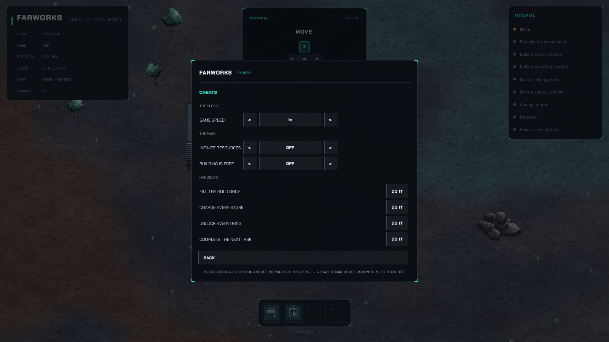

**Game speed** is the ladder the `-` and `=` keys already walked, from a quarter speed to eight
times, with the rung it is on written where you can see it. In a co-op run the row is greyed for a
client: the clock is the host's, because a client running its own copy faster is not a faster game,
it is two machines disagreeing about how much has happened.

**Infinite resources** is new. While it is on, every ore, bar and part in the hold goes back to a
full stack several times a second -- so a belt priced by the tile, a machine fed by hand and a wall
paid for out of the pack all behave exactly as they really do, and simply never run you out. It is
deliberately a different cheat from **building is free**, which is also on the page: free building
skips the paying, and this skips the fetching. It hands over no tools, because those are not
resources.

The four handouts that were only ever on keys -- fill the hold, charge every store, unlock
everything, complete the next task -- are on the page too, under their own heading. Switches change
how the run behaves from here on and handouts change what is in it this second, and a page that
mixed the two would be a page where you could not tell which press you were about to be living with.

**The shortcut keys have not moved** and are still development kit: `F1` is one fat finger from
filling a hold nobody asked to have filled. Nothing on the page is written into a save, and every
load reloads the scene, so a loaded game comes back with every cheat off.

**Fixed on the way:** the cheat tick sat behind the guard that keeps stray key presses out of the
game while something is being typed into and while the capture pass drives the clock. A switch is
not a key press -- so a hold that stopped refilling itself because somebody opened a text field,
and one that did nothing whatsoever for the length of a capture run. The switches tick on their own
now, and the keys stayed behind the guard where they belong.

---

## [1.38.0] - 2026-09-07

The building blocks, reworked: what may stand on what, where you are allowed to put it, and what
the pieces look like once they are standing.

**A foundation is a floor, so anything stands on one.** A machine always could. A wall could not,
nor a door, nor a flight of steps -- a block on the ground refused every other block, foundations
included, on the argument that stacking them would turn a floor plan into a guessing game about
what is underneath. The guess is answered by looking, and what the rule actually cost was the
obvious thing: laying a slab and building the room on it. Now the only thing refused on a deck is
another deck, which is genuinely two floors in one place.

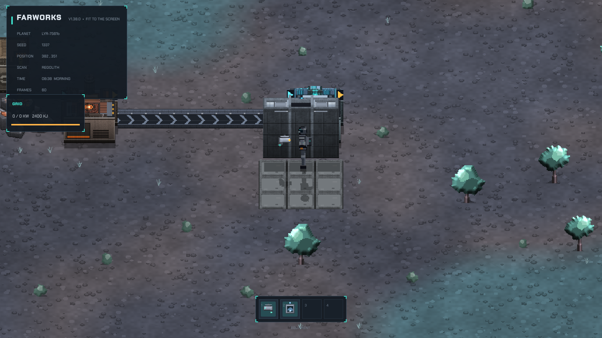

**A deck holds itself up, and nothing else does.** A roof used to need something load-bearing
within three tiles of it on the floor below, so a base could only grow upward from inside a room
it had already built -- and a wall that happened to be carrying something refused to come out of
the run it was in. A foundation may now be laid in **mid air**, which is how a second storey gets
started over open ground; everything that is not a deck still wants a floor under it, which is what
makes laying a floor worth doing. The support rule is gone, and so is the wall that would not
budge.

**And a way to say which storey you mean.** A cursor can only ever point at a place on the screen,
and one screen pixel is the ground, the roof of the shed behind it and every floor in between --
so as soon as a slab can go in the air, the mouse has run out of answers. `F` takes the ghost off
the cursor: the arrows walk it a tile at a time in the direction you are facing, `Page Up` and
`Page Down` move it a storey, and the prompt says which storey it is on. One press is one tile;
holding repeats. The mode stays up between pieces, because laying a floor by hand is laying forty
slabs by hand. `F` again gives the arrows back to the walk.

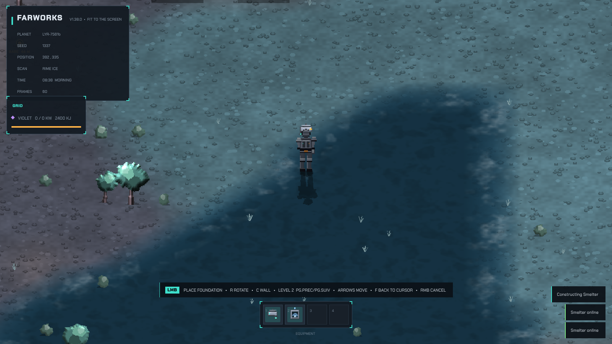

**The blocks are cut from heightmaps now**, which is the last of the eleven-hull conversion from
1.37.0 -- the four things a base is made of were the ones that never got one, and they were the
four flat lids left in the game.

- A **foundation** is a cast slab with a kerb round it and a pin at each corner, poured level with
  the floor so nothing standing on it sinks and it throws no shadow. Two slabs side by side meet in
  a shallow ridge with a score between them, so a floor is countable in tiles from any quarter
  rather than by a line painted on it.
- A **wall** is a panel held between two rails, and the rails stand up. They are cut from the same
  shape the wall is, so a run is capped along its length, a corner is capped round its corner, and
  a wall with nothing to join is a post that stands a little proud of both.
- A **door** carries the same rails through the opening, with **jambs** standing higher than
  anything on a wall -- which is what makes a doorway findable down a long run of one. The opening
  was cut back off the rails to make room for them; it used to leave one pixel of rail top and
  bottom, which was fine while a rail was a painted line.
- A **deck** gets an edge beam and its bolts. Its joists are drawn and deliberately *not* raised:
  standing them up as ribs was three dark bands to a tile, and over a roofed base the floor stopped
  being a floor and became a rack of trays.
- A **staircase** gets a handrail, sloping with the climb rather than stepping with the treads, on
  a post every other step. It is the one block with nothing standing above the floor it lands on,
  so a flight against a wall used to end in nothing at all.

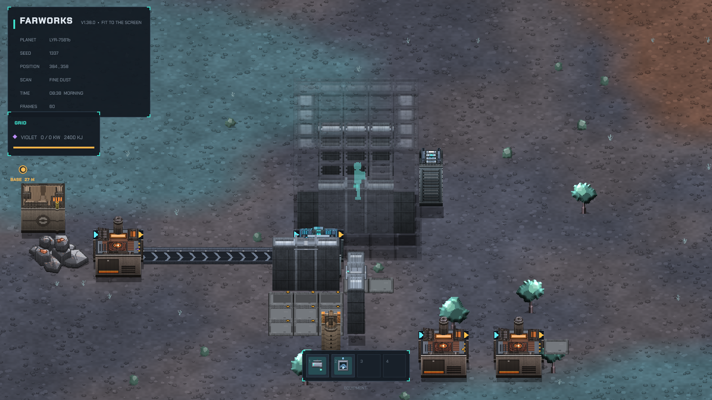

**Also:** relief on these is painted *down* rather than up. A cap on a hull drawn in plate takes
the plan's own pixel and adds the light of the sky, so a kerb painted in the slab's own concrete
comes back as a pale band round every slab in the base -- the same lesson the miner's cutter head
taught in 1.37.4, learned again on four more pieces.

**Known:** a mark on the ground under a floating ghost was built and dropped -- it reports itself
enabled, sprited, coloured and correctly positioned, and rasterises nothing. Written up as
[KNOWN-ISSUES 7](docs/KNOWN-ISSUES.md) rather than shipped dead. The storey is said in words in the
prompt instead, which is the information it was for.

---

## [1.37.4] - 2026-09-07

The miner's drill bit has not been visible since the world went 3D.

**It was sitting on the floor.** A hundredth of a unit up, which was right when a miner was a
picture and the ground and the deck were the same plane. Once the frame became a solid one and a
third of a unit tall, the bit stayed down there -- behind the machine's own front face, from every
angle the camera can be turned to. The one moving part that tells you a miner is cutting has been
hidden for the whole of that time. It is at the height of the deck the frame leaves a hole in now,
which is where its sprite was always drawn to sit: sized to that hole and no wider.

**And it is a cutter head rather than a disc with three lines on it.** A boss over the shaft
standing highest, three arms as ribs off it, a cutter proud at the end of each and a tip proud of
that, and the rim nearly down at the plate. One mesh for the life of the game, carried by the
transform that already spins, because a bit spinning is a bit turned and the shape never changes
with the angle -- the same trade the belt's rails make.

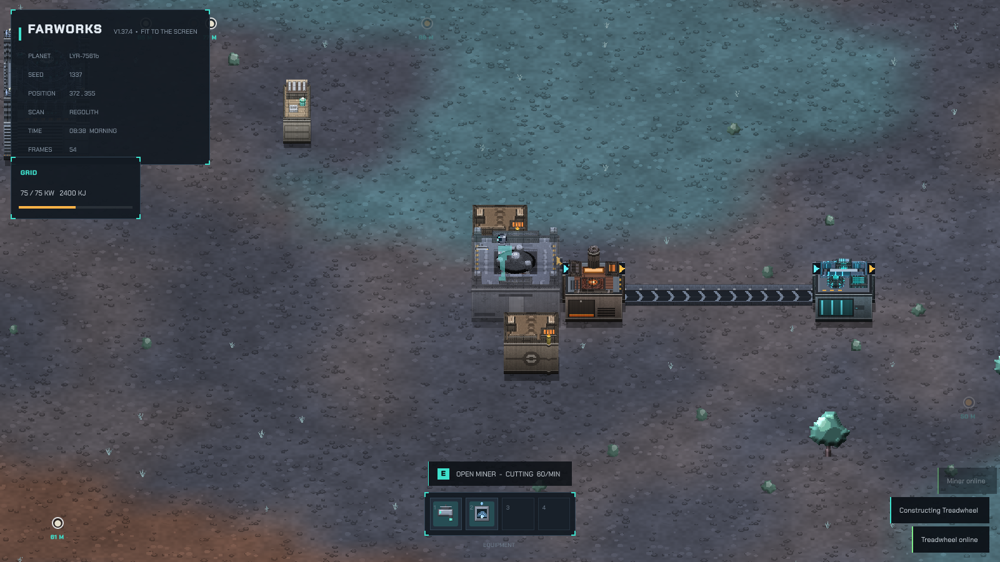

**Also:** the head is painted darker than the drawing beneath it. A lid on a hull drawn in plate
takes the plan's own pixel and adds the light of the sky, and it takes it flat -- there is no fall
across a lid the way there is down a wall. Painted in the sprite's own steel it came back as one
pale mass with the form shading that made it read as metal thrown away.

---

## [1.37.3] - 2026-09-07

The last block was standing next to the smoke.

**A smelter's stack was the one piece of relief left that was a box**, on the argument that a stack
is a box. It was also, like every block before it, standing where the drawing puts nothing -- and
here something else already knew where a stack belongs. The plume is vented at the middle of the
north edge and the block sat in the corner above the mould, so a working smelter has always smoked
out of a patch of bare roof beside its own chimney.

**There is a stack drawn now, over the vent**, and it is relief rather than a block for the reason
every cap in this release turned out to matter: a block's cap is plain plate whatever the plan
underneath says, and the one thing a stack must have on top of it is a hole. Turned, tapered, and
open at the mouth.

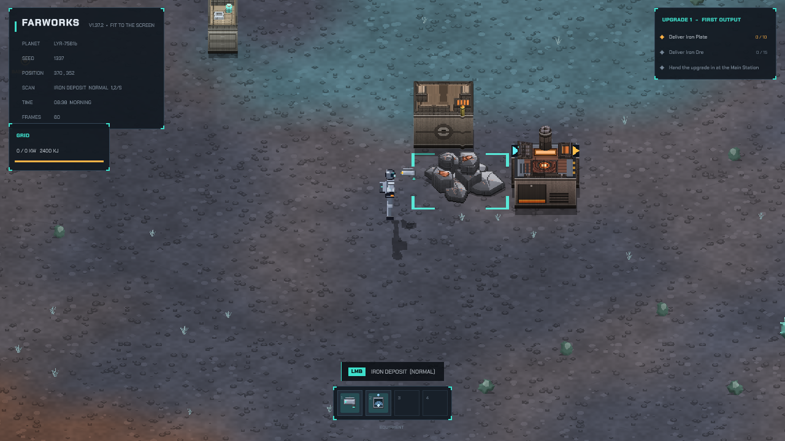

**And that empties the apparatus behind it.** `ReliefOf` returned a list of blocks per building;
every one of those buildings is cut from its own heightmap now, so the struct, the routine that
turned a block with its hull, the one that raised four walls and a cap for each, the one that laid
their shadows on the roof, the one that worked out what a block was standing on, and the two
constants for how far a roof shadow reached are all gone with it. Working out the tallest thing on
a hull used to mean finding the best stack of block-upon-relief; it is the highest pixel of the
plan. 345 lines out, 9 in.

**Every hull in the game is now cut to the shape its own drawing describes**, which is what the
three releases starting at 1.37.0 were for.

---

## [1.37.2] - 2026-09-07

The escape pod is standing on its feet.

**Its landing struts were the one part of it given a height and no shape.** Everything else on the
capsule was cut to the curve the drawing describes -- the barrel, the canopy bulging out of the
crown, the seams sunk into the hull -- and then the two struts were set at a flat sixth of a unit
and left there, sitting neither on the pod nor on the ground. That is the exact fault the heightmap
was for.

**A strut carries weight**, so it leaves the hull at the height of the hull's own flank and runs
down and out to a pad lying flat on the dirt. Which is a ramp, and the ramp is the whole of what was
missing.

**It needed something drawn under it, too.** Relief is cut from the plan, so a leg with nothing at
its outer end can only ever be a leg ending in mid air -- and the drawing gave a strut a dark bar
and stopped. There are pads now, wide enough to read as feet rather than as the end of a bar. That
width is what made the difference: the first attempt was correct and almost invisible, because a
capsule's own bulk stands in front of anything small on its flanks.

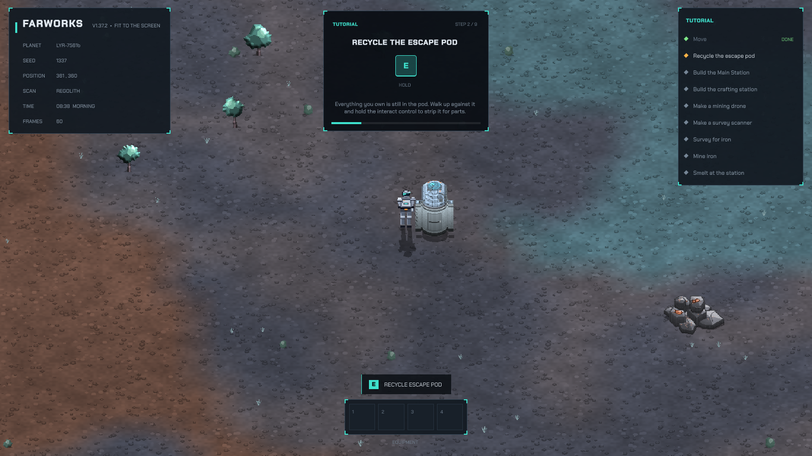

---

## [1.37.1] - 2026-09-07

The belt was the flattest thing left on the planet.

**Every machine around it grew relief in 1.37.0 and the belt did not**, so a run of them read as a
decal painted on the floor between raised things. A belt is also not a hull: `Belt` is its own
component, never extruded, no slab, height nought, its tiles sitting a hundredth of a unit off the
ground. There was no heightmap to write for it.

**What it gets instead is a rail hull** -- three static meshes, one per shape a tile can be --
raised from a plan that is only the rail pixels, asked with the same tests the sprite uses to decide
what a rail is rather than read back off the finished picture. The surface between the rails does
not move: the stock rides where it always rode, at the height it always rode, and machines meet the
belt at their ports exactly where they met it before.

**Only the outer lip stands up**, because the rollers are drawn down the middle of a rail and they
slide with the belt. A lid over the full width froze them -- a lid is the plan reproduced, and the
plan one is cut from here has to be a single picture for every frame, or this becomes a mesh swap
per tile per frame of every run in the base. So the lip rises, and the roller course stays at the
surface wearing the sprite that moves.

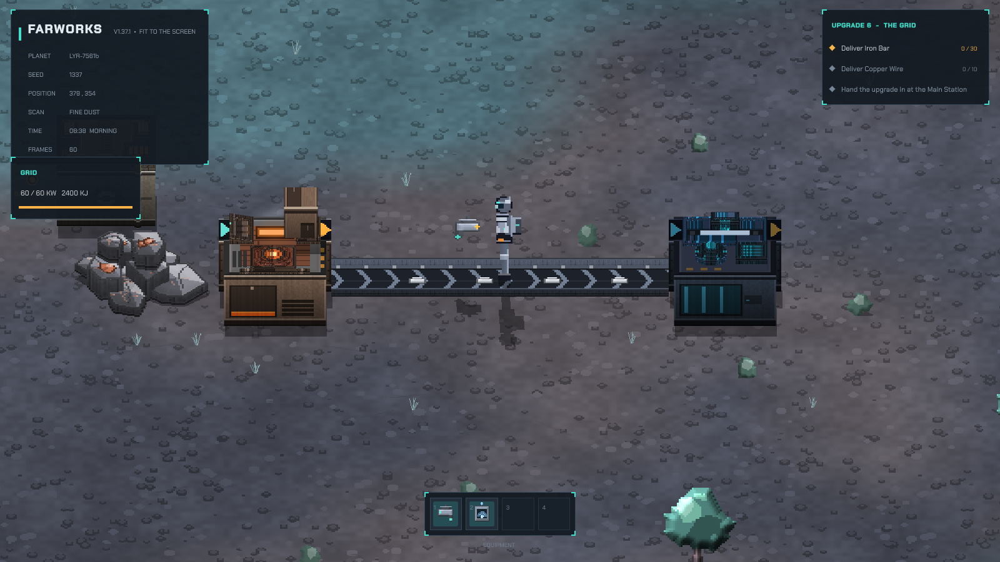
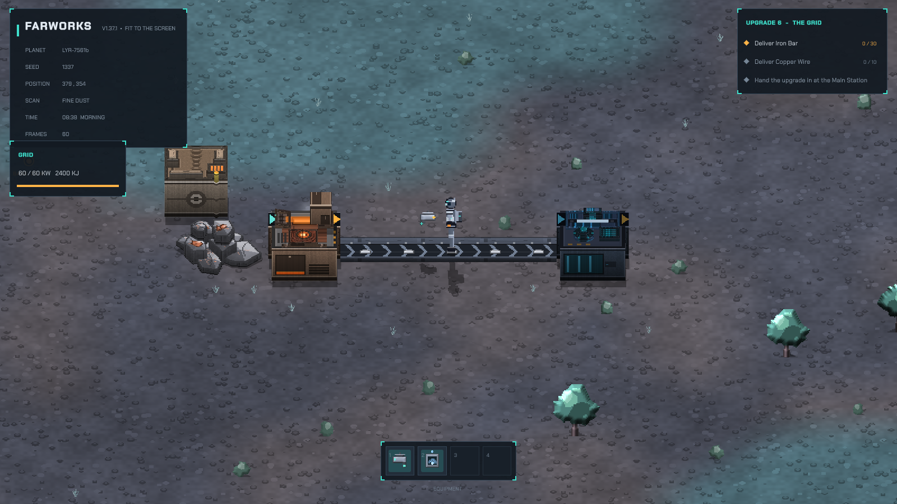

**Fixed:** relief was being tinted against the plan's own average colour on hulls drawn in plate.
That normalisation exists because the sheet a machine's relief sits on already carries that colour,
having been mixed from it -- and the plate sheet does not. It is generic, the same for everything
using it. The belt is the first hull on plate to carry a heightmap and it came out with rails lit
like strip lights, because rails are the brightest thing on a belt and the formula read that as a
reason to make them brighter still. Every machine has a flank of its own, so nothing shipped in
1.37.0 was affected.

---

## [1.37.0] - 2026-09-07

Every building was a prism.

**The outline was already exact and the height was a single number.** A hull is traced from the
picture painted on top of it -- the mesh walks every pixel of the plan and raises a wall wherever a
solid pixel meets an empty one, so a smelter notched in by a pixel gets a face notched in by a
pixel. That part was right. What was wrong is that `Stands` was one float for the whole footprint,
so whatever shape the outline cut, the thing standing in it had a flat lid, dead vertical sides and
exactly one altitude. No slope, no chamfer, no dome, no recess. The only relief in the game came
from a handful of axis-aligned boxes bolted onto the lid.

**A plan carries a height per pixel now.** A wall goes up wherever the height changes rather than
only where the machine stops, and the raised part of a plan gets a lid of its own. What that buys
is every shape a box cannot hold: a domed firebox, a tapered hopper, a chamfered lip, a dished
well, a barrel, a roof that steps. Depth is measured up from the roof plane and never down -- the
roof is still the sprite, one flat quad, so a recess is made by raising what surrounds it.

**Curves are terraced on purpose.** A heightmap is read a pixel at a time, so a smooth dome is not
smooth once it is built: every column of the curve lands on its own height, gets its own one-pixel
riser, and the result is corduroy. Four wide steps read as a turned casting where twenty-six narrow
ones read as noise. Deliberate steps beat accidental ones.

**Eleven hulls were converted, and nine of the eleven blocks turned out to be doing harm.** Six
were sitting on top of the thing that mattered: the container's contents, the miner's shaft, the
pod's canopy, the crafting station's tools, the treadwheel's wheel, the pole's mast. Two more were
painting over the material itself -- a block's cap is plain plate whatever the plan underneath it
says, so the timber crate was rendering grey and the pod's beacon was rendering blank. Only the
crate's lid was the right shape to begin with, and even that was the wrong colour.

- **The smelter** has a domed firebox where it had a box, its charging hopper leans back toward
  the mouth it is fed from, and the mould has a chamfered lip with the casting well set inside it.

  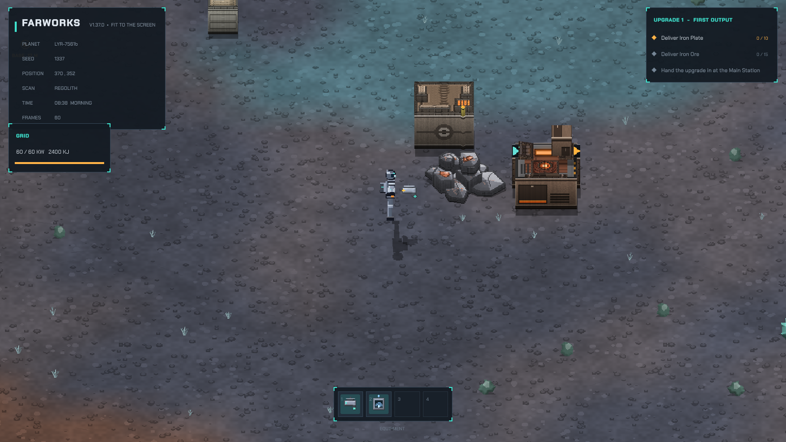

- **The crafter** is cut the opposite way round, because a machine tool is a frame with a bed sunk
  into it: the edge rises, and the deepest line on the whole thing is the groove the stock runs
  along. The rotary tool head is four terraced discs.

  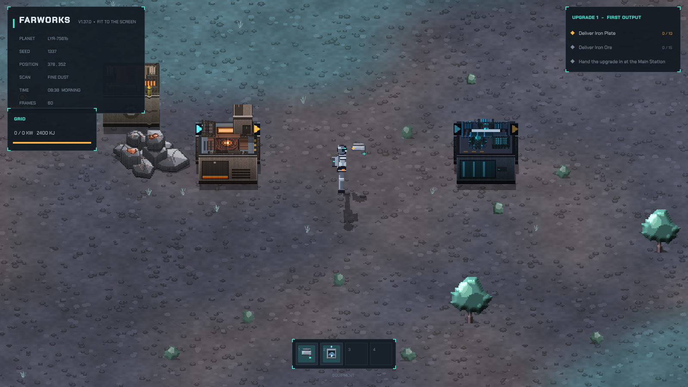

- **The station** grows in its heightmap, so every upgrade adds equipment a player can see from
  outside their own base. The socket is a dead collar until the well is brought up and then it is
  the mouth of a terraced tower. The heat exchangers get their ten fins a side, one at a time. The
  dishes are terraced down to a floor and back up to a feed horn. The beacon is the last thing
  there is to add, so it stands highest.

  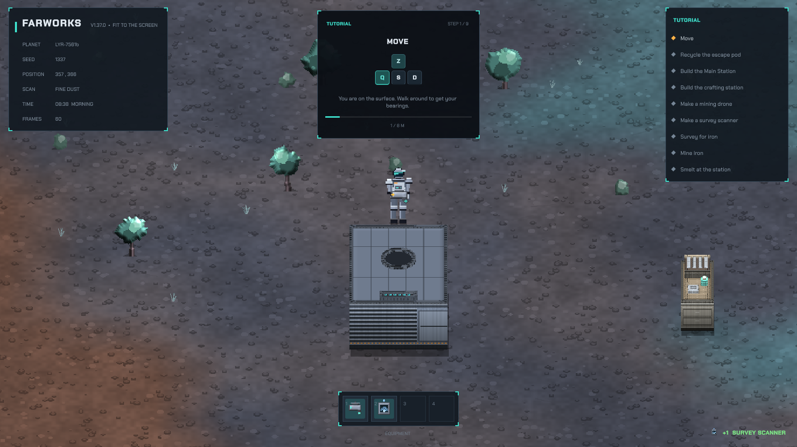
  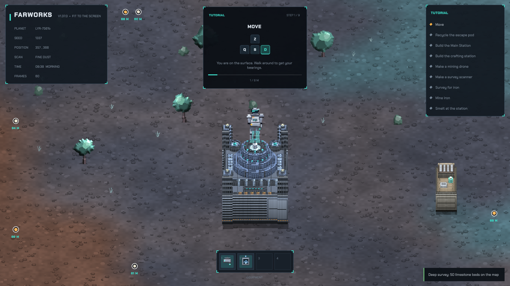

- **The container** was the sharpest of them. It is drawn with a pallet of stock inside it on
  purpose -- so that a full one and an empty one are not the same picture from above -- and its
  block was a lid over all of it. Wall up, floor down, and the wall corrugated, because that is
  what a container is. **The crate** beside it keeps its lid, which was right, and gains the
  grooves between its planks, the steel strapped over them and a catch you could get a finger
  under. It is also timber now instead of grey.

  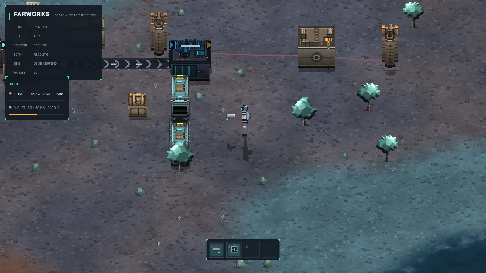

- **The miner** had a box over the hole in the middle of its frame, which is the shaft the bit
  works in and the entire reason a frame is a frame. The deck comes up so the shaft can be a
  shaft, the corner blocks are legs, and the motor's seven vents are seven openings.

  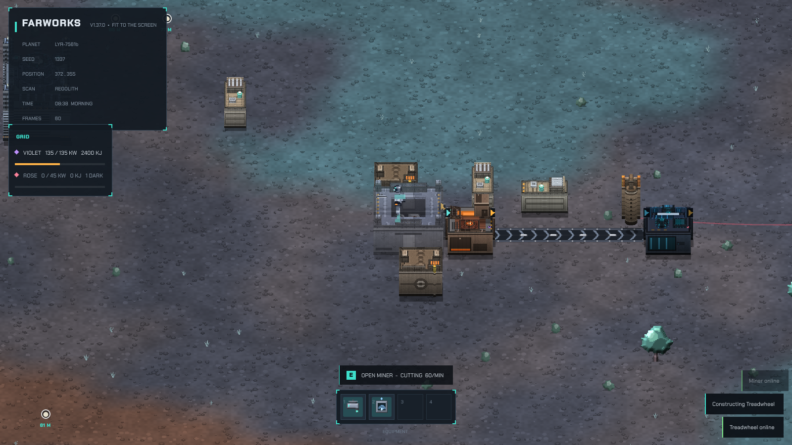

- **The escape pod** is terraced out from its spine, so it falls away in every direction at once
  rather than having a barrel's flanks and a tube's ends. The canopy bulges out of the crown, the
  panel seams are cut into the curve, and the scorch the drawing has carried since the day it was
  written is a dent.

  

- **The crafting station** was a backboard built out of a block, which is the wrong thing to build
  a backboard out of: what a backboard is for is the four tools hanging on it, and they were being
  flattened into a grey panel.

  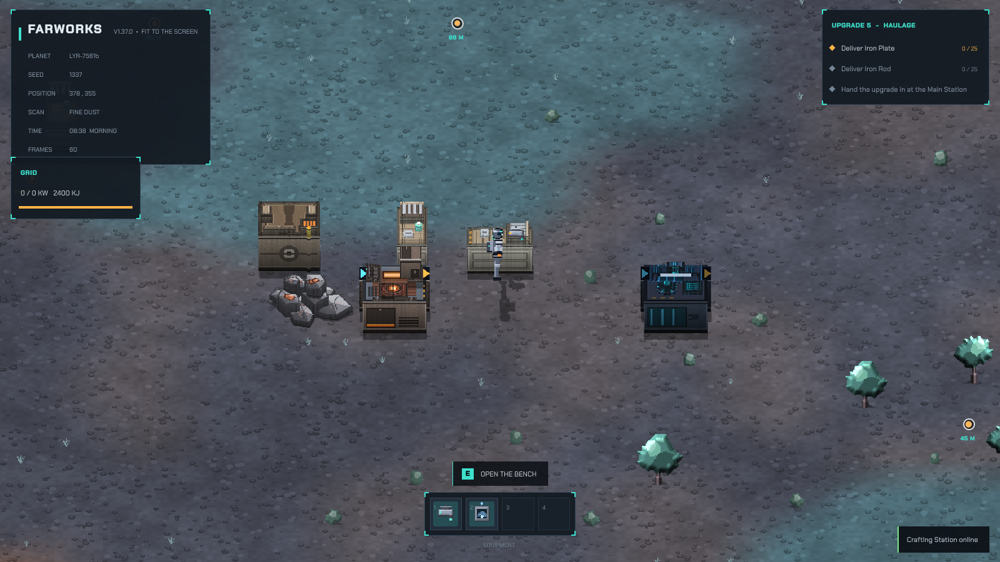

- **The treadwheel** was the worst of them. Its block was an axle housing laid down the middle of
  the bed, where the drawing puts nothing and the wheel puts itself -- so the wheel a player runs
  in was under a grey slab. Its frame is relief now: two bearing blocks, a dynamo with the windings
  sunk into its case, and the rail you lean on to push.

  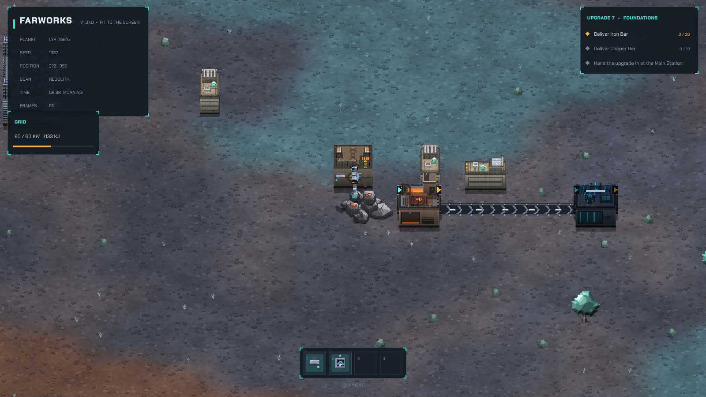

- **The pole** is drawn end on, so which of its parts is highest is the whole subject, and flat
  there was no answer. Bottom to top now: plate, arm, insulators, mast.

  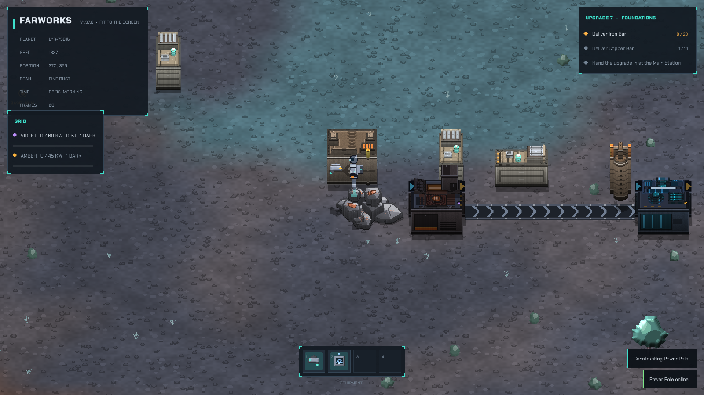

**And the conveyor lift had never been drawn at all.** It is extruded as `ConveyorLiftUp` or
`ConveyorLiftDown`, and every switch that asked about it spelled the style `ConveyorLift` -- so
three labels had never once matched. Its relief block never appeared, it never got a flank, and the
elevation written for it, a ladder frame with the buckets climbing, has been sitting unreachable
since the day it was added. The tallest thing a base can have was rendering as a black slab. All
three now name the styles that exist, and its plan is relief besides: the casing, the two rails
standing off it, and the run set down between them.

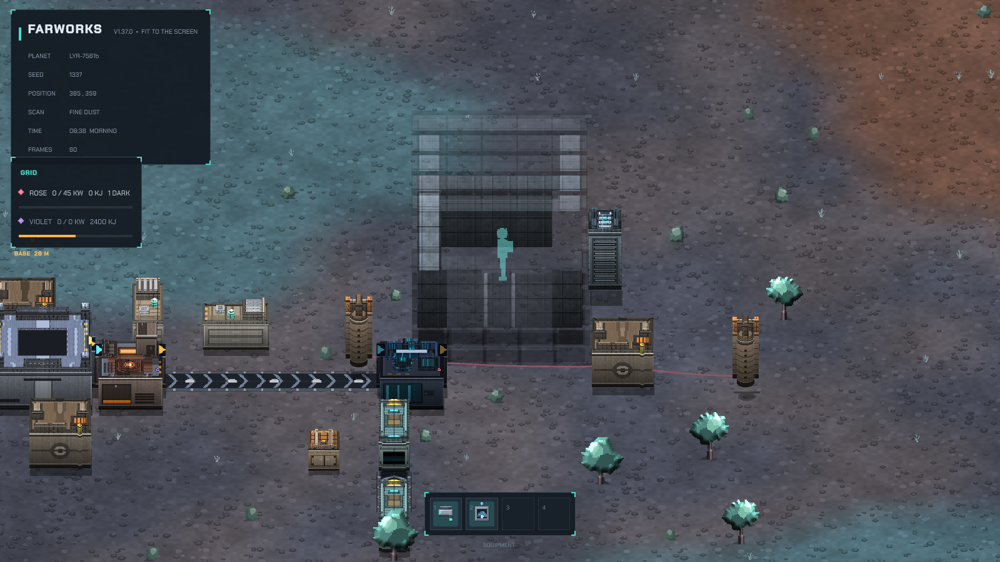

**Also:** `Pixels` gained `Fill`, `Disc`, `Dome`, `Ramp` and `Sink` for height buffers, so relief is
described with the same calls that drew the sprite. `Sink` subtracts rather than sets, because a
groove given a height of its own is a plank lying on the hull rather than a groove cut into it. And
a new capture scene, `stationtiers`, photographs the station at all nine upgrades in one run -- out
of the release pass, since it is nine pictures of one building.

---

## [1.36.0] - 2026-09-07

A rock is not one height.

**The deposits were a mesa, and no amount of drawing was going to fix them.** An outcrop was one
picture with one height under it: ten boulders painted from above, each with its own lit face and
its own shaded one, and then every last pixel of it raised to exactly the same altitude. So the
paint said "round stones sitting at different heights" and the geometry said "one plate cut with a
jigsaw", and the geometry is what the eye believes. Round the outside of the plate ran a single
tall vertical face taken down to half light at the foot -- which on a machine is a flank, and on
rock is a hole the rock is standing in.

**An outcrop is three solids now**, and every stone is drawn into whichever one matches how tall it
stands: a wide skirt of shattered rubble, a pair of blocks stood on it, and one that stands clear
above the rest. Deliberately not three shrunken copies of one outline -- that is a wedding cake,
and a wedding cake is no more a rock than a mesa is. Different stones in each, so the silhouette
steps down to the ground at its own edges and the one tall face spends most of its life behind the
low ones, whichever way the camera has been turned.

**And the stones are faceted from an apex.** Painted as a blob with a lighter blob smeared over
its lit half -- which is what they were -- a stone at this size is a flat pad with a smudge on it,
and a group of those stacked is a pile of pancakes at any heights you like. What broken stone
actually has is flat faces meeting at hard edges. So each one gets a high point set up-light of its
middle and a triangle run from there down to every corner of its outline, each face lit by how far
it turns toward the light. Six sides, knocked about, and squashed along an axis of its own: a
seven-sided outline with a light jitter is a regular hexagon with a bad shave, and a field of those
reads as floor tiles, which is precisely what they looked like.

**Iron ore is rust, and it was being drawn in iron.** The ore lumps took the colour of the metal
you get out, which for iron is a pale grey -- so an iron outcrop, a limestone one and a plain
boulder were three pictures of the same thing, and the only way to tell them apart was to walk over
and read the tooltip. An ore whose own colour has nothing to say against grey stone now borrows its
fleck, which exists for exactly this. Coal keeps its black. And the lumps are chunky and few where
they were small and many: twenty-six single pixels of fleck on a picture ninety-six across is
noise at the distance this is actually looked at.

**Then the ore was painted down the sides of the rock.** A hull takes the colour of its side from
the plan pixel above it, so a lump reaching the outline paints the whole flank of that stone in
ore -- a rust stripe running from the top of the rock to the floor, which at a glance is a stripe
painted on a rock rather than ore in one. Placing the ore inside the outline was most of the answer
and not all of it, because an outline is jittered corner by corner and then squashed, so how far it
is from the middle of a stone to its edge is not a number the placing knows. Two pixels in from
wherever the picture stops, the rock is now the rock again, whatever was drawn over it.

**And the block on a machine's roof stopped popping.** How much of a building has been put up is a
fraction measured from the floor, and everything above was written as a fraction of the hull alone
-- nought at the floor, one at the roof. Which put every corner of every stack, housing and aerial
at one as well, there being nowhere higher to be, so the clip that draws a building from the ground
up let all of them through in the same frame: the last one. A machine grew out of the floor over
the whole of its construction and then, once it had finished, its chimney appeared. The fraction is
measured against the whole thing now, roof furniture included, and the plan on the roof is
uncovered by the time the walls under it are done -- so the stack grows out of a finished roof over
what is left of the sweep, in the order a thing is actually put up.

### Changed

- Ore deposits: three stacked solids instead of one raised plan, faceted stones, ore in the colour
  that says which ore it is, and a side face that no longer takes the rock down to near black.

- What stands off a machine's roof is built during the construction animation rather than appearing
  when it ends.

- The outcrop check no longer counts daylight down the columns of one picture -- there is no
  painted face left for that fault to happen to, and a gap between two stones standing side by side
  is a gap. It checks the shape that can still go wrong: a skirt broken into scattered pebbles, a
  tier that came out empty, and tiers that stopped stepping and are three plates of one size
  stacked.

### Fixed

- Ore no longer paints itself down the side of the stone it is sitting in.

---

## [1.35.0] - 2026-09-06

A walk, and a suit to walk in.

**The walk was a march, for two reasons and neither of them was the drawing.**

The first: there were three drawings, arranged as a pose, a step, a pose, the other step. Half of
every cycle the character stood bolt upright. There are eight now, posed off the phase rather than
picked from a table, and they are the four a walk is actually made of, twice -- the foot lands, the
body drops over it, the other leg swings through, the body rises off the toe. A leg lifts only over
the half of the cycle its foot is off the ground, which is the difference between walking and
stamping.

The second, and the one that mattered: the feet were driven by ground covered -- so that somebody
who speeds up takes quicker steps rather than longer ones, which is right -- and the body's bob was
a sine driven by the clock at a rate loosely picked off the speed. Two waves at unrelated
frequencies. They drifted through each other, so the body dropped at moments that had nothing to do
with any foot, and no amount of drawing fixes that. The bob is read off the same phase the feet are
now: twice a cycle, lowest as the weight lands, highest riding over the straight leg in the middle
of the pace.

While we were in there: the bob was being clamped to its positive half before it was applied, on
the reasonable grounds that a negative one would push the sprite into the floor. Which meant half
of the motion was drawn and half was thrown away. It runs from nought upward now, so all of it is.

**And the suit is the darker one.** Not as dark as it was drawn to be -- the obvious sci-fi answer
is a dark suit with lit edges, and on this planet a dark suit is a character you lose track of. The
mass is mid grey with lighter plating over it, plated knees and one plated shoulder, a lit readout
on the chest, and the orange is down to a belt.

### Changed

- The walk: eight drawings round the cycle instead of three, and the body's rise and fall locked to
  the footfalls rather than to a clock of its own.
- The suit, and the equipment panel's figure with it.

  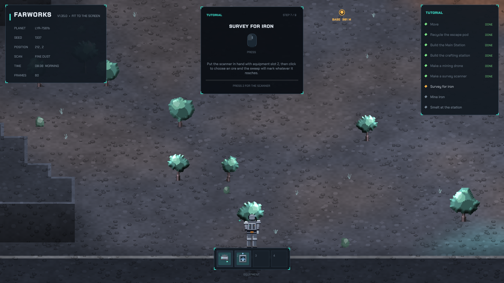

  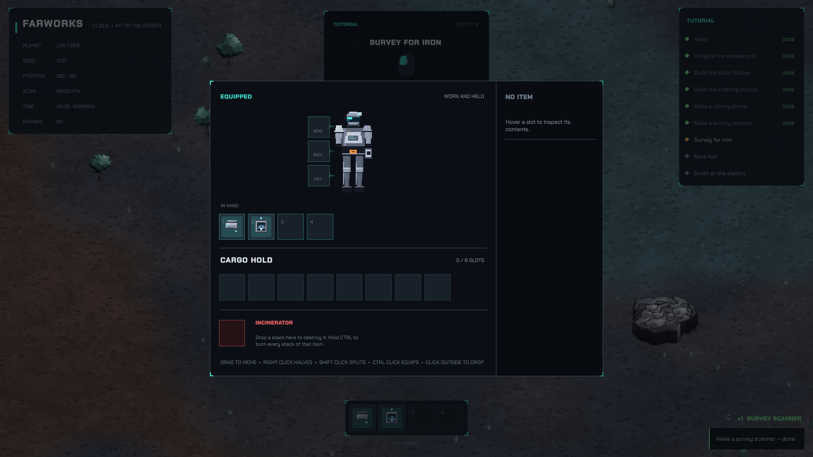

### Fixed

- The whole of the walk bob is drawn. Half of it was being clamped away before it reached the
  sprite.

---

## [1.34.0] - 2026-09-06

The character again, and this time as equipment.

The last pass gave the figure a structure it did not have -- four values, a collar, a waist, a
faceplate that was a band rather than an eye -- and it was still, plainly, a drawing of a person
rather than a picture of a suit. Worth writing down why, because the reasons are all general.

**Everything was a rectangle.** Torso, arms, legs, boots: bars with square corners, and nothing
built out of right angles alone reads as machined however carefully it is shaded. Forms are
chamfered and tapered now -- a greave wide at the knee and narrow at the ankle, a sleeve narrowing
to the cuff, shoulder plates that cap the arm instead of shelving out beyond it -- and there are
panel seams inside the large surfaces instead of one flat fill.

**The head was a quarter of the figure.** That single ratio is the strongest cue that a drawing is
for children, and it was forced: a helmet needs a visor, a visor needs pixels, so the shorter the
sprite the bigger a share the head has to take. The figure is forty-eight pixels now rather than
forty, standing a tile and a half, and the head is a fifth.

**The accent was a banner.** A saturated orange bar across the chest is a poster, not a garment.
The orange is reflective banding now -- a pixel or two round a shin, a forearm, the chest -- which
is what somebody working outdoors actually wears, and the scarcity is what makes it read as a
marking rather than as paint. What is on the suit instead is kit: a lit console on the chest, a
lamp on one side of the helmet, a pouch on one hip and not the other. Asymmetry is most of what
separates something a person was issued from a shape somebody drew.

**And the bevel was too deep.** The shading pass rounds a silhouette off with a sine profile, and
run deep it turns every plate on a hard suit into a pillow. It is shallow now, so edges stay edges.

The figure in the equipment panel is the same suit, redrawn with the space that panel has.

### Changed

- The character, and the equipment panel's figure, redrawn as a working suit rather than a
  spacesuit from a poster.
- The character's picture is 48px rather than 40, so the figure stands a tile and a half and its
  head is a fifth of it rather than a quarter.

### Added

- `Pixels.Plate` and `Pixels.Wedge`: a rectangle with its corners cut, and one that narrows as it
  rises. Between them they are the difference between hardware and a toy at this size.

### Fixed

- The mining drone rides clear of the character's shoulders again. It hovers at a height picked
  for a figure a tile and a quarter tall, and the figure is now a tile and a half, which had put
  the cutter across their hips.

---

## [1.33.1] - 2026-09-06

Everybody else climbs it too.

The last release gave the character a climb they walk up: on a flight or a ramp the height they are
drawn at is read off the surface under their feet, so the rise takes exactly as long as the walk.
It gave it to *your* character. Everybody else was still drawn the old way -- a storey number
arrives over the wire ten times a second and the body eased toward it -- so a friend walking up the
same staircase beside you rose a whole storey in a tenth of a second while you walked up it. A mate
is the player seen from outside, and that difference is the first thing anybody notices.

The two bodies are drawn by different code for good reasons, and neither could sensibly be written
in terms of the other: yours knows its own position every frame, theirs is slid toward wherever the
host last said they were standing and is a guess in between. What they can share is the question.
How high off the ground is somebody standing here is a question about the world, so the world
answers it now, and both bodies ask.

Theirs asks it of the position they are *drawn* at rather than the pose that arrived, for the same
reason their feet already did: the poses come ten a second with nothing in between, and the ground
under the character somebody is watching is the ground under where they are watching them.

### Fixed

- Other players climb flights and ramps the way you do, instead of rising a storey on the spot.
- A character riding a climb no longer drags their shadow a third of a tile down the slope. Holding
  them toward the camera to clear the treads is a depth trick and moves them nowhere on screen --
  but a shadow is on the ground, and it took its ground point off the same transform.

---

## [1.33.0] - 2026-09-06

A climb you walk up, and somebody worth watching do it.

**The way up was never drawn.** A ramp is the one tile of a cliff you are allowed to walk onto from
below, and the picture of the planet did not know that: it drew the tile flat, at the height of the
low ground, exactly like every other tile of the terrace. So climbing a shelf meant rising two units
into the air over ground that stayed where it was, and the rise itself waited for the rules to
agree you had left and then happened all at once, in a tenth of a second, after the step that caused
it. The whole of terraced country was climbed that way.

A ramp is a slope now. Two of its corners sit on the low terrace, two on the high one, its flanks
are closed down to whatever lies beside it, and its crest catches the light -- which is also the
first time the way up a cliff can be seen from across the map rather than found by walking into it.

**And the character stands on it.** Which storey somebody is on has to be a whole number; how high
off the ground they are does not, and treating those as the same number was the whole of the
problem. On a flight of steps or on a ramp the height underfoot is a question about where on the
tile you are standing, so it is answered that way. The rise now takes exactly as long as the walk
that earns it -- slow across a flight, quick over it, back down again if you change your mind
halfway -- and the storey still flips somewhere in the middle with nothing left to show.

**Every staircase on the planet climbed north.** A flight is the one hull whose sides are real
geometry rather than an outline traced from a top-down picture, and it was the one hull that never
got told which way its owner had been turned. The rotate key offered all four quarters and all four
built the same flight. They face where they are put now, and which way a flight climbs is what the
character rides up it.

**The character has been redrawn.** The old figure was one pale grey from boot to helmet -- a
silhouette with nothing inside it, a ball on a box, and from behind a featureless egg. The suit has
four values now, so the dark ones can do the structure and the pale ones the shape: dark boots that
put the figure on the ground, a collar so the helmet sits on a neck, a chest that tapers to a waist,
and a faceplate cut as a band across the front of the dome rather than set into it as a circle,
which at this size is the difference between a helmet and a cyclops. The picture is also drawn at
the height it wants to be instead of being drawn tile-sized and blown up, so the character is
finally on the same pixel grid as the ground they walk on.

The figure in the equipment panel was a different person in a different palette. It is the same suit
now, drawn with the space that panel has, with the boxes led to the part of the body they are for.

### Added

- **Ramps are slopes.** A ramp tile is built with two corners on the low terrace and two on the
  high one, its flanks closed down to the ground beside it, and its crest a shade brighter than the
  shelf it arrives at — which is the first time the way up a cliff can be seen without walking into
  it.

- **A staircase faces the way it was placed.** The rotate key always offered four quarters and all
  four built the same flight, because the one hull whose sides are real geometry was the one hull
  never told which way its owner had been turned.

### Changed

- **A climb is ridden, not jumped.** On a flight or a ramp the height the character is drawn at is
  read off the surface under their feet, so the rise takes exactly as long as the walk that earns
  it. The storey underneath still changes in one step, and there is nothing left for it to show.

- **The character is redrawn**, in four values rather than one pale grey: dark boots that put them
  on the ground, a collar so the helmet sits on a neck, a chest that tapers to a waist, and a
  faceplate cut as a band across the dome rather than set into it as a circle. The figure in the
  equipment panel is the same suit now instead of a different person in a different palette.

- The character's picture is drawn at forty pixels rather than scaled up from thirty-two, so the
  figure sits on the same pixel grid as the ground it walks on.

### Fixed

- A character on a staircase no longer has their shins painted as an x-ray ghost by the treads
  above their boots.

---

## [1.32.3] - 2026-09-06

The host holds onto what Steam would not take.

The client end has kept a backlog since the knock went missing two releases ago. The host end looked
at Steam's answer, wrote a line about the refusal, and dropped the message -- the same fault, on the
end with more to lose. What a host says is the welcome a join is waiting on, the verdict that tells
somebody whether their click did anything, and the news of what happened that every other copy of
the world is applying. A pose going missing is nothing. Any of those going missing is a run quietly
diverging from itself, which is the kind of fault nobody reports because nobody can see it happen.

Held per guest and in order, because a message that jumped the queue would arrive before the one it
was the answer to.

And a limit on holding, on both wires. A guest who has taken nothing in five hundred messages is not
a guest having a bad minute, they are a guest who is not there -- and the queue behind them would
otherwise grow at ten poses a second for the rest of the run. They are let go instead, which the
session already knows how to handle. The same cap now sits on the direct wire's buffer, which had
the same appetite.

### Fixed

- A host's messages survive Steam refusing them, instead of being logged and dropped.
- Neither wire will grow a backlog for somebody who has stopped listening.

---

## [1.32.2] - 2026-09-06

Three faults from one evening of two people playing, and they are all the same shape underneath:
something that belongs to one machine was being done on both, or something that has to agree
between them was left to chance.

**A screen is not a world change.** Using a bench or a furnace is an action like any other -- asked
of the host, said to have happened, applied by everybody -- and applying it opened the panel. On
every machine. So one person opening a bench opened it on the other's screen too, which is a
rummage through your pack by somebody standing across the base. The pod still comes apart
everywhere, because that is a thing that happens to the world; the screen and the note now only
appear where the person who pressed the button is sitting.

**A dropped thing was thrown by a die.** Nothing that lands on the ground is sent over the wire:
each machine spawns its own and they are matched afterwards by what they are and roughly where they
lie. "Roughly" was doing a great deal of work. The angle, the distance and even the number of
stacks were rolled independently on each machine, which put the same ore metres apart -- well
outside the reach a pick-up is matched within. One machine's copy could then never be taken: it
magnetised to whoever walked past, asked to be picked up, was refused because the host had nothing
there, and followed them about for the rest of the run. The rolls now come off the world's seed, so
both machines throw it the same way.

**And the host could hang outright.** Two causes, both mine, both about a frame that does not end.
A socket write waits when the far end has stopped reading, and it waits on the main thread -- so a
peer that was loading a world or busy for a moment could stop the host dead, which Windows paints as
"Not Responding". Sockets are non-blocking now and what will not go waits its turn. The second is
subtler and applies to Steam as much as to a socket: the session drains its post in a loop, and each
turn of that loop went back to the wire for more. Refilled as fast as it empties, the loop never
ends. The wire is now read once a frame.

### Fixed

- Opening a machine, bench or store no longer opens it on everybody else's screen.
- Dropped stacks land in the same place on every machine, so the last one is never left following
  somebody about, unpickable.
- The host no longer freezes when a peer stops reading for a moment.
- Neither transport can be held in its own drain loop by a talkative peer.

---

## [1.32.1] - 2026-09-06

Everybody else throws a shadow too.

The same omission as the walk and found in the same picture: what the player's own body was given,
the body drawn for everybody else was not. A figure walking about a planet where every rock and
every wall throws a shadow, throwing none itself, does not read as somebody standing on the ground.
It reads as a sticker on the camera.

On the same terms as the player's: no throw, because a character standing on the floor has their
feet on it and a shadow laid from the feet is not thrown away from them at all. It rides the storey
they are climbing toward rather than the one they have arrived at, so it goes up a ramp with them
instead of jumping a floor early and leaving them walking above their own shadow. And they dim in
other things' shadows now, which the player already did.

A shadow lies on the floor rather than on the character, so it is not a child of the body and does
not go when the body does. Somebody leaving now takes theirs with them in the same frame.

### Fixed

- Other players cast a shadow, and are dimmed by the shadows they walk through.

---

## [1.32.0] - 2026-09-06

Everybody else walks.

The stride and the bob were written into the body that had input to drive them, and nothing was
left for the body that had not. So for as long as there has been anybody else to look at, everybody
else stood bolt upright and slid about the planet like a chess piece, facing the right way and
never taking a step.

The figures now live in one place and both bodies read them, because two bodies drawn to two copies
of the same numbers is two bodies waiting to drift apart. What the mate could not have is the one
thing the walk is driven by: nobody at this keyboard is pressing their keys, and their poses arrive
ten a second with nothing in between. So the feet are driven by how fast the body is *drawn* to be
moving rather than by the poses -- which is the honest source, and the one the eye is following. Off
the poses the feet would step four times and stop, four times and stop, under a body sliding along
smoothly.

Also fixed on the way past: `-factoryConnect` only ever dialled from the front page, so asking for
it together with anything that boots straight into a world -- a capture pass above all -- did
nothing at all and said nothing about it. It is the flag you would use to script two instances,
which is exactly what it could not do.

### Fixed

- Other players walk, bob and take steps, instead of standing to attention and gliding.
- `-factoryConnect` joins from either boot rather than only from the main menu.

### Changed

- The walk cycle is one set of figures, read by the local body and by everybody else's.

---

## [1.31.1] - 2026-09-06

The second of two checks that had been failing on their own account rather than the game's.

The friends page puts a heading over the favourites, and the check marked one to see the heading
appear. It cleared that friend first, so as not to depend on whether they were already marked --
which reads like enough and is not. The heading is put there by the *first* favourite and by no
other, so on a machine whose owner had ever marked anybody the friend simply moved from one group
to another under a heading that was already up, the count did not move, and the check failed every
run from then on. It had been measuring nothing.

It now clears every favourite, takes both counts from there, and puts back exactly what it found --
which matters more than the check does, being somebody's own list of their own friends.

### Fixed

- The favourites check controls all the favourites rather than one of them, and reports how many it
  borrowed. It was failing on a machine where the feature worked.

---

## [1.31.0] - 2026-09-06

The network door is a button now, on both ends, so testing two players no longer means a command
line.

The main menu's multiplayer page has an address under the code — `127.0.0.1` already filled in,
because the machine you are sitting at is the answer nine times in ten — and it reports on itself
the way the code box does, on its own line rather than borrowing the code's. In a run, the
multiplayer page has OPEN ON THIS NETWORK beside the Steam door, and says which port it took.

The two doors are exclusive and each hides the other while it is open. That is plumbing rather than
policy: a session has one wire. It matters because allowing both would announce a Steam lobby
pointing at a socket that was never made — a code that finds a game and then reaches nothing at all.

The flags still work and go through the same two methods the buttons call, so a script and a
keypress cannot drift apart.

### Added

- An address box and CONNECT on the main menu's multiplayer page.
- OPEN ON THIS NETWORK in a run's multiplayer page, with the port it is listening on.

---

## [1.30.0] - 2026-09-06

Two players, by yourself.

Of the eight faults that had to be fixed before two people could play, six were nothing to do with
Steam: the front page not listening for a join, a repeated knock the host answered with silence, a
socket left standing in a run that had ended, a joiner who turned out to be the host, an inventory
screen that never told the other machine anything, and a client left standing on a planet whose host
had closed the game. Every one of them lives above the wire. Every one of them would have shown
itself in a minute to anybody with two windows open. Every one of them was instead found late, by a
friend, on their evening, after it had shipped.

So there is a second carrier under the same interface -- which is what the interface was always for.
`-factoryListen` opens a plain socket where a lobby would go, `-factoryConnect` dials one, and the
joining end walks exactly the path a Steam join walks: the same knock said before the wire is up,
the same welcome, the same world built from the host's save, the same reload carrying the wire
across. Nothing takes a shortcut, because a test wire that took a shortcut would be a test of the
wrong thing.

`-factoryAs` gives each copy a name, and it is not decoration: a character is remembered by its key,
the key comes from Steam, and two copies run by one person are two copies of one Steam account. Left
alone they would be handed the same character -- which is the exact fault this exists to catch, built
into the tool that catches it.

This says nothing about whether Steam works. The lobby, the invitations, the relay and the share
code are still verified by hand, by two people. What it removes is the need for two people to
verify everything else.

See "Two players, by yourself" in README.md.

### Added

- A direct transport, for testing without a second person. Two windows on one machine, or two
  machines on a network.

---

## [1.29.2] - 2026-09-06

The capture pass has been failing its recycled-pod check for some time, and the game was innocent.

The check walks the player onto the ground the pod stood on, to prove that ground is clear, and then
measured where they came to rest. Letting go of the controls is not stopping: a person walking has
weight and coasts on for a fraction of a second, so a walk that arrived dead on the mark was
recorded as one that missed by however far the coasting carried them past it. It reached 0.11 of a
tile against a threshold of 0.12, drifted to 0.22, and was failed against a tolerance of 0.20.

The tolerance is unchanged. What is measured is now how near the walk actually got, which is what
the check was always about -- a collider left behind would stop the player a tile short, which no
amount of coasting reaches. The resting distance is still logged, so the coast stays visible.

### Fixed

- The recycled-pod check measures how near the walk got rather than where it stopped. It was
  reporting a failure the game did not have.

---

## [1.29.1] - 2026-09-06

The drop pod is always reachable.

It was two faults wearing one face. The pod reported itself on storey nought and was drawn at the
height of nought, whichever storey it had actually come down on -- so on any planet whose middle
falls on a terrace, and that is about one in five, the capsule appeared at the foot of the cliff the
player was standing on top of and could not be interacted with by anybody, including somebody who
walked all the way around and down to it. And its tile was the landing point plus a fixed nudge
east, taken on trust: a bet that two tiles are the same kind of place, which loses outright when the
terrace edge runs between them.

The pod now knows its storey, and picks a tile it can be walked to from where the player is
standing -- the same storey, not a ramp, nothing solid in the way. Its usual spot is tried first and
by name, so a planet where this was never a problem is a planet where nothing has moved.

Note what this deliberately is not. The landing pad is cleared of rock and trees but its levels are
never flattened, and flattening them would move terrain under every planet ever generated from a
seed. The pod does not need flat ground. It needs ground the player can walk to.

### Fixed

- The pod comes down on the storey it is actually on, rather than always on the ground floor.
- Its tile is chosen rather than assumed: the same storey as the landing point, off the ramps, and
  clear of rock, outcrops and water.

---

## [1.29.0] - 2026-09-06

A host that goes takes the run with it.

There is no other honest answer. The host holds the world -- every action is asked of them and every
consequence comes back from them -- so a client that has lost them is not playing a game with a bad
connection, it is standing on a planet with nothing behind it. Carrying on would be a run where
nothing anybody does has any effect, which is a worse thing to hand somebody than a menu.

Two ways it happens and both are answered. A host closing a run now says goodbye before the socket
does, so there are words to put on a screen. A host whose machine simply stops says nothing at all,
and the only evidence is the wire going quiet -- which has to be enough on its own, because on the
day it matters it is all there will ever be.

Nothing is saved on the way out. The world was the host's, and writing it into this machine's own
slot would be taking a copy of somebody else's planet home.

### Added

- A client whose host has gone is put back on the main menu, which says why it is up rather than
  appearing without a word.
- The self-check covers it: told and gone, dropped without a word and noticed anyway, and a refused
  knock correctly not read as a host leaving. This is the one part of two people playing that a
  loopback can genuinely test -- noticing an absence is the same shape whether the wire was Steam's
  or a queue in memory -- and it caught two faults in its own first run.

### Fixed

- The loopback drops both ends when either closes, and keeps what already arrived. A goodbye sent a
  moment before the socket shut was being thrown away with the socket.

---

## [1.28.0] - 2026-09-06

Two people can now actually play, rather than merely connect.

**A joiner was the host.** A world is built the same way whoever is building it: number nought is
whoever is at this keyboard. That is right on a host and right on somebody playing alone, and wrong
on a joiner -- because a joiner's world is the host's save, and the host is standing in it as
nought. So the joiner looked through the host's eyes, walked the host's body and carried the host's
pack, while the character the host had actually welcomed them as stood at the landing site doing
nothing.

Which is also the whole of what looked like lag. The joiner walked the host's character locally, and
ten times a second a pose arrived saying that character was somewhere else entirely, and put it
there. Nothing was slow. Two machines were walking one body in opposite directions.

**The inventory screen was playing by itself.** Every stack move went straight into the applier
rather than through the game, which on one machine is a shortcut and on two is a different game: a
pack emptied, a chute filled or a crate of ore thrown on the floor happened on exactly one machine
and was never mentioned to the other. That was the whole of dropped things not appearing.

On a client, an inventory click is now a question with an answer a moment later, like every other
action -- the stack leaves the hand when the host says it did, not when the mouse went down.

### Fixed

- A joiner plays their own character. The camera, the pack, the tools and everything worn move to
  the actor the host welcomed them as, instead of staying on the local number nought.
- The apparent lag, which was the same bug: the joiner's own body was being corrected ten times a
  second toward where the host was standing.
- Stack moves reach the other machine. Dropping something on the ground, filling a chute or
  emptying a pack is a thing that happened to the world, and the inventory screen was the one part
  of the game that never said so.

---

## [1.27.6] - 2026-09-06

Joining works.

The host's socket never called `base.OnConnected`. That base call is where Facepunch puts an
arriving connection into the socket's poll group, and the poll group is the only thing `Receive`
ever reads -- nothing else adds to it. So the host accepted every connection, the joiner was told it
was through, and the host could not receive one byte from it, ever. A guest let in through a door
into a room where nobody can hear them.

It took four releases to find because every symptom pointed outward. The connection succeeded, the
lobby worked, Steam reported no error, and nothing in the game's own checks could see it: the
session tests run on a loopback, which has no sockets and no poll groups and was perfectly happy
throughout. The five things fixed on the way here were all real, and none of them was this.

The same override skipped `base.OnDisconnected`, which is what actually closes a connection, so
departed guests left their handles open.

### Fixed

- The host can receive. `base.OnConnected` is called, so connections reach the poll group `Receive`
  reads from.
- Connections are closed when somebody leaves, rather than left open.

---

## [1.27.5] - 2026-09-06

A run that ended took nothing with it.

`Session` was a field on the object the scene reload destroyed, and the socket behind it was not.
Steam holds a listener open until somebody closes it, and the lobby saying where to find that
listener is static and outlives every scene in the game. So a host who went back to the menu, loaded
a save, or started another planet left a door standing in the previous run: still advertised, still
handing out its code, still accepting connections -- because accepting is a callback and runs for
whoever is listening -- and read by nobody, because reading it was the dead session's job.

Which is the worst shape a fault can have. Both ends work. The joiner reaches the machine, says
hello, and is never answered, and there is nothing at either end that looks broken.

The run now shuts its own door: the session closed, the socket with it, and the lobby taken down.
The one exception is the wire built to outlive the scene -- a client that has been welcomed reloads
on purpose and carries its transport into the run being made for it.

**A host who reloads has to open the door again.** The code from before the reload is gone, because
what it pointed at is gone.

### Fixed

- A run ending closes its session, its socket and its lobby. None of the three used to go, so a
  reloaded host advertised a code for a door nothing was behind.

---

## [1.27.4] - 2026-09-06

A read back over the whole of joining rather than over the part that was failing, on the grounds
that the last three releases each found the next problem only by shipping past the one before it.

The worst of what it found is that the previous release's fix could not work. A joiner who hears
nothing knocks again -- and the host, finding it already had that peer down as arrived, returned
without a word. The one state nothing recovers from: the joiner knocks forever at a door that has
already counted them as inside. It now sends the welcome again, which is the whole reason somebody
knocks twice.

Underneath that, the host was doing what the client was doing wrong two releases ago. Steam answers
every send, and the host looked at the answer for exactly none of them -- including the welcome,
which is the largest thing this game ever puts on a wire and the one the entire join waits on.

And a limit worth knowing about before it is hit: Steam carries 512KB in one reliable message, the
welcome is a whole save inside a message, and a save is the one thing here that grows without limit
as somebody plays. Today's are around 50KB. Going over would not have been an error anybody saw --
the send simply would not have happened -- so it is now checked, and says so loudly.

### Fixed

- A repeated knock is answered. The host returned silently when it already knew the peer, so the
  joiner's second knock -- the fix from the last release -- could never have worked.
- The host checks whether Steam accepted a send. It never did, on any message, to anybody.
- A message too big for Steam is reported rather than silently not sent, and is dropped from the
  outgoing queue rather than blocking every message behind it forever.
- A wire that comes up and then goes down shows why on the join page instead of waiting out the
  clock to say nobody answered.

### Changed

- The welcome says its size in the log, so a planet that has grown too large to hand over is
  visible before it becomes a mystery.

---

## [1.27.3] - 2026-09-06

The relay connection comes up now. The joiner reaches the host's machine and then waits, so what
is left is the conversation across a wire that is demonstrably there -- which is a much smaller
place to look than the one before it.

Unlike the last two releases this one does not name a single cause and fix it. It closes the two
ways a knock could go missing on a wire that was working, makes the joiner ask twice rather than
once, and makes both ends say what they saw. One message, sent once, was the whole of getting in:
if it went astray anywhere then nothing was ever going to happen, the joiner sat looking at a
screen, and the host sat wondering who had not turned up.

### Fixed

- A message arriving on a connection the host had not yet been told about is no longer dropped.
  Messages are polled and connection state arrives on a callback, and nothing says which of the two
  a given frame sees first -- so the first message on any connection, which is always the knock,
  was the one at risk.
- A send Steam refuses is held and tried again rather than assumed to have gone. The result was
  never looked at.
- The joiner knocks again after three seconds if nothing has come back. The host hands the same
  character to somebody who has already been let in, so asking twice costs a message.

### Changed

- Both ends say what they saw, in the log: the knock going out and being repeated, the knock
  arriving with the door's state beside it, who was let in or turned away, and the welcome or the
  goodbye coming back.

---

## [1.27.2] - 2026-09-06

The last release got a joiner as far as the host's doorstep. It found the game, read who was
running it, opened a socket to that machine and then sat there, because the socket was on a network
that had not been switched on.

Valve's relay network has to be woken before anything connects through it: the client fetches the
list of relays and pings them, and until it has, a relay socket has nowhere to go. Nothing here ever
asked. There is no error for this and no log line -- nothing failed, the network simply was not
there yet -- which is why it presented as a host that never answered. It is now asked for at the one
point Steam starts, so it has the whole menu to get ready in.

The host also stamps its own Steam id onto the lobby now, rather than leaving a joiner to read the
lobby's owner a fraction of a second after joining it, while the member list is still arriving. A
zero read out of that dials nobody, and dialling nobody looks from the outside exactly like a host
that never answered.

### Fixed

- Joining connects. `SteamNetworkingUtils.InitRelayNetworkAccess` was never called, so every relay
  socket -- the host's listener as much as the joiner's call -- was made on a network that had not
  been brought up.
- The host's Steam id is read from lobby data rather than from `Lobby.Owner`, which is reliable
  eventually rather than immediately. A joiner that read a zero dialled nobody and waited.

### Changed

- The join page names which of the three silences it is in: nothing found, found and not reached,
  reached and not answered. They fail in different places and are fixed in different places, and
  calling all three "no answer" sends you looking in the wrong one.
- It waits 25 seconds rather than 12. A first relay connection is legitimately slow.
- The join path says what it is doing in the log: the lobby found and what it said its host was,
  the number being dialled, and the connection reaching and arriving.

---

## [1.27.1] - 2026-09-06

The first time two people who were not both this machine tried to play together, neither route in
worked. Every part of joining was right except its last step, twice over.

The front page was not listening. Answering an invitation and answering a code both hung off the
end of building a planet, so a run had them and the menu did not — and the menu is where somebody
who has just opened the game is sitting, which is exactly the person a friend invites. A code typed
in found the game, joined its lobby, read the host's number and handed it to nobody.

The knock was said into a socket that was not open yet. A client asks to be let on the instant it
has a transport, and a relay connection is not made for a fraction of a second after it is asked
for. The message was dropped without a word, so the host never heard a knock and the joiner waited
forever for an answer to a question it had never managed to ask.

And a code is now searched for worldwide. Steam's default lobby filter is a distance one, which
would have quietly lost two friends on different continents reading the same six characters to each
other.

### Fixed

- Invitations accepted from the main menu now join the game. They were only answered from inside a
  run, which is not where anybody accepting one is.
- A join code typed on the main menu now connects. The lobby was found and the host identified;
  nothing was subscribed to hear it.
- A client's first message no longer goes missing. Anything said before the Steam relay connection
  is up is held and sent the moment it comes up, in the order it was said.
- Join codes are searched for worldwide rather than within Steam's default distance filter.
- A refused joiner is told why. The host's reason -- "FRIENDS ONLY", usually -- was sent, received
  and thrown away, so a door shut in your face looked exactly like a door nobody came to.

### Changed

- The join page says how it is going. It said "LOOKING FOR ..." once and then said it forever,
  whatever happened next; it now reports the knock, a code that found nothing, a game that did not
  answer, and Steam not running.

---

## [1.27.0] - 2026-09-06

The last release applied one rule to everything: a thing is drawn as tall as it is. It was the
right rule and it was still a rule about drawing. Height was a distance up the screen — a storey
was 0.6875 world units of northward shift, a second number in a second unit meaning the same thing
as the first, and the conversion between them was written down nowhere. Every seam in the game for
three releases came out of that: a surface drawn at a height it was not at needs a patch wherever
it meets a surface that is.

The world is solid now. The ground is geometry at a real height, the sides of everything built are
walls rather than pictures of walls, and the camera is tilted off vertical and turns in quarters —
which is the only arrangement from which any of that can be seen at all. `Levels.Rise` is deleted
and there is one height unit left.

Nothing about how the game plays has moved. There was never any engine physics here: collision has
always been the project's own boxes and circles tagged with a storey, and footprints have always
been indexed by tile and level. The simulation already had real height. Only the drawing was
pretending.

### Added

- **The view turns.** Comma and full stop swing the camera a quarter round the map, eased over a
  fifth of a second rather than snapped — a view that jumps through ninety degrees leaves you to
  work out that the base you are looking at is the one you were looking at. The walk keys turn with
  it: "up" means away from you, whichever quarter away from you happens to be, including part way
  through a swing.

### Changed

- **The ground is solid.** Terraces are meshes at their own height and a cliff is a vertical face,
  on all four sides. Three of those sides used to be a dark line painted on the low ground beside
  them, because a step lifted straight up the screen shows nothing at all from the east or the
  west — which left the top of a shelf invisible from three approaches out of four. The honest four
  are less code than the faked one was.

  The terrain keeps a depth buffer now. Sorting order could never answer whether a shelf is in
  front of a patch of low country, because the answer depends on how far north the patch is;
  painting the cliff last drew the whole escarpment leaning out over the plain.

- **Buildings have sides.** A hull was a top-down picture with a flank drawn hanging off its south
  edge, darkened and grained and seamed — a good drawing of a side, and correct from exactly one
  angle. The sides are raised from the plan now, one wall per pixel of the outline, so a hull that
  notches in by a pixel has a face that notches in by a pixel. Each face knows which way it points
  and is lit by how far it turns toward the light, instead of every side wearing the south face's
  shading.

  They are plated rather than smooth: courses across, joins down, grain over the whole of it,
  sampled by where on the wall each pixel is. A short wall and a long one are plated at the same
  size and a run of them lines up. A blank gradient reads as a slab, which is what the painted
  seam always existed to stop.

- **The character stands up, and is redrawn to.** It was a figure seen from directly above, turned
  on the spot to point wherever you were aiming — right for a camera looking straight down and a
  person lying on the floor for anything else. There are three drawings now, standing: front, back,
  and a profile that flips for the other side. Turning is a change of drawing rather than a rotation
  of one, and which drawing you get is decided in your terms — somebody walking north is walking
  away from you from one quarter and across you from the next.

- **So does the wood.** Plants are stood upright and kept square to the camera, which also means
  they are never foreshortened and the sheet is drawn at exactly the size it was authored. They
  scale the same both ways: a real height applied to the vertical axis alone pulls a tree to three
  times its drawn proportions, and `Size` has always said it is the width with the height following
  the artwork.

- **The cutaway follows the camera.** It used to answer one question — how much of the ceiling over
  your head this is — and a disc around you answered it completely, because looking straight down
  the only thing that can ever cover you is a floor above you. A tilted camera is blocked by
  anything standing between it and you, which here is mostly the wall on your own floor: two tiles
  of solid geometry a metre from the lens. Whether a wall is in the way is worked out from where
  the camera is standing and how steeply it looks down, both of which change while you play.

### Notes

- **Terrain does not get out of the way yet.** Walk along the foot of a cliff with the camera on
  the low side and the cliff hides you. Buildings can fade because each is a few renderers with
  something watching them; terrain is one mesh per chunk with no per-thing anything, so the fix
  belongs in the terrain shader. Turning the view a quarter is a way out in the meantime. Recorded
  in [KNOWN-ISSUES.md](docs/KNOWN-ISSUES.md).

- **A flight of steps is still a picture of a ramp** rather than something built. It is drawn the
  whole way up, as it has been since 1.26.0, but it has no sides of its own and reads flatter than
  the walls beside it now that they have some.

- The tree sheet still wants redrawing. It was noted last release as art drawn for the old
  proportions; standing it up has not changed that, and now that `Height` no longer draws anything
  the sheet is the only thing saying how tall a plant looks.

- `-factoryPitch <degrees>` and `-factoryYaw <quarters>` set the camera at boot, so an angle can be
  tried or a scene shot from another quarter without a rebuild.

---

## [1.26.0] - 2026-09-06

The terrain has always obeyed one rule: a surface a storey up is drawn a storey up, with its side
filling the gap beneath it. Nothing built obeyed it. A hull's top face was pinned to its own tile
and its side hung below, so a wall one storey tall and a terrace one storey up — the same height
above the same ground — were drawn a whole storey apart. Everything that had to span the two needed
a special case to do it. This release is the rule, applied to everything.

### Changed

- **A thing is drawn as tall as it is.** Every hull's picture now rises by its own height, top face
  raised by exactly the side it shows, foot planted on the ground it occupies. A wall stands as
  high as the terrace beside it that the definitions call the same height. A deck lines up with the
  tops of the walls carrying it instead of floating a storey above them.

  The anchor moves rather than the transform, deliberately. Sprites sharing an order are drawn back
  to front by where their transform sits, so lifting the transform would sort a tall thing as
  though it stood further away. The transform stays on the ground and only the picture rises.
  Everything hung on a hull rides up with it: the parts, the mask that uncovers it during
  construction, and the silhouette it throws, which is the same picture laid flat and would
  otherwise float off the floor by exactly the height of the thing casting it.

- **A staircase is drawn the whole way up.** A flight is a ramp, not a box, so its height is the
  climb and the climb is the picture: from the tile it claims to the floor it arrives at, treads
  lightening as they go, the last of them landing on the storey above rather than short of it. It
  shows no side — the south end of a flight is the end that meets the floor, and there is nothing
  there to show.

- **A tree is as tall as it says it is.** Flora was the last thing drawing to its own scale. An
  ironbark calls itself 2.2 tiles and was drawn between 1.21 and 1.73 world units tall, where the
  rule puts that height at 0.75 — so a wood stood about twice the height of a wall the same
  definitions call slightly shorter than it, and towered over any base built beside it. Width still
  comes from Size and the same jitter varies both, so a stand of them is as ragged as it was.

- **A flight is no longer turned.** Its landing is its own tile one storey up and a storey is drawn
  up the screen, so the climb goes north wherever the flight is placed. Turning the picture would
  point the climb at a neighbour. The rotate key still cycles while placing; it has nothing to
  change about a flight.

### Fixed

- **A staircase on open ground was a trap.** It has to carry you up — reaching the first roof is
  done by standing on a flight and laying deck from up there — so the top of a lone flight is a
  landing with a storey of empty air on all four sides. Every direction was refused and the catch
  that stops a flight firing twice would not put you back down either. Stepping off a flight is
  stepping down it now.

### Notes

- The tree sheet is still art drawn for the old proportions and squashed into the new ones.
  Redrawing it for a view this far overhead — more canopy, less trunk — would read better than
  compressing what is there.

- Still on the old footing: the player and their mates sort above every structure, so nothing built
  can stand in front of them. Under the old drawing that was unnoticeable, because a hull never
  covered ground north of its own tile. It does now.

## [1.25.1] - 2026-09-06

Two things about staircases, both found by building one against a hillside — which is the first
thing anybody does with a flight of steps once the ground has heights in it.

### Fixed

- **A staircase against a cliff was somewhere you got stuck.** Walk onto one and you could not
  reach the shelf it climbs to, could not get back down, and could not move at all. It carried you
  up the moment your middle crossed onto its tile, with a third of you still hanging over the one
  behind — which indoors is more decking and nothing is wrong, and on a hillside is open air a
  storey below. That handed you a height at which the place you were standing is not allowed, and
  the collision test only ever refuses a move: it has no way to push anybody out of somewhere they
  should not be. So every direction was refused, including back the way you came, and the catch
  that stops a flight firing twice made sure it never fired again to undo it. A flight now waits
  until the whole of you fits on it at the height it is taking you to.

- **A flight is drawn arriving where it goes.** Everything in the game says "I have height" by
  hanging a face southward, toward the camera, because that is the side of a wall or a machine you
  can see. It is the wrong side for the two things whose whole business is reaching upward. A
  storey is drawn a rise up the screen, so the floor a staircase climbs to is a rise above the tile
  the staircase is drawn on — and between them is a strip of screen belonging to neither, filled by
  the side of whatever the step is. Drawn like a wall, a flight stopped at the bottom of that strip
  while the floor started at the top of it, and read as a staircase standing most of a tile short of
  the thing it was meant to join. Stairs and lift shafts now carry a riser across that gap, drawn
  over the cliff face they cross and meeting the floor above.

  It is a piece of its own rather than part of the hull, because the hull turns and this must not: a
  landing is the flight's own tile one storey up, and up is up the screen whichever way the treads
  have been turned to run. Stairs stay as rotatable as they were.

### Notes

- The terrain scene builds the case now — a flight on the low ground against a plain step, up onto
  the shelf, and back down again. Before this it reached neither and stood at exactly 10.00, the
  tile boundary, which is the whole of the first bug in one number.

## [1.25.0] - 2026-09-06

Height was the oldest thing in the game that had never been sat down and thought about. A storey and
a terrace have been one number since the ground got heights, and everything since — the sorting
bands, the shadows, the cutaway — was built on that number being right. It mostly was. What was
wrong was everything around it: who got to change it, when, and what the picture did about it.

### Changed

- **Changing floors is a climb rather than an arrival.** A storey is a whole number and the picture
  of one is not. The character used to appear at the new floor's full height on the frame the
  number changed, which threw the camera two thirds of a tile and then smoothed it back — while the
  cursor, corrected by the storey number, jumped the whole way at once. Two different amounts of the
  same correction, and the gap between them is the world sliding under the mouse for a tenth of a
  second every time you take a step upstairs. There is one height now, it moves over the same moment
  the ceiling fades in, and the transform, the camera, the cursor and the shadow thrown down onto the
  planet all read it. Agreeing on a moving number is what makes the movement invisible.

- **Which floor you are on is settled once.** It was decided by four passes run one after another,
  each of which wrote it: a staircase moved you, the ground test immediately re-read what the
  staircase had written, and the fall test re-read that. The order they ran in was the whole of what
  made it come out right, and nothing said so. Stairs beat a ramp, a ramp beats standing still,
  standing still beats falling, and the answer is written once at the end. The rule that was missing
  is the third — whatever is already under your feet wins — which is why the answer used to be worked
  out from nothing every frame and come back different.

### Fixed

- **The middle of a ramp was a place you could stand and flicker.** A ramp changes height partway
  across rather than at the top, because the tile past it is only somewhere you may stand once you
  are already up. That was a single line at the halfway mark, and a line is somewhere you can stand:
  wobbling across it changed floors every frame, and a floor changing is a sorting band rewritten, a
  shadow appearing, a ceiling opening and the character jumping a storey up the screen. The way up
  is a little past the middle now and the way down a little before it, so there is no line left to
  stand on — crossing back costs a real step.

- **Falling went through your own building.** Losing the floor under you asked the planet what
  height it was on that tile and took the answer whole, so a character whose deck was dismantled on
  the third storey landed on the dirt through two floors that were still standing, still walled and
  still holding themselves up. You come down to the first floor there is now, which is not
  necessarily the ground.

- **Taking a wall up unregistered the wall underneath it.** A building gave back every claim that
  shared its tiles on any storey. The walls of a second floor stand on exactly the tiles the walls
  of the first do — that is what a second floor is — so pulling one out quietly gave back its
  neighbour below, and left a wall standing there that could be walked through, built over, and
  would no longer hold up the deck it was carrying. A building gives back what it claimed: its own
  storey, and the one above when it spans two.

  This was also hiding the rule that stops a roofed room being stripped of the walls holding it up.
  Pulling a wall was deleting the deck tiles it was supposed to be supporting, so there was
  progressively less left to strand. The rule refuses the same wall it always did, for the first
  time because it is actually the one doing the work.

- **A workbench upstairs could not be worked at.** What counts as being in reach of a bench was
  asked without saying which floor, which took the ground by default — so a crafting station built
  on a second storey was unusable while standing beside it, and one on the ground floor could be
  used from the roof over its head.

### Changed (internal)

- **The register of what is built is a tile map now, not a list to walk.** Every question it answers
  used to be a walk of every claim ever made, and these are not questions asked occasionally: the
  player asks four of them a frame before taking a step, and the placement rules ask one per tile of
  a footprint on top of that. A belt claims one tile at a time, so a developed base is thousands of
  them, and the game got slower the more of it there was. Claims are stamped into blocks of tiles as
  they are made, and the blocks exist only where something has been built — so the cost follows the
  size of the base rather than the size of the planet.

- **How high the ground is has one place that answers.** The planet keeps its terraces and the
  register keeps its decks, and the two know nothing about each other. Putting them together was a
  private method inside the player, which was fine while the player was the only thing that walked.

### Notes

- No screenshots. What changed here is motion — a climb that used to be a jump, a flicker that is
  gone — and a still frame of any of it is a still frame of the release before it. The rules for
  this file say pictures of what changed, and there is nothing here a picture would carry.

- The capture pass grew three checks that could not have passed before: standing at the exact middle
  of a ramp and staying on the floor you arrived from whichever one that was, taking the deck out
  from under somebody two storeys up and landing them on the storey below, and catching the climb
  partway through to ask whether a screen point still lands on the tile it is over.

## [1.24.0] - 2026-09-05

### Changed

- **Taking things apart is a mode with a cursor in it.** The teardown was a key held down while
  standing against the thing: the game worked out what you meant from where your feet were, so
  saying "not that one, the one behind it" meant walking, and taking a row of wall up meant walking
  the row. `X` now opens a disassemble mode. Point at what should come apart — the footprint lights
  up under the cursor, whatever storey it is on — and hold the primary button for two seconds to
  take it up.

- **A batch, for when it is a row rather than a building.** `E` marks what is under the cursor and
  puts it on a list, drawn in amber against the red of the cursor; press it again on the same thing
  to take it off. The hold then takes the whole list apart at once and says one line about the lot
  rather than one line each. The list is the mode's: leaving the mode forgets it, because a mark is
  half a sentence and finding a hold undoing a choice made minutes ago is worse than remarking.

- **The teardown has no reach any more.** There was a two tile rule, added when actions started
  arriving from other machines, and it was the old gesture written down: standing against a hull is
  what "close enough" meant. Pointing at something is not, so the rule is gone and anything on the
  screen can be taken apart. What is left is the storey: the cursor only ever picks on the floor
  being stood on. Right click or `X` leaves the mode; `Escape` does too, before it reaches the menu.

## [1.23.2] - 2026-09-05

### Fixed

- **A building turned round is still standing up.** The picture of a building is not flat: it has a
  side face hanging off its south edge, because that is the edge a camera looking down from the
  south can see. Turning the renderer turned that face with it, so a smelter placed facing east
  showed its flank out to the east and one placed facing north showed its underside above the roof
  — a building that had fallen over rather than one that had been turned round. The turn now goes
  into the pixels: the top is rotated and the side is worked out again from it, so everything the
  hull says about which way it faces turns, and the height goes on pointing at the camera.

  The moving parts keep the transform, so a bench laid on its side still runs its glow along the
  row the stock travels down. The shadow follows the hull and is no longer flattened across the
  wrong axis, and the placement ghost is turned the same way, so what it shows is what goes down.

- **Trees no longer grow out of ore.** The woods are seeded before the ore is buried, deliberately,
  so that adding an ore to the game never moves a deposit an existing save is standing on — which
  left whatever was growing there standing on top of the outcrop the moment the outcrop arrived. A
  deposit now clears what is on it as it surfaces rather than at the seeding, which covers one that
  comes up later as well: a bare patch in a wood would otherwise be a map of where the ore is.

- **The chat line takes the keyboard when it opens.** It was asking a frame after being shown, and
  being refused in silence: a hidden element cannot take focus, and whether it is hidden is read
  from the resolved style, which had not caught up with the one just set. So the chat opened with
  the keyboard still driving the player. It is asked again once the field genuinely has a box on
  the screen, which is the first moment the answer is yes.

- **A cost line stays on its sector of the build ring.** The label group had one fixed box, which
  could only ever be right for one direction: a sector is a piece of an annulus, and across the
  band there is only the band's width while around it there is however much of the circumference
  the sector comes to. At the sides that box was wider than the band and a three-part cost ran out
  over the rim. It is sized from the sector it rides on now, and the cost wraps inside it.

- **The hand-in strip's eyebrow is no longer printed under its own title.** A label is only as wide
  as flexbox says it is and its text carries on at its own size when that is not wide enough, so a
  panel short of room did not shorten MILESTONE TASK — it drew the title over the last few letters
  of it. Which is what a larger interface scale is: the same panel with fewer units to lay it out
  in. The eyebrow keeps its width and the title gives way onto a second line instead.

- **A grid with nothing in it is not drawn.** Nothing generating, nothing drawing and nothing
  stored is a pole standing in a field, or the station's cell after it has died; `0 / 0 KW   0 KJ`
  in the corner of the screen says nothing that was not already obvious. With no other grid to
  draw, the panel goes with it.

## [1.23.1] - 2026-09-05

### Changed

- **Both settings pages live behind one OPTIONS door.** They sat on the front page for exactly as
  long as there was one of them. A second put seven entries on a screen whose first four are the
  only reasons anybody opens it — and made the in-game list nine deep, half of it settings and half
  of it ways out of the run. The two you touch once and then never again are worth a press.

  Escape steps back through the new landing rather than over it: one press from the graphics page
  reaches OPTIONS, a second reaches the front. Which page sits under which is written down once and
  read by both the BACK buttons and the escape handler, because a BACK that goes somewhere escape
  does not is a menu with two different shapes depending on which hand you use.

- **The graphics settings are laid out as two columns.** The name was floating at one edge of the
  panel and its control at the other, with the gap between them changing on every line — which is
  right for a save and its date, and wrong for six settings that read as two unrelated lists down
  opposite sides. The name column has a width now and the controls follow it immediately.

### Fixed

- **The right-hand arrow is no longer clipped off by the panel edge.** The boot screen's panel is
  420 wide and leaves 376 inside its padding; the setting row came to just over 400. It was cut off
  at every interface size, because the panel scales with the row rather than against it. Both
  columns are sized against the narrower of the two panels that shows them.

---

## [1.23.0] - 2026-09-05 — "Fit To The Screen"

### Added

- **A graphics page, in the menu and in the run.** Until now the only thing the game would let you
  change was the keyboard, and the window was whatever the executable happened to launch as. There
  is a page for it now, and it is the same page in both places — like the controls, because a
  monitor belongs to the person in front of it rather than to the planet they are standing on, so
  setting it up before a run and fixing it halfway through one are the same act.

  Six settings, in three groups. **Window mode** is windowed, borderless or fullscreen — borderless
  is its own entry and not a tick box beside fullscreen, because what a player knows about it is
  that alt-tabbing out is instant, and that is a choice between three things rather than two things
  and a modifier. **Resolution** is every distinct size the machine reports, deduplicated across
  refresh rates, with the aspect ratio beside it because that is the half people actually choose
  by; it locks while borderless, which is the display it is on by definition. **Monitor** appears
  only where there is more than one. Then **vertical sync** and a **frame limit**, and an
  **interface size** from 75% to 150%, for a dense text interface on a screen it was not laid out
  for.

- **The window changes are kept only if you say so.** The three that can leave a screen nobody can
  read — the mode, the resolution and the monitor — happen at once and then take themselves back
  after ten seconds unless the player presses the button that says to keep them. Nothing reaches
  disk until that press, so picking exclusive fullscreen at a size the monitor will not show costs
  ten bad seconds rather than a game that boots into a black screen for good. The countdown is
  driven from the game loop and not from the page, because a player looking at an unreadable screen
  is exactly the player who will close the menu.

- **Moving the game to another screen actually moves it.** A window that is not windowed cannot be
  walked across: exclusive fullscreen owns the display it is on, and a borderless window is pinned
  to the one it fills. So choosing another monitor puts the frame back on, walks the window over,
  waits for the platform to say it has arrived, and sets the mode again on the other side — three
  frames rather than three lines. Borderless then fills the screen it was sent to rather than the
  one it came from, which is the difference between a 1440p monitor filled and three quarters of it
  covered.

### Changed

- **The boot screen's OPTIONS is now CONTROLS.** It was only ever the bindings page, and it was
  called OPTIONS because it was the only settings page there was. With a graphics page beside it, a
  button called OPTIONS is a button that does not say which options — and the in-game menu has
  called the same panel CONTROLS all along.

- **One panel for every screen in the game, cloned rather than shared.** The boot screen, the run
  and the loading screen each loaded the interface settings asset out of `Resources` for
  themselves. That was harmless while nothing wrote to it and wrong the moment something did: in a
  player `Resources.Load` hands back a runtime copy, but in the editor it hands back the file on
  disk, so setting the interface size would have quietly edited a checked-in asset. There is one
  clone now, made once, and that is what the size is written to.

---

## [1.22.1] - 2026-09-05

### Fixed

- **The host owns the clock.** `docs/design/coop.md` settled in stage six that changing the speed
  should be the host's alone, and it was never actually enforced. A client pressing the speed keys
  sped up nothing but its own copy of the world — both machines step the same factory at the same
  fixed rate, which is the whole reason the step was made a fixed one — so it was not a faster
  game but two machines disagreeing about how much had happened. It says so now rather than doing
  it quietly.

### Changed

- **Written down: batchmode for the verdict, windowed for the pictures, and they are two runs.**
  Batchmode fits a virtual mouse and drives the clock itself, so a scripted click lands where it
  was aimed; it is the only mode whose pass or fail means anything. Windowed, the pass puts its
  own window to the back — which is what makes it usable while somebody works — and an unfocused
  window is not handed pointer events, so every check that depends on a click fails at once for a
  reason that has nothing to do with the game. The shots are the other way round: windowed they
  are the real screen, and under `-nographics` they all come out black. In the README and in the
  capture director, after an hour was spent chasing two failures that were the mode and not the
  game.

---

## [1.22.0] - 2026-09-05 — "Narrow It Down"

### Added

- **A filter on the friends page.** Typing narrows the list as you go rather than on Enter: this
  is a filter and not a search, so there is nothing to submit and no way to get it wrong, and an
  empty box means everybody. It matches anywhere in a name rather than only the start, because a
  Steam name is as often a phrase as a word and nobody remembers which end they know it by. The
  note underneath says how many of how many are showing.
- It starts empty every time the page is opened. A filter left over from a minute ago is a
  friends list with most of your friends missing from it, for a reason that has scrolled off the
  top of the page.
- The capture pass types a scrap of the first friend's own name, then nonsense, then clears it,
  and checks the list narrows, empties and comes back.

### Fixed

- The favourites check in the capture pass measured from whatever the machine happened to be
  carrying rather than from a state it set, so it passed or failed on whether somebody had
  already marked that friend — which is not the question it was asking.

---

## [1.21.3] - 2026-09-05

### Fixed

- **The mark inside the favourite button sat off centre** — two pixels low and two pixels left,
  measured. It was a diamond character, and a character is placed by the font's own metrics
  rather than by the layout, so no amount of centring the label moved it. It is a square turned
  on its corner now, which is geometry and lands where it is put: six pixels of gap on all four
  sides. It is also the same pip the objective list has used all along.

---

## [1.21.2] - 2026-09-05

### Fixed

- **Pressing the favourite mark invited somebody instead of marking them.** The mark was a label,
  and labels out of the interface factory ignore the pointer — so every press went straight
  through to the row behind it, which is itself a button and does something quite different. It
  is a real button now: a bare element, which takes the pointer, wrapped round a label, which
  does not. Drawn as one too, with its own border and ground, since it sits on a row that is also
  pressable and means something else.

### Added

- The capture pass counts things on that page that can be pressed by eye and not by pointer, and
  fails if there are any. This is the second time something built out of the factory looked
  finished and did nothing — the rows themselves were the first — and it is a fault no compiler
  and no headless run can see.

---

## [1.21.1] - 2026-09-05

### Fixed

- **No friend could be clicked.** Rows out of the interface factory are scenery and do not take
  the pointer, and every part of a friend row was built from it — so the only thing on the row
  that could be pressed was the favourite mark, which is a label and pickable by default. The
  list looked entirely finished and did nothing at all.
- **The scrollbar was a wide grey stripe with a thin line lost inside it.** Two faults on top of
  each other: the slider and its drag container were left carrying the default theme's own dark
  ground, and the groove was being painted across the full sixteen pixels the bar reserves rather
  than the hairline it was written for. The groove is gone entirely now and the handle is the
  whole scrollbar — inset rather than sized, since the bar's own width does not move from the
  stylesheet, with a floor under its height so that seventy friends in a window six deep does not
  give a handle nobody can catch hold of.
- The favourite mark was a few pixels across. It is now large enough to see and to hit.

---

## [1.21.0] - 2026-09-05 — "Faces In The List"

### Added

- **Avatars**, on the left of every row, fetched once and kept for the life of the process. The
  square is held whether or not a picture ever arrives in it, so the list does not shuffle
  sideways as faces land.
- **A line under each name saying what somebody is doing**, in the colour of what they are doing:
  Steam's own convention, because everybody already reads it — green in a game, blue signed in,
  amber away, grey gone. The one departure is this game itself, which takes the interface accent,
  since somebody already on a planet is the one row on the page that means something different
  from all the others.
- **Favourites.** A mark on the right of each row pins somebody to a group at the top. A friends
  list is mostly people you will never invite to anything, and Steam's sort by who-is-online is
  the right default and no help at all when the two names that matter are somewhere in the middle
  of seventy. Kept in `PlayerPrefs` beside the key bindings — it belongs to the person at this
  machine, not to the planet, and it does not travel to whoever they hand a save to.

### Notes

- **The name of the game a friend is in is not available to us.** Steam's own list shows it and
  the client plainly knows it, but the API a game is given exposes the app's number and no way to
  turn one into a title. What can be read is the rich presence that game publishes, which is
  better where it exists — what they are doing rather than merely where — so that is used when
  offered and "in a game" when not.

### Fixed

- Avatars that arrived too quickly were dropped. Steam answers instantly for a face it already
  holds, so the callback fired while the row it belonged to was still being assembled and not yet
  on screen — and the code waited for an attached element before drawing. It waited forever, for
  exactly the friends whose pictures came back fastest.

---

## [1.20.0] - 2026-09-05 — "Our Own Picker"

### Added

- **A friends list inside the game.** Invite a friend no longer hands off to Steam; it opens a
  page the game draws, in three groups — playing now, online, offline — alphabetical inside each,
  so a name does not move under the cursor as people come and go. A click sends the invitation.
- Offline friends are listed and dimmed, and pressing one says they are not online. A row that
  quietly ignores a click is worse than one that answers.

### Changed

- **Steam's own picker is no longer used**, having been watched doing the wrong thing: under a
  borrowed app id the overlay does not open a lobby invite dialog at all. It opens the general
  friends panel and offers Remote Play Together, which is a different feature. Steam will still
  send an invitation when asked directly, so the list is ours to draw — better on its own merits,
  being one screen instead of two and in the game's own hand, and it works whether there is an
  overlay or not.
- No avatars, deliberately. Steam has them and they would be easy to fetch, but there is not a
  photograph anywhere else in this interface and a column of faces would belong to a different
  game.

### Notes

- An invitation still names app 480 — but a friend who **already has this game running** is, as
  far as Steam is concerned, already in that app, so accepting should raise the join request
  inside their running copy rather than launching anything. That is the same precondition the
  code has. Whether it behaves that way needs two people to find out. See `docs/design/coop.md`.

---

## [1.19.1] - 2026-09-05

### Fixed

- **The loading screen was black.** It builds its own document, and its own document needed its
  own copy of the stylesheet, which it never got. Nothing failed: every class still resolved, to
  nothing — so the full-screen ground had no colour, the planet's name and the phase came out in
  the default near-black, and the bar had no height. The result was a black screen for a second
  and a half, which is precisely the thing this screen exists to prevent.

### Added

- Shots of the join page **and of the loading screen** in the capture pass. Neither had one. The
  loading screen is up for a second and a half and then gone, so no pass had ever looked at it —
  it is held still and photographed now, and asked whether it has a ground of its own, since a
  missing stylesheet is invisible from inside the markup.

### Changed

- The boot screen's join page is headed **Multiplayer** as well. It was "Somebody else's planet",
  which is truer to what joining one is, but it was the only place left calling this by a
  different name — and one word in two places beats a better word in one.

---

## [1.19.0] - 2026-09-05 — "The Guest List"

### Added

- **Friends only**, a second switch beside the door. The first is whether anybody may join, this
  is who counts as anybody, and on a development app id shared with everyone else testing on it
  the difference is real: those lobbies are public and ours carries the code as searchable data,
  so a stranger could find one. On by default, remembered between runs.
- **Copy code**, which puts the six characters on the clipboard. They are short enough to read
  out and long enough to get wrong.

### Changed

- The pause menu's **Somebody else** is now **Multiplayer**.
- The friends rule is enforced **at the door rather than by the lobby**. Making the lobby
  friends-only would have been the obvious move and is the wrong one: such a lobby is not in
  Steam's search results, so the code would stop finding it. The lobby stays findable and the
  host asks Steam whether the arriving account is a friend — so both ways in keep working, and
  only the people they should. The identity is taken off the socket, never out of a message,
  because a message is written by whoever is at the far end of it.
- A wire that cannot say who anybody is — an in-process one, a check — reads as "cannot tell"
  rather than as a stranger. A rule about people should not shut out something that is not one.

### Notes

- **Invitations cannot work on app 480**, and the game is doing its part correctly: launched from
  Steam it has an overlay, opens a lobby and puts the friend picker on the screen. A Steam
  invitation names an app for the friend's client to launch, and that app is Spacewar — so the
  best case is a friend being asked to start a game that is not this one. Until there is a real
  App ID the code is the way in, and it needs nothing launched by anybody: both people already
  have the game open. See `docs/design/coop.md`.

---

## [1.18.1] - 2026-09-05

### Added

- **Steam's sign-in line now says whether there is an overlay.** It is the one part of Steam that
  can be absent while everything else works, and nothing said so: a run started from its own
  folder signs in, makes lobbies and carries traffic while having nothing to draw a friend picker
  with. Reading `overlay = False` on a build run by hand and `overlay = True` on the same build
  launched from Steam is how that was finally pinned down.
- **`-factoryInvite`** opens the door, waits for the lobby and presses "invite a friend", saying
  what happened at each step. The invite is the one path here no ordinary check can reach — it
  needs an overlay, which needs Steam to have launched the game, so it cannot be headless; and it
  ends in a dialog somebody has to look at. This covers everything up to the dialog and puts the
  dialog on the screen for the person who can.

---

## [1.18.0] - 2026-09-05 — "A Ring Round It"

### Added

- **The game has an icon**: a planet with a ring of cargo going round it, which is the whole thing
  in one shape. Drawn in code like the rest of the art, and drawn again at every size the platform
  asks for rather than drawn once large and shrunk — an icon is looked at as sixteen pixels far
  more often than as a thousand, and a thousand-pixel drawing pushed down to sixteen becomes four
  grey smudges. `Factory` ▸ `Make Game Icon` bakes it and points the player settings at it.

### Fixed

- **The word on the co-op page's door could not be read.** A button whose word changes is built
  over a label the page keeps, and that way into a button never applied the class the words are
  coloured by — so it was drawn in the default near-black, on a panel that is very nearly black.
  The class goes on inside the button now, where no caller can forget it, and the capture pass
  counts unreadable labels across the whole menu so it cannot come back quietly.
- **Opening the door showed no code to pass on.** The page was drawn once as it opened, on the
  reasoning that nothing on it changes while somebody stands in front of it. Steam answers the
  request for a lobby several frames later, so what it showed was an open door and no code —
  which reads exactly like a code that failed to arrive. It follows the lobby now, and says it is
  waiting while it waits.
- **"Invite a friend" did nothing and said nothing.** The friend picker is drawn by Steam's
  overlay, and the overlay is only in a game Steam itself launched; run the executable out of its
  own folder and Steam will happily make lobbies and carry traffic while having nothing to draw
  with. The press now says so, and points at the code instead.

---

## [1.17.0] - 2026-09-05 — "Two Machines"

### Added

- **`tools/build.sh`**, which makes a player for Windows, for Linux, or for both. One place the
  flags live, so a build made by hand and a build made by a script are the same build. `Factory` ▸
  `Build Linux Player` and `Build Both Players` do the same from the editor menu.
- The Linux player lands in `Builds/Farworks-Linux64/Farworks`, with `libsteam_api.so` and the
  Posix build of the Steam wrapper carried into it and the Windows ones left out. That comes free
  from the `.meta` files in the plugin folder rather than from anything here.

### Changed

- **A build is described rather than written out per platform.** The two differ in four facts —
  where they go, what the file is called, which target Unity is asked for, and nothing else — and
  a second copy of the whole routine would have meant the Steam app id being carried into one of
  them and not the other, which is exactly the sort of difference nobody notices until a friend
  cannot join.
- Asking for a platform this editor cannot build says so, and says where the module comes from,
  rather than failing somewhere deep about a missing player.
- The README says how to build both, and names the two things about a Linux player built on
  Windows that look like faults and are not: it arrives without its execute bit, because NTFS has
  nowhere to keep one, and `steam_appid.txt` has to travel with the executable.

---

## [1.16.0] - 2026-09-05 — "Somebody Else"

### Added

- **A door you can actually open.** *Somebody else* on the pause menu: one switch, the six
  characters to pass on while it is open, and Steam's own friend picker. The word on the switch
  says what pressing it would do rather than what it is, because "allow joining" over a run that
  already allows it is a sentence nobody can act on.
- **Somewhere to type a code.** *Join a game* on the main menu. A code rather than a list of games
  to pick from, because there is no list: what is on the other end is one person's run, and the
  only thing that says you were meant to be on it is that somebody gave you the characters.
- **Everybody else, drawn.** A character each for the people who are not at this keyboard, tinted
  so it is obvious at a glance which one is you. They are not walked here — nothing about somebody
  else's walking is this machine's business — they slide toward wherever the host last said they
  were standing, which arrives ten times a second.
- Sliding rather than snapping, because ten poses a second is a step every hundred milliseconds
  and a character that jumped between them would read as stuttering rather than walking. Past six
  tiles it snaps instead: that far in one step is a staircase, not a walk, and sliding it would be
  a character sprinting through a wall.
- Somebody logged off is not drawn. Their character is still standing there with their pack in it,
  but a body for a person who is not playing reads as a person who is.
- **Somewhere to say something.** Enter opens a line, Enter sends, Escape puts it away. Shut, it
  is the last few lines fading off the bottom-left corner; open, everything stays legible so a
  conversation can be read back. It does not exist at all when there is nobody on the other end,
  because a chat with nobody in it is a notepad and a key that opens one walks you into a lake.
- **Nothing said is saved.** A factory is a record of what was built and a conversation is not
  part of it. It lives as long as the run is open and goes when it closes — and a joiner is sent
  the planet, not the afternoon that happened on it.
- **The host stamps the name on what a client said**, taking it from the actor it holds for that
  peer rather than from the message. Same rule as an action only ever naming its own actor: what
  arrives over a wire says whatever the far end wanted it to, and typing under somebody else's
  name should not be a thing that can be done.
- Somebody arriving or leaving drops a line in, which is the cheapest way to know a friend
  actually got in.

### Fixed

- **Typing would have played the game.** Controls are read straight off the keyboard, so a line of
  chat would have dropped an item on "q" and walked into a lake on "w". Rather than patching the
  twenty places that read a control — where the one that got forgotten would be the one that cost
  somebody their iron — the action layer itself returns nothing at all while somebody is typing.

---

## [1.15.0] - 2026-09-05 — "Six Characters"

### Added

- **Two ways in, and neither of them is a screen anybody sees.** The host flips one switch and the
  run is announced; from there a friend can be invited through Steam's own picker, or handed six
  characters to type. Shutting it stops new arrivals and leaves whoever is already here alone.
- **A code that survives being read out.** Six characters from an alphabet with no O against 0 and
  no I against 1, because a code is read off one screen and typed into another, and the two pairs
  that look alike cost more in mistyped codes than the extra values are worth. Typed back in lower
  case, or with the dashes and spaces people add when copying by eye, it still finds the game.
- **Every route in lands in the same place.** An invitation accepted while playing, one accepted
  with the game shut, a friends-list join, and a code typed at the menu differ only in how the
  host's number arrived — so they all end at one call that dials it.
- The friends-list *Join Game* entry lights up on its own while the door is open, for people who
  never needed a code.
- **A loading screen, and a planet that is rolled in pieces so the bar can move.** Generating one
  is 1.6 seconds of work, which is a freeze rather than a pause: the last frame of the menu sat
  there and then the game appeared, which does not read as loading, it reads as a game that has
  stopped answering.
- Phase-level chunking alone would not have been enough, and the timings say why. Laying the
  ground is 513ms, cutting the ramps 521ms, filling the rivers 393ms, and everything else put
  together is 209ms — three half-second stalls with a bar jumping between them. The ground and
  the rivers now hand back a frame every twenty-four rows and the ramps between passes, so it
  moves continuously.
- There is still one way to make a planet. The all-at-once call runs the very same steps to
  completion rather than a copy of them, because two ways would eventually be two planets, and
  the one the tests roll would not be the one anybody plays on.
- The bar is honest about what it knows. Phases report how far through themselves they are, so it
  moves because work finished rather than because a timer said so — and nothing pretends to know
  how long is left, because the phases are wildly unequal and a smooth lie is worse than an
  honest jump.

### Fixed

- **The main menu, the HUD and the pause menu still said APHELION.** The rename swept for
  `Aphelion` and these are upper case, so a case-sensitive search walked straight past the three
  most visible places the name appears.

### Changed

- World generation says how long it took, and what each phase of it cost. Knowing the figures is
  what settled how finely it had to be cut up.
- The boot is walked rather than done: the world, the roots, the player, the pod, the interface
  and the save, in the order they always were, with frames in between.

### Verification

- The half a build machine can check is checked: the alphabet has no lookalikes in it, a code
  survives being typed back with dashes and spaces, and rubbish stays rubbish. Making a lobby and
  finding one need Steam and a second person, and are checked by hand.
- Cutting generation into pieces changed no planet: the same seed still gives 77 deposits, 100
  dormant sites, 8758 river and 47207 lake tiles, which is what says the pieces are the same work
  and not merely similar work.
- The loading screen itself is not checked by anything automated, and cannot be: the capture pass
  starts once the boot has finished, which is the moment the screen comes down. Somebody has to
  look at it.

---

## [1.14.0] - 2026-09-05 — "A Name To Keep"

### Changed

- **The game is called Farworks.** Aphelion turned out to be a game on Steam already. "Far" for
  the distance and the exploring, "works" as in ironworks — a factory, a long way out. Checked
  against the store before settling on it, which is more than was done last time: *Apoapsis* and
  *Regolith* were both taken as well, the second by a base-building space automation game.
- Only the player-facing layer moved, exactly as before. The `Factory` namespaces, the
  `Factory:` log prefix the capture pass asserts on, the `-factory…` flags and `Assets/_Factory`
  all stay. Released changelog entries still say Factory and Aphelion, because that is what they
  were released as.

### Added

- **Saves written before a rename are brought across on the way in.** The folder a save lives in
  is built from the product name, so renaming the game moves it — the files stay exactly where
  they were, which to whoever wrote them is indistinguishable from having lost an afternoon. They
  are copied, not moved, so a rename that goes wrong costs nothing; only into a folder with
  nothing already in it, so a second launch cannot write over a run started since; and never for
  a scripted run, which points somewhere scratch precisely so it cannot touch anybody's real
  files.
- It ran for real on the way to being checked, and said so: four saves brought across from when
  this game was called Aphelion, with the originals still where they were.

---

## [1.13.0] - 2026-09-05 — "Through The Relay"

### Added

- **Messages carried by Steam.** The same transport interface the loopback implements, so nothing
  above it changed — which is why it was written against an interface first. What is different is
  only the carrying: two people on different continents, through Valve's relay network, with
  nobody forwarding a port. A relay socket rather than a direct one, because punching through a
  router and falling back to carrying the traffic is the largest single thing Steam does for a
  game like this and the reason not to write a transport by hand.
- **The Steam client, started once and pumped once a frame.** Development runs on app **480**,
  Valve's Spacewar, which anybody may build against without being an approved Steamworks
  developer. It becomes a real app id when there is a store page to attach it to, which is a
  condition of shipping rather than of building.
- **Steam is allowed to say no.** It is asked for only when somebody wants other people, and a
  machine with Steam shut, or nobody signed in, or no Steam at all, boots and plays exactly as
  before. A game that would not start because Steam was closed would be a worse game than one
  with no co-op in it.

### Changed

- `steam_appid.txt` lives in the repository root and the build copies it beside the executable.
  Steam reads it to know which game is starting when one is launched from outside the client,
  which during development is every time.
- The fast compile check now sees managed plugins, and the shims that let code targeting
  netstandard use an assembly built against .NET Framework. Without either it reported every line
  touching Steamworks as a missing type — a hole in the check rather than in the code.
- Plugin debug symbols are no longer ignored by git. `*.pdb` was, while `.meta` files are kept
  deliberately, which would have left orphan metas that Unity deletes on the next import and a
  dirty tree for anyone cloning.

### Verification

- What a build machine can check is that Steam is optional, and it checks it **both ways**. The
  first version of that check only walked the branch where Steam was present, because the machine
  it ran on had Steam running -- something only tested where it does not apply is not tested. So
  `-factoryNoSteam` refuses Steam whatever the machine has, and the run now asserts that with it
  the wire comes back, without it nothing does and nothing throws, and the factory steps on
  regardless either way.
- Everything past that needs two people and two signed-in clients, and is checked by hand.

---

## [1.12.1] - 2026-09-05

### Fixed

- **A save written with a widened pack came back missing everything past the eighth slot.** The
  load restored the cargo before anything had told the pack how big it was, and filling a pack
  means walking its slots — so a hold of seventeen was filled as a hold of eight and the last nine
  stacks had nowhere to go. It sized to seventeen forty lines later, with those slots empty. The
  pack is sized before it is filled now. Nothing else changed: growing a hold always kept what was
  already in it, which is why this only ever bit on a load.
- **A milestone that widened the hold widened only one person's.** The boards that hand those
  slots out are shared, so what they hand out is too: the room belongs to the world, everybody has
  the same, and somebody joining long after the work that paid for it walks into the same pack as
  everybody else.

---

## [1.12.0] - 2026-09-05 — "Who Rolled It"

### Fixed

- **A mining yield was rolled separately on every machine.** An action is applied on every copy of
  the world, so a yield decided by dice on each of them is two different yields — and two
  different factories by teatime. It is rolled once, by whoever is holding the world, and written
  onto the action, which is the thing that goes back out as what happened. Everybody else is told.
- **A stack on the ground walked into whoever came near it.** With one person that is the same as
  an action and cheaper; with two it is the one thing both of them would do, separately, to the
  same stack — and both would come away with it. Picking something up is asked for now, like
  everything else, and granted once.
- **Taking something apart had no reach at all.** There was no rule because there did not need to
  be one: the teardown is a key held down while standing against the thing, and the interface was
  quietly standing in for the rule. That stops being true the moment a request can arrive from
  another machine, where nothing about it says the asker was anywhere near. Two tiles from the
  edge of the footprint, which is wider than every gesture that already reaches one.

### Changed

- A stack is asked for by what it is and roughly where it is lying, rather than by which object it
  happens to be. The thing on the ground was thrown there by each machine separately and is not
  the same object on any two of them; what has to agree is who ends up carrying what.
- The reach a pick-up is judged against is wider than the distance that sets one off, because
  somebody on another machine says where they are standing ten times a second and walks half a
  tile between one of those and the next.

---

## [1.11.0] - 2026-09-05 — "Asked, Not Done"

### Added

- **The game holds a session of its own.** It is pumped at a known point in the step — a world
  stepped at a fixed rate wants its post at a fixed point too — and where everybody is standing
  goes out ten times a second rather than sixty, because there is nothing in a walk that the
  faster rate says and the slower one does not.
- **A click on a machine that is not holding the world is a question.** It goes out and nothing
  happens locally; the answer comes back a moment later and is said out loud then. A run with
  nobody in it has no session at all, so playing alone costs nothing and knows none of this.
- **A verdict can be *pending*.** "Not yet" is not "no", and everything that undoes itself on a
  refusal has to leave it alone — otherwise a client would put every ghost down and snatch it
  straight back.
- **What actually happened is broadcast, and every copy applies it.** Nobody applies their own
  action on the way out: they apply it when it comes back, so every machine applies the same list
  in the same order. The host's own doings go out too — a host that kept them to itself would be
  the one machine playing a different game.
- **Joining is loading a save somebody else sent you.** The planet is rolled from their seed and
  their snapshot put on top of it, which is exactly what continuing a run has always done. There
  is deliberately no second way to build a world; one of the two would have been the one that
  got tested.
- Opening and shutting the door, and leaving a session, are things the game does rather than
  things the session is asked for.

---

## [1.10.0] - 2026-09-05 — "Come Back Tomorrow"

### Added

- **A conversation between two machines about one world.** A `Session` with a message set — a
  knock, a welcome, a request, a verdict, where somebody is standing, a goodbye — over a transport
  that is deliberately an *interface*. What crosses the wire is what somebody did, not what
  everything is: belt items and machine progress are worked out on each machine from the same
  rules at the same fixed step, which is what the four stages before this were for.
- **The transport for now is a loopback that never leaves the process**, and that is on purpose.
  Steam is the answer and Steam can never be tested by a build machine, which has no signed-in
  client. So the conversation gets a carrier a test can drive, and Steam becomes a swap
  underneath it rather than the thing the protocol is debugged through.
- **A door, not a doorman.** One switch decides whether anybody may join, and it starts off. There
  is no prompt when somebody tries and nothing for the host to approve in the middle of building
  something. Nothing is announced and no lobby exists until it is turned on.
- **Come back and your character is waiting.** Somebody who joins gets an actor keyed to who they
  are rather than to the seat they sat in. Log off and it stays standing on the planet with
  everything in it; knock again tomorrow, even under a new name, and it is handed back — the same
  pack, the same tools, the same boots. A different key gets a different character.
- **The save carries everybody.** It described one person, because there was only ever one. A
  friend who filled a pack and logged off has an afternoon in it, and the host closing the game is
  not a reason to lose it. Older saves have no list and still load exactly as before.

### Changed

- **One map between everybody.** The fog of war belongs to the world and is swept for every actor
  inside the step, so ground one person walked is ground the other does not have to. Splitting up
  and meeting back at the base with half a continent each only works if the map is shared.
- **Everybody shows on it.** Yours is the pale marker and carries no label; theirs carry their
  names. Somebody logged off is left off — their character is still out there, but a marker for a
  person who is not playing reads as a person who is.
- A peer may only act as their own person. It is the one rule in the session that is not
  bookkeeping: without it a message from another machine could name somebody else's actor and
  spend their material.

---

## [1.9.0] - 2026-09-05 — "One Factory"

### Fixed

- **No objective and no tutorial step could ever have advanced on a host.** Both moved on from a
  frame, and a host draws nothing. Progression is simulation, so both are stepped with the rest
  of the factory now. This is the same shape of bug as buildings never finishing on a host, found
  the same way, which is what the headless run is for.

### Changed

- **What is shared belongs to the world.** The unlocks, the opening, the objectives board and the milestone
  board were the game's; they are `GameWorld`'s. A factory two people are working on is one
  factory: somebody earning the conveyor lift means everybody may build one, and the delivery
  boxes hold real goods that cannot be two piles that happen to agree.
- **The opening is shared too, and asks after anybody.** A host starts a game, a friend joins and
  finds the same drop pod standing there, and either of them taking it apart moves the teaching
  on. So the steps that used to measure the person at this keyboard now measure the planet: how
  far the furthest of them has walked, whether a pistol exists here at all. Two steps still watch
  the local player — the ghost held over a tile and the scanner sweeping — and knowingly: they are
  instruments rather than achievements, feeding only the half-full bar, and what actually
  completes those steps is the building standing and the ore being found.
- All three directors stopped being `MonoBehaviour`s, which they had no use for — one had no Unity
  callback at all, and the other two had a single `Update` each that was simulation in disguise.
- Hand crafting is the actor's, not the world's. A person stands at a bench and makes something
  with their hands out of their own pack — it looked like a fourth thing to share and it is not.

---

## [1.8.0] - 2026-09-05 — "Two On The Planet"

### Changed

- **A person is an object now.** Where somebody is standing, which storey they are on, their
  pack, the stack in their hand, what they are carrying and what they are wearing were all
  properties of the game itself — "the pack", "the hand", the one player in the scene. They are
  an `Actor`, and a world holds a list of them. This is the first half of the fifth stage of
  the co-op plan, and the last thing standing between the game and there
  being two people on one planet.
- **Every rule now asks whose.** Applying an action takes the actor doing it: which pack is
  charged, which hand the stack passes through, where a reach is measured from and which storey
  counts are all theirs. Nothing in the applier says "the player" any more, because on a host
  with two people there is no such thing.
- Walking and drawing stayed where they were. A `PlayerController` moves an actor about and gives
  them a body; an actor on a host has neither, and is none the worse for it.
- The screens still say "the pack", and are right to: they belong to one player. What must not
  say it is a rule.

### Fixed

- **Putting a milestone task down with a full pack left its goods stranded.** The delivery boxes
  handed back only what the hold could take and kept the rest -- sitting in a box belonging to
  work nobody was doing, which the next task then pinned to a different item entirely. The boxes
  come out empty now, and what will not fit is laid on the ground at the feet of whoever asked
  for it. `Select` had said as much in its own comment for as long as it has existed.

### Verification

- The headless host now runs two actors on one world. The second stands forty tiles off and is
  refused the furnace the first is standing at — the same action, from two people, two answers —
  lays their own floor, and holds their own stack in their own hand.
- The host's own script no longer builds for free. Both actors are stocked and both are charged,
  because whose pocket a price comes out of is half of what that run is checking.

---

## [1.7.0] - 2026-09-05 — "Nobody Looking"

### Added

- **A host with no screen.** `Aphelion.exe -batchmode -nographics -factoryHost` boots a planet,
  steps it, applies a script of actions to it at the ticks they ask for, reports what became of
  them, and exits — with no camera, no interface and no sprites anywhere in the process. That
  last part is counted rather than assumed: the run tallies cameras, sprites, masks, meshes,
  interface documents and world views, and one of anything is a failure. `-factoryActions <file>`
  names a script; without one the host writes its own — a furnace, a floor, a run of belt, a
  recipe once the furnace is up, ore into it, the furnace used, and three things that have to be
  refused — and checks the world afterwards. This is the fourth stage of
  the co-op plan, and the one that says whether the first three were real.

### Fixed

- **A building only ever finished going up while somebody was drawing it.** Construction
  progress advanced in the cosmetic `Update`, which a host with no screen does not run — so on a
  host, nothing would ever have been finished and no machine would ever have worked. It is
  stepped with the rest of the factory now. The reveal, the sparks and the notice are still the
  picture, and they ask before they show.
- **The day was wound on by the sky being painted.** The clock is world state — the save carries
  it, and two people on one planet share it — and it advanced in the sky view's `Update`. It is
  wound on by the step now, at a rate the world owns; the menu's fast day and the capture pass's
  held clock are both that rate and a flag on the world rather than settings on a picture.

### Changed

- Everything that makes a picture asks first. Sprites, shadows, smoke, sparks, resource flights,
  cables, the treadwheel's rim, a building's hull and a belt's surface are made only where there
  is a screen to put them on; the building, the belt and the pod stand either way. The player's
  position and pack are state and exist on a host; the body, the camera and the tools are the
  screen and do not.
- The scene's own camera is removed on a host, so that a run which counts the things that draw
  can count to nought.

---

## [1.6.0] - 2026-09-05 — "In So Many Words"

### Changed

- **Everything the player does to the world is a value now.** Placing a building, laying a run
  of belt, taking either apart, setting a machine's recipe, moving a stack, cutting a unit of
  ore, using something and handing work in are each a small record — tiles and storeys and
  counts, nothing that points at an object — applied by one entry point that answers accepted or
  refused, with a reason. The click, the belt tool, the inventory screen, the mining tool and the
  capture pass all build the same records and hand them to the same place. This is the third
  stage of the co-op plan, and it is the shape a request has to have before
  a second machine can make one.
- **The rules are asked where the action is applied, not where the button is.** The screen may
  already have refused to draw a ghost where a building cannot go; the answer is asked again when
  the placement is made, because a screen is not the authority on a world. A run of belt is
  planned again from its tiles when it is laid, by the same plan the tool drew it with.
- **The stack in hand belongs to the game, not the screen.** Picking up and putting down are each
  one stack move with the hand as a container, which is what lets whoever applies the action be
  the one holding the stack in between — the thing two people reaching for the same shelf will
  need.
- The applier never talks to the interface. What came of an action goes back as a verdict and the
  one who asked decides what to show: a refusal is a warning, an acceptance a note, and a click on
  a full slot is nothing at all, because the inventory screen is its own feedback.
- The capture pass makes one of every kind of record, writes it out as text, reads it back, and
  applies the copy that went through text — then asks each to do something it should refuse.

---

## [1.5.0] - 2026-09-05 — "A World Apart"

### Changed

- **The world is an object now, rather than five static classes everything reached for
  directly.** What has been built, what is in the way, what can be walked up to, what is wired to
  what and the clock that steps it all live on one `GameWorld`, with the planet's grid alongside
  them. A building or a belt belongs to the world it was placed in and claims its tiles from that
  world and no other. This is the second stage of the co-op plan: a static
  is the one thing you cannot have two of, and a client holding its own guess beside the host's
  needs exactly two.
- The prize is not networking, and the capture pass asserts the prize rather than the plumbing: a
  second, sixteen-tile planet is rolled beside a run in progress, a foundation is laid on it and
  its clock stepped thirty times, and the live world's buildings, claims and tick do not move.
  Thrown away, the small world empties and the live one is still whole.
- The power grid draws its cables into whatever it is handed, and draws none when handed nothing —
  a world with nobody looking at it still has a grid.
- The sweep for every building — the save, the grid rebuild, the belt tool's search for ports,
  the cheat that fills every store — walks the world's own list in placement order instead of
  asking Unity for every component under the root.
- Presentation stays where it was. The shadow field, the cutaway and the lighting are about what
  is on screen, and a headless host has no screen.

---

## [1.4.0] - 2026-09-05 — "In Step"

### Changed

- **The factory is a simulation that gets stepped now, rather than a few hundred components each
  ticking themselves.** Every machine, miner, lift, belt and treadwheel used to advance itself from
  its own `Update`, in whatever order Unity happened to call them, by however long the last frame
  happened to take. It advances in whole steps of a fixed 1/60th of a second now, in a stated
  order, driven from one place — with a catch-up limit, so a frame that stalls for ten seconds runs
  twenty steps rather than six hundred. This is the first stage of
  the co-op plan: two machines cannot agree on a factory that neither of
  them can step the same way twice.
- **What a machine does is separate from what it looks like.** The work moved into `Simulate`; the
  smoke, the doors, the spinning rim and the pulse of a working part stayed in `Update`. The split
  is what lets the simulation later run on a machine with nothing to draw on.
- The step is in seconds rather than in ticks, deliberately: every rate in the game was already
  written per second, so nothing needed rebalancing. The capture pass re-ran the smelter, crafter,
  belt, power and miner scenes to say so rather than assuming it.

### Fixed

- **The capture pass quietly did nothing when the machine gave it no mouse.** A player build
  started with `-batchmode` is not always handed input devices, and every injected click was
  dropped before it was sent — which reported as the belt tool ignoring a start tile rather than as
  a click that never happened. It brings its own devices now.

---

## [1.3.1] - 2026-09-05

### Fixed

- **The player walked in front of trees they were standing behind.** Flora was geometry in the
  terrain meshes, and a mesh has one sorting order for all of it — so whether the player was in
  front of a given tree had been decided when the mesh was built, and was wrong half the time by
  definition.

### Changed

- **Flora is drawn as sprites again, but only what the camera can see.** Putting it in a mesh
  solved the count — half a million tiles carries tens of thousands of plants, and that many
  objects is not a thing to do to a machine for scenery — and it was the right answer to the wrong
  question. The count is solved a different way now: only the visible tiles are dressed at all,
  which at the furthest zoom this game has is a couple of hundred plants, and every one of them is
  a sprite sorted against the player by where it stands.
- They sit in the player's own sorting band, which is the whole mechanism: north of a tree you go
  behind it, south of it you come out in front, and neither is a decision anything has to make in
  advance. The capture pass asserts that band rather than the pictures — everything else follows
  from it, and it is the part that would not survive somebody moving it.
- Still no real shadows on flora. The contact shadow is painted into each plant's own cell, and a
  couple of hundred more casters in the shadow field — walked in full for every question anything
  asks it — would cost far more than it showed.

---

## [1.3.0] - 2026-09-05 — "A Planet Behind The Menu"

### Added

- **The boot screen sits on a planet.** One rolled fresh every launch, with a camera drifting
  across it and the day turning — so the first thing anybody sees is the thing they are about to be
  dropped onto, at whatever hour it happens to be. Everything needed for it was already here: a
  generator, a renderer and a clock, none of which need a player to run.
- The menu's own planet is much smaller than one you would play on. It exists to be looked at while
  somebody decides what to press, the camera only ever sees a corner of it, and generation is the
  one thing standing between launching the game and seeing anything at all.
- The drift is a constant heading that turns away from the edges rather than a path anybody laid
  out. A planet is the same everywhere in the ways that matter to this, and a scripted tour would
  only be a way of finding the same rock twice. The clock runs five times normal behind the menu,
  because a day at playing speed means sitting there ten minutes to find out there is a night.

### Changed

- **The menu is a column down the left** rather than a panel in the middle. There is something
  worth looking at behind it now, and a box in the centre of the window would be a curtain drawn
  over it.
- **Trees come in four shapes and every size between.** Short and broad through to tall and narrow,
  each leaning its own way, each tile picking a variant and a size off its own coordinates — so the
  same tile is the same tree every load and no two neighbours have to be. Scrub has three ways and
  bristle two. A wood of identical trees on a square grid reads as wallpaper.
- **A tree stops you, but only its trunk.** The crown is most of what is drawn and none of what is
  solid, so walking under the edge of one works the way it looks like it should — and a wood stays
  a wood rather than a wall. Tested against the tiles a mover overlaps rather than kept in the
  obstacle list, which is walked in full for every question anything asks it.

---

## [1.2.0] - 2026-09-05 — "Something Growing On It"

### Added

- **Trees, scrub and bristle.** Ironbark gathers on the damp regolith, ash scrub is the commonest
  thing on the planet, and rime bristle takes the ice nothing else will. How green a stretch of
  ground is comes off a slow noise field, and what grows on it comes off what the ground is — so a
  walk crosses woods and bare country rather than an even sprinkle of shrubbery everywhere.
- **It is scenery, and deliberately not written as scenery.** Everything a plant would need to be
  worth walking to — what it drops, how long it takes to cut, whether it stops you — is a field on
  its definition already, sitting at the value that means "does nothing". Painting foliage into the
  ground texture would have been half the work and would have to be torn up the day anybody wants
  wood out of a tree.
- Building on a plant clears it. A tree in the middle of a smelter is not a question anybody needs
  to think about, and belts clear their route the same way.

### Changed

- **Flora is drawn as geometry, not as objects.** It goes into the terrain chunk meshes off a
  single sheet, as a third sheet per terrace beside the ground and the cliffs. A planet of half a
  million tiles carries tens of thousands of plants even lightly scattered, and that many sprite
  renderers — each one a shadow caster the shadow field walks in full for every question anything
  asks it — is not a thing to do to a machine for scenery.
- The contact shadow under each plant is painted into its own cell on the sheet. It is the one
  thing a real shadow was doing here, sitting the plant on the ground rather than letting it float,
  and it points the way everything else's does.
- Nothing grows on the landing pad. The opening is a tutorial with no slack in it and a wood
  between the pod and the first thing to build is one more thing in the way.
- Flora is laid out from the seed and costs the save nothing. What has been cleared was cleared by
  something that *is* in the save, so the ground under it is cleared again on the way back in.

---

## [1.1.3] - 2026-09-05

### Fixed

- **The side of every cliff was drawn a whole step below the cliff.** A tile's ground ends at its
  own top edge; the tile above it is drawn a step further up the screen, so its bottom edge is a
  step higher again — and between the two is a strip exactly the height of the step with nothing
  in it. That strip is where the face belongs. It was being drawn one step lower, over the top of
  the ground it should have been standing on, which left the real gap showing whatever was behind
  the world and put the side of the cliff somewhere the cliff is not.
- What that looked like was a fat dark band along every terrace, half of it the misplaced face and
  half of it a hole. They are thin, tight bands under the brink now, and a step reads as a step.

---

## [1.1.2] - 2026-09-05

### Fixed

- **Battlements along the bottom of every cliff.** Where a cliff turns a corner, a tile has higher
  ground to the north and to the east at once — so it took the full face across its top *and* a
  side bar the height of the whole tile. The bar hung below the face, and a diagonal cliff is a
  staircase of exactly those tiles, so every one of them grew the same tooth.
- The side bar is only drawn where there is no face to do the job. On a tile that already has one,
  the face is the contact line; the bar was never adding anything there but the tooth.

---

## [1.1.1] - 2026-09-05

### Fixed

- **You could not see where the ground stopped.** A step is lifted straight up the screen, so only
  a cliff facing south is ever between the camera and the ground — an east or west edge is exactly
  edge on and draws nothing at all. Three sides of every terrace out of four had no mark on them
  whatever: you walked, and then you stopped.
- **Every plateau is outlined now.** A lit line inside the brink on all four sides, and a dark one
  at the foot of the drop on the three that show no face. One without the other does not work: a
  bright line with nothing under it reads as a stripe painted on the floor, and it is having both
  that makes it an edge.
- The edge is drawn as a line rather than as a gradient across the tile. It was a brightening of
  the corner colours, and a corner colour can only fade — what says "the ground stops here" is
  something with an edge on it.

---

## [1.1.0] - 2026-09-05 — "Room To Get Lost In"

**A fresh planet is a different planet.** The map is five times the ground it was and the terraces
are cut differently, so an existing save comes back to a world that has moved under it.

### Changed

- **The planet is five times the area** — 720 tiles square rather than 320. The value lives in the
  scene as well as the code, which is why the first attempt at this changed nothing: a serialized
  field wins over the default it was written with.
- **Ore did not scale with it.** Deposits are placed at most one to a coarse cell, and the cell was
  widened with the map — so there are about as many deposits as there always were, spread over five
  times the ground. Ore that scaled with the area would mean a field within walking distance
  wherever you landed, and belts would go back to being a thing you build because the menu offers
  one. The distance is the problem; the belt is the answer.
- **Three steps up instead of one.** There were four terrain heights and only the first was
  walkable — everything above it was bedrock, so all that height was a wall. Bedrock now starts
  well above the top shelf, which puts two more walkable terraces under the ridges.
- Chunk sheets are made when something first lands in them rather than up front. A square of the
  map usually holds one or two heights out of four, and on a planet this size the rest would be
  thousands of empty meshes existing to draw nothing.

### Fixed

- **The water tore along a band down the middle of every river.** The first terrace was cut just
  below the ceiling rivers run under, so a narrow strip of river tiles came out one step up — and
  the water, which is a single flat sheet, was drawn across ground that had been lifted out from
  under half of it. The first step is cut at exactly that ceiling now, so every wet tile on the
  planet is on the low ground.
- **Shadows came away from the things casting them.** Two causes, both mine. The stretch a low sun
  applies went to two and a half times, which threw a big sprite's shadow clear of it — the pod
  ended up with what looked like a hole in the planet a couple of tiles to its south. And the pod
  and the player were handed their throw directly rather than through the one figure everything
  else uses: the pod's was nearly four tiles of height, twice what a full storey of wall throws,
  for a capsule you can see over. Both go through the height rule now, and the stretch tops out at
  half as long again.

---

## [1.0.0] - 2026-09-05 — "The Lie Of The Land"

**Existing saves will not load into the planet they left.** A save stores its seed and rebuilds the
world from it, and the world is a different shape now — the ground has height. Buildings would come
back standing on terrain that moved under them. This is what the major version is for.

The elevation field was always there. It has decided where ore spawns, where water pools and where
the bedrock ridges run since the planet generator was written, and it only ever drove shading. Now
it is solid.

### Added

- **The ground has three heights.** Low country, a raised shelf, and the bedrock plateau above it.
  The steps fall exactly where the map already changed colour, because they use the thresholds the
  ground types were already using — the basalt band *is* the shelf and the ridges *are* the
  plateau. Nothing about the shape of the land changed; it stopped being flat.
- **Cliffs are walls and ramps are the way up.** A cliff cannot be walked off or built across, and
  every shelf that can have a ramp gets one. Walk onto a ramp and you take the terrace above it
  halfway up rather than at the top — it has to change in the middle, because the tile past the top
  is only somewhere you may stand once you are already at its height, so a climb that counted on
  arrival could never arrive.
- **A terrace and a storey are the same number.** A machine on the middle shelf is on level one,
  and so is a machine standing on a roof beside it. Everything height already did — the sorting
  bands, the shadow throws, the cutaway over your head — works on terrain it was never written for
  without knowing anything changed.
- **A belt that would cross a step gets a lift, or it does not get laid.** Draw a run up a cliff
  and it is cut at the step with a conveyor lift dropped in to carry material between the halves,
  priced into the quote before you commit. Without a lift earned, the run is simply refused. The
  lift finally has a job outside somebody's own building.
- A belt may not lie on a ramp. Dropping a lift there would wall off the way up.

### Changed

- Placement takes the height of the ground under the cursor rather than the ground under your
  feet, so a shelf can be built on from the low country beside it. A footprint straddling a cliff
  edge, or with a ramp under part of it, is refused: it has no single height to be at.
- The terrain renderer builds one mesh per terrace per chunk instead of one per chunk, plus the
  cliff faces between them. A face sorts just above the ground it lands on rather than with the
  terrace that cast it, so a machine at the foot of a cliff is in front of the cliff.
- Higher ground is drawn slightly brighter and the top edge of every step catches the light. Without
  both, a shelf is the same grey as the low country and the only thing saying it is raised is a dark
  line along its southern edge, which reads as a line drawn on a map rather than as a step up.
- Deposits are kept to one terrace and off ramps. A deposit half on a shelf is one a miner cannot be
  squarely seated on.
- The rim of the map stays on the low ground however high the noise says it is. A terrace is drawn
  lifted and the tile below covers the gap that leaves — at the very edge there is no tile below,
  and a raised border showed a strip of background along the boundary.

### Fixed

- Nothing that could be reached before can no longer be reached. Giving every shelf a ramp is not
  the same as making every shelf reachable — a shelf can have a good ramp down onto low ground that
  is itself cut off — so generation now walks the map the way a player would and keeps cutting ramps
  until the answer stops improving. The capture pass measures this against the same map with its
  steps ignored, which is what it was before, and asserts that terracing stranded **no deposit that
  was reachable before**. On the reference seed it strands none: the three that cannot be reached
  are ringed by bedrock and always were.

---

## [0.44.0] - 2026-09-05 — "A Day On It"

The planet turns. Ten minutes to a day at normal speed, running on the game clock, so the speed keys
wind it forward with everything else.

### Added

- **A day and a night.** A run starts mid-morning and the readout in the corner gives the hour and
  what part of the day it is. Nothing about the factory cares yet: machines run at night, ore is
  where it was, and no light is required anywhere. This is what the planet looks like, not a thing
  to be managed.
- **Shadows are what tell you the time.** They swing round as the sun crosses, stretch to two and a
  half times their length as it drops toward the horizon, and go out entirely at dusk — not faded
  to almost nothing, off, so a base at midnight is not lit by a hundred grey smears lying beside it
  in the dark. In a view straight down an object's own shading barely changes with the sun, and the
  shadow it throws changes completely, so the shadow is what carries the hour.
- **Night is a wash over the world**, deepening to blue at midnight and warming to amber twice a
  day — on the way down and on the way back up. One sprite over everything rather than a tint on
  every object, which is why a machine can pulse, a hull can be uncovered and a storey can fade
  under a cutaway without any of them having to know what time it is.
- The clock is saved. A save written before there was one reads as exactly zero, which is midnight
  and the one hour nobody wants to be dropped into on a load, so those come back in the morning.

### Changed

- **There are two lights now, and the difference between them is the whole design.** One never
  moves: every sprite is lit from its own silhouette when it is generated, and the terrain shades
  its slopes into vertex colours once when the planet is made. Neither can be redone every frame,
  and a game that tried would spend all of itself rebuilding a hundred chunk meshes. So the key
  light that art is *drawn* with is a constant and stays one; the sun that *casts* is the one that
  moves.
- **The sun keeps to an arc** rather than crossing the sky properly — fifty five degrees either
  side of the baked direction. Going the whole way would put shadows due east at dusk while every
  sprite on the map is still lit from the north west, and that mismatch is worse than the astronomy
  is worth.

### Fixed

- A capture scene could leave the player across the map from the pod, and the next scene's setup
  had five seconds to walk back to it. Arriving late meant no salvage, which meant no station,
  which was reported as the station refusing to go down — a walk timing out, dressed as a placement
  bug. Setup puts the player beside the wreck now; getting there is not what any of those scenes
  are testing.

---

## [0.43.0] - 2026-09-05

### Changed

- **A wall holding a storey up will not come out from under it.** Support was asked once, when a
  deck went down, and never again — so a roofed base could have its whole ground floor taken out
  one wall at a time and the storey left hanging in the air, with the game perfectly content:
  still walkable, machines still running, still casting its shadow on the ground it was no longer
  touching.
- **The rule is not "a wall under a roof is stuck".** A deck spans three tiles from whatever
  carries it, so in an ordinary room most walls are covered by their neighbours and come out
  freely — fourteen of the fifteen in a five by five room. What refuses is the one whose going
  would leave a deck tile with nothing in reach, which makes the span rule visible at the moment
  it matters rather than only when a roof is first laid.

### Fixed

- **A count of buildings quietly ignored an entire floor.** Counting one staircase as one thing
  rather than as the two storeys it claims was done by treating anything sitting directly on its
  own kind as the upper half of a spanning block — and the second storey of every building is a
  wall built on the wall below it. Only things that actually span are checked now.

---

## [0.42.1] - 2026-09-05

### Fixed

- **A gap round every wall and door.** Taking the concrete footing off them in 0.42.0 fixed the
  colour of their new side face and left the tile bare around the band, so the floor showed through
  along the top of every run. The footing is back, and filled in *after* the extrusion rather than
  painted in before it — which is the whole trick: a side is carried down from the lowest solid
  pixel of each column, and a slab covering the tile is the lowest solid pixel of every column, so
  drawing it first gave the wall a side the colour of concrete and the width of the whole square.
- **Task tiles printed over the panel underneath them.** A tile's height comes from its contents,
  and in a row that had run out of room flexbox was shrinking the box while the labels inside
  carried on at their own size. Tiles keep their height now and the page scrolls instead.

### Added

- **Scrollbars.** A panel that can run out of room needs somewhere for the rest to go, and the
  milestone screen was the first to actually run out — four tasks on the first milestone rather
  than three. Both of its columns scroll now, drawn to match the rest of the console: no arrow
  buttons, a hairline track and a thin dragger in the accent colour. It is meant to read as a hint
  that there is more, not as a control anybody spends time in.
- **Two cheats**, on `F4` and `F6` and only where cheats are on. `F4` toggles **free building** —
  buildings and belts cost nothing and need nothing held, which is what laying out three storeys of
  wall to look at actually needs. It deliberately does not cover crafting: a smelter turning ore
  into bars out of nothing is not a smelter being tested. `F6` **completes the next milestone
  task**, through the same award path as handing one in at the station, so it unlocks and pays back
  exactly as earning it would. See [Cheats, for testing](README.md#cheats-for-testing).

---

## [0.42.0] - 2026-09-05 — "Taller"

Building upward worked in 0.41.0 and looked flat. A storey rose a third of a tile and the wall
standing on it showed a five pixel side, so the storeys never joined into anything and a tower read
as a floor plan drawn slightly out of register. A floor is a room tall now, and it throws a shadow.

### Changed

- **A storey is a room, not a step.** `Levels.StoreyHeight` is the one number the whole scheme
  hangs off: a wall is that tall, a staircase climbs that far, a lift spans that much, and a floor
  is drawn that much further up the screen than the one below. It is twice what the rise used to
  be, and walls went from shoulder high to a full storey — taller than every machine in the game,
  which is right: a smelter is a box on the floor and a wall is something you cannot see over.
- **The rise and the wall height are now tied together and cannot drift.** A floor is lifted by
  exactly the side face a thing one storey tall shows, so a stack of walls reads as one continuous
  side however many there are. Written separately, the first thing that happens is a gap between
  every storey — which is precisely what 0.41.0 shipped.
- **Floors sort below the things standing on them.** Decks had shared a sorting band with
  buildings, where sprites are drawn back to front by where they stand — so a wall, being further
  up the screen than the slab in front of it, was drawn first and the slab was drawn over the top
  of its side face. That was invisible while a wall had five pixels of side to lose. A wall a whole
  storey tall loses the storey, and every walled room on a foundation was flat because of it.
- Walls and doors no longer draw a dark concrete footing across their whole tile. It was there
  because a wall is a band narrower than its square and the ground showed either side of it; a full
  storey of side face does that job far better. It was also actively breaking the new one — a
  face is carried down from the lowest solid pixel of each column, that slab was the lowest solid
  pixel of every column, and so a storey of wall came out the colour of dark concrete and ran to
  near black at its foot.

### Added

- **A storey throws its shadow all the way down to the planet.** A floor does not stop the sun: a
  wall on the third storey shades the deck it stands on, and it shades the dirt outside the
  building too — and the second of those is the only thing on screen that says how tall the
  building really is. Anything standing above the ground now drops a second silhouette in the
  ground's own sorting band, thrown by its own height plus every storey underneath it.
- **Nothing stretches anything to fake it.** A tower has a caster on every floor, each throws its
  own shadow a little further out than the storey below, and the union of them is the tower's
  shadow. Which means it is still right when a storey is missing a wall, or when a building is
  wider at the bottom than the top — the shape follows the building rather than a bounding box of
  it. Where they overlap they build from the leading edge back toward the base, which is roughly
  what a penumbra does.
- **A flat deck casts too.** A roof has no height of its own and throws nothing across the storey
  it is the floor of, because that shadow would land under the slab that cast it. It is still the
  lid of the room below and the thing actually stopping the light, so it shades the ground — a
  roofed building whose shadow was only the outline of its walls read as a building with no roof
  on it.
- **Standing in one counts.** Walk past the foot of a tower and the character dims, the same as
  walking into any other shadow. The tower is nowhere near your own floor, so the shadow field now
  answers for both of a caster's shadows: the one on its own storey, and the one on the planet.

### Changed

- The shadow the player throws now follows them up and down stairs, and they pick up a ground
  shadow of their own while they are on a roof. Both are built the moment they are first needed
  rather than when the character is created, because whether somebody needs one can change after
  the fact — a building knows which storey it is on when it goes down, a player finds out by
  walking up a flight of steps.
- The cutaway leaves ground shadows alone. Opening a ceiling over somebody's head is about seeing
  into a room; fading the shadow the building lays across the dirt outside would make the daylight
  flicker every time they walked through a door.
- Both shadows are recomputed from the light direction every frame, so they already follow a sun
  that moves. Two things still hold one still: `Lighting.ToLight` is a constant, and the terrain
  bakes its slope shading into vertex colours at generation.

---

## [0.41.0] - 2026-09-05 — "Upstairs"

A base has only ever spread sideways. It can now go up, as many storeys as there is material to
build them out of, and you can see that it has.

### Added

- **The Roof.** A deck laid over the storey below: a ceiling from underneath and a floor from on
  top. It is the same idea as a foundation at a different height, and it is one flag in the code
  rather than two — the rule that lets a smelter stand on a foundation is the rule that lets one
  stand on a roof. It needs walls within three tiles to carry it, so a deck spans inward from the
  room it covers and anything bigger than seven tiles across wants something in the middle. A roof
  is put up over your head rather than laid at your feet: aim at a spot on your own floor and the
  deck appears above it.
- **The Stair.** A flight up to the deck above, and the way back down. Walk onto it and you come
  out on the storey above; walk onto it from up there and you come back down. It occupies its tile
  on both floors — an obstruction on the one it rises from, a landing on the one it arrives at —
  and it comes up through a deck rather than needing a hole cut in one first, so a room can be
  roofed and then given its stairs, or the other way round.
- **The Conveyor Lift.** A belt stood on end, and the only thing in the game that moves material
  against gravity. Set it running up or down with the rotate key as you place it, and it hands
  goods between a run on one storey and a run on the next. It takes a belt against any of its four
  faces, because a shaft one tile square has no side to approach from. All three arrive together
  in a fourth task on the first milestone, because two of them are no use alone: a roof with no way
  onto it is a lid, and a floor you can only feed by hand is somewhere to stand rather than
  somewhere to build.

### Changed

- **A storey is drawn by exactly the height of the side face below it.** The view is top down and
  orthographic, so a floor above cannot be further away — there is no perspective to put it there.
  It is drawn up the screen instead, by eleven pixels in thirty-two, which is the side face a thing
  one tile tall already shows. That is not a figure picked to look right: it is the only one that
  works, because a storey lifted by precisely the face below it lands its floor plate on the top
  edge of that face. The flanks of a tower meet with no seam however many are stacked.
- **The ceiling opens up over your head and the tower stays standing.** Hiding every floor above
  the player would mean a five storey building vanishing the moment you walked into it, so only the
  patch of ceiling you are actually under is opened, and only while there is a deck over you —
  walking past the foot of a tower is not a reason to see through the side of it. Sorting order
  cannot express that, so it is answered the way cast shadows already were: each sprite asks how
  far into the opening it is and fades itself.
- **A block may now stand on the deck it is standing on, above the ground.** On the ground the old
  rule holds exactly as it did — the planet is the floor, a foundation laid on it is an extra thing
  on that tile, and stacking blocks would turn a floor plan into a guessing game. Above the ground
  there is no planet: the deck is not something on the tile, it is the only reason the tile exists,
  so a wall going up on a roof is a wall standing on the floor. A deck over a deck is still refused.
- Everything that asks where something is now asks which storey too — collision, what is in reach,
  which run of belt joins which, where a shadow falls, what the cursor is pointing at. Tiles are
  unchanged by height: a wall three floors up claims the same tile numbers it would on the ground,
  and only its drawing moves.
- Saves carry the storey each building, belt and the player were on. An older save has no such
  field, which reads as zero, which is the ground — so every save written before this still loads,
  exactly where it left off.

### Fixed

- Putting the player somewhere exactly — a load, or a scripted capture — moved the picture and left
  the character behind, because where somebody is drawn and where they are standing are no longer
  the same point. Both now go through one call that moves both.
- A cast shadow followed its caster's position but not its sorting band, so anything that changed
  band would have left its shadow behind on the floor below.

---

## [0.40.1] - 2026-09-05

### Changed

- **The Storage Container's hatches moved to its ends.** They were cut into its long sides, which
  put both of them on the same tile and meant a line running through a container had to turn twice
  to get past it. In at the near end, out at the far one — the machine rule of in on one side and
  out on the opposite one, given the quarter turn that matches the way the hull stands.
- The container's ironwork runs down its sides rather than across its top, because both ends are
  now hatches and there is nothing left to hang off one.

---

## [0.40.0] - 2026-09-05 — "Somewhere to Put It"

### Added

- **A third task in the first milestone.** It asks for plate, concrete and wire, and pays out two
  places to put things down and a map to find them again.
- **Storage Box** — one tile, twelve stacks, no ports and nothing to power. Somewhere to put down
  what you are carrying, next to wherever you happen to be working.
- **Storage Container** — one tile by two, twenty stacks, with a hatch at each end cut the same way
  every machine is: in on the west, out on the east. A belt into it fills it; a belt off it empties
  it, taking whatever is in the first slot on its screen. **Which slot goes down the line is a rule
  you can see**: to send a particular thing, put it at the front.
- **The map, on `M`.** The planet from above at one pixel per tile, blacked out everywhere nobody
  has been. Home, where you are standing and whatever the last survey turned up are marked on it.
  Surfaced ore reads through the ground colour, so a deposit you have walked past stays findable
  after the survey marks have gone.
- **A record of where the player has been**, swept four times a second at sixteen tiles around
  them. A fixed radius rather than whatever the camera shows: zoom is free, and tying the record to
  it would mean the first thing anybody does on unlocking the map is scroll out once and have the
  whole planet. It goes in the save deflated — eleven thousand tiles marked adds about a kilobyte.

### Changed

- **A belt asks the building what to take rather than reading slot zero of a box.** That was the
  right answer for a machine, where those slots are the hopper and the mould, and the wrong one for
  a store, where the first slot is just the first shelf. Machines behave exactly as before.
- Unlocks now carry a third kind of thing beside recipes, ores and buildings: a *feature*, for a
  reward that is not a thing you hold. The map is the first.
- Taking a store apart hands back everything on its shelves, the same as a machine's hopper.

### Fixed

- **Pressing the interact key at a miner did nothing.** The guard behind the machine screen insisted
  on a `Machine`, and a drill has a `Miner` instead — so the drill has had no screen at all since it
  landed, and the capture pass has been photographing the world and filing it as `54-miner-screen`
  for eight releases. Same guard, now three kinds of building wide.
- Ctrl-clicking a stack with the drill's screen open threw rather than moving anything, for the same
  reason: the quick transfer reached for `ActiveMachine.Machine.Input` without checking there was a
  machine. Unreachable until the line above was fixed.

---

## [0.39.0] - 2026-09-04 — "Rock, Not Puddle"

### Added

- **Ore deposits are outcrops now, not stains on the floor.** The pieces are drawn far to near so
  each one covers the one behind it and its own rim shows where they meet, every piece takes its
  own shade and its own lit and shaded face, and one gradient across the whole heap grades the far
  side up and the near side down. Veins of the ore run through the rock and flecks of it sit in
  the stone -- iron's rock is the same grey as iron, so without them an iron outcrop and a plain
  boulder were the same picture.
- **A frame counter in the corner panel**, smoothed over about a third of a second so it can be
  read rather than watched flickering.
- **`Factory > Dump Art Sheet`**, and `-executeMethod Factory.EditorTools.ArtTools.DumpArtFromCommandLine`
  with `-factoryArtOut <dir>`. Art is the one thing here that can only be judged by looking at it,
  and the only way to look at it was to build a player and run a capture. This asks the same code
  for the same sprites and writes them straight to disk: seven seconds, no game.

### Changed

- **Side faces have more to them.** A seam across the middle to measure the height against, a
  little hashed variation down each column, and a lit rim along the north edge -- how hard that
  rim catches the light is now per-object, because a machined edge takes a bright line along it
  and a rock does not.
- The base a face is pulled down to is smoothed across neighbouring columns. A ragged outline
  notches in and out by a pixel or two, and giving every notch a full-height face of its own
  turned the bottom of an outcrop into a flight of terraces.
- The contact darkening now falls on the row where the thing meets the ground. It was landing
  directly under the top surface instead -- the opposite end of the face from the one the comment
  beside it described.
- A deposit's silhouette is reduced to its largest island before the face is pulled out of it.
  Rough-edged blobs painted over one another throw the odd speck clear of the rock, and a speck
  is invisible until it grows a face of its own and hangs there in mid air.

### Fixed

- Loose scree around the base of a deposit is gone. It was there to tie the rock to the ground,
  and now that every solid column grows a face of its own, each pebble was standing on a little
  dark stalk instead.

---

## [0.38.0] - 2026-09-04 — "Standing Up"

### Added

- **Everything has a height, and everything about depth comes off that one number.** A wall is
  0.45 of a tile, a smelter 1.1, the Main Station 1.5, a pole 1.6; a foundation and a belt are
  zero, because they are flat on the ground. From it: how deep a side face the thing shows, and
  how far its shadow is thrown.
- **A side face, so a building looks like a thing standing on the ground rather than a picture
  lying on it.** The south edge is pulled downward and darkened, following the outline — a round
  hull gets a round face, a wall run gets one only where the wall is. The top face still covers
  exactly the footprint; the extra hangs over the tile in front, which is where a real one would
  be seen from.
- **Sprites sharing a sorting order are drawn back to front by where they stand**, so a face
  lands on the ground in front of its building and not over whatever is standing there.

### Changed

- Shadow length is read from the height rather than picked per building. It was two hand-written
  figures in two places and they drifted: a wall throwing a smelter's shadow, a floor casting one
  at all. Both were fixed in 0.37.1 by hand; now they cannot come apart, because there is only
  one number to get wrong.

### Known

- The faces are a first pass and deliberately plain: one darkening ramp down the side, no lit
  edge and no ambient shading where a building meets the ground. Terrain and ore beds have no
  height yet either, so a deposit still lies flat beside a machine that does not.

---

## [0.37.1] - 2026-09-04

### Fixed

- **The ring was cut through its own options.** The lines were drawn on the multiples of the
  sector angle, which is exactly where the icons sit, so every icon had a line through it and each
  sector's visible middle fell halfway between two of them. They belong on the boundaries, which
  are half a sector along from that.
- Nothing caught it because everything else agreed with itself: the icons, the lit sector and what
  the cursor was pointing at were all measured the same way, and only the drawn lines were out. So
  the capture now reads the cuts off the texture — a line through an option, or a boundary with no
  line, fails the run.
- **A wall stood in the middle of its tile with the ground showing either side**, which against a
  foundation read as a gap between the two. It has a footing over the whole square now, so a wall
  meets a deck the way it meets another wall.
- **A foundation cast a shadow.** It is a floor, lying flat on the ground; the one it threw drew a
  dark edge round every deck.
- **And a wall threw a machine's shadow.** How far a shadow is thrown stands in for how tall the
  thing is, and a shoulder-high panel was using the figure meant for a smelter — so it landed a
  third of a tile away as a hard dark band, separated from the wall, which is the other half of
  what looked like a gap. It hugs the foot of the wall now.

---

## [0.37.0] - 2026-09-04 — "Point At It"

### Changed

- **The radial menus are rings cut into sectors** rather than tiles floating on a circle. The
  sector is the target now, out to the rim, and which one is being pointed at comes from the angle
  and distance of the cursor from the middle instead of from any element's rectangle — a rectangle
  cannot describe a wedge, and a menu of floating tiles asks you to hit the tile. Throw the cursor
  in a direction and let go.
- The middle and everything past the rim are the way out, so the hub is somewhere to let go rather
  than a button to avoid.
- **A building says what it costs on its own sector**, instead of only in the hub when hovered.
  What do I need for this is asked of every option at once — you are choosing between them on it —
  and a hub that answers for whichever one the cursor happens to be over makes you sweep the ring
  to compare two things you can see side by side.
- **A wall is drawn for the run it is in.** Sixteen pieces, one per set of neighbours: a block in
  the middle with an arm out to each side that carries on, so a run meets itself at every tile
  boundary and a corner is a corner rather than two squares that happen to touch. The belt has
  been drawn this way since it existed; a wall stood out beside it as a row of identical tiles.
- **A door lies along the wall it is set into, and its halves part along it.** Set into a run
  going across and it opens left and right; set into one going up and down and it opens up and
  down. A door that opened across the wall it is in would be a door you could not walk through.
- Both are worked out again whenever anything is built or taken apart, which is the same event a
  belt re-reads its ends on — so a wall closes over the gap when its neighbour is taken up.

---

## [0.36.0] - 2026-09-04

### Changed

- **Every building stays in hand after it goes down, not only the blocks.** Putting one thing down
  is very often putting several down: a row of smelters, a line of poles out to a quarry, a floor
  of forty slabs. Going back to the menu between each one was the whole of the work.
- It lets go on its own in the two cases where carrying on makes no sense — when there is nothing
  left to pay with, and when the thing was one of a kind and now exists, so the Main Station still
  puts the ghost away the moment it is built. Right click puts it down at any time.
- Worth knowing: the ghost being up means a stray left click is another building and another
  cost. That is the trade for not reopening the menu forty times, and it is why running out of
  material ends it rather than leaving something on offer that cannot be had.

---

## [0.35.0] - 2026-09-04

### Added

- **A block stays in hand after it goes down.** A base is laid out in dozens of foundation, wall
  and door, and going back to the build menu between every slab was the whole of the work. The
  belt tool has kept itself up after a run for the same reason since belts existed; the blocks now
  do too. It stops on its own when the next one cannot be paid for, which is the moment you wanted
  telling about anyway.
- Everything else still puts the ghost away when it goes down. A smelter is placed once and then
  set going; a wall is placed forty times.
- **`C` steps to the next building in the same drawer while the ghost is up**, so a run of wall,
  wall, door, wall is one key rather than four trips through the menu. The prompt names the key
  and what it would step to — `C WALL` — and says nothing at all when the drawer holds one thing.
- The turn is kept when it steps. Somebody going from wall to door has already decided which way
  round the piece faces, and putting it back to north would undo that on their behalf.
- `C` is rebindable like everything else, and it is a new key rather than an overload: pressing
  the build menu key while placing still opens the menu, which is the way back to another drawer.

---

## [0.34.0] - 2026-09-04

### Added

- **The build menu has drawers.** A ring holds about nine tiles before they start covering each
  other's labels, and there were eleven. Rather than shrink them until nothing can be read, the
  ring now offers **Stations, Machines, Power, Logistics** and **Building**, and each opens a ring
  of its own — so the menu stays the same size however much there is to build.
- Grouped by what you are doing rather than by what things cost. Laying a floor plan, wiring a
  grid and standing a machine up are three different jobs, and somebody in the middle of one is
  not looking for the other two.
- **Right click backs out of a drawer rather than closing the menu**, which is what it means
  everywhere else here: it undoes the last thing you did, not all of it.
- **The ring stays flat while everything still fits.** Below nine buildings there is nothing to
  gain by making somebody open a drawer to reach the only thing in it — the opening has one
  building in the whole menu — so the drawers appear when the crowding would have.

### Fixed

- **The milestones tab could not be clicked.** The helper that lays a row out builds something to
  put other things in, so it takes no pointer events; the tabs were built with it. The page could
  be opened from code and by nothing else. Nothing caught it because the capture pass turns the
  page through the same call the tab makes rather than by pressing the tab — so the one thing
  never exercised was the tab itself.
- The capture now asks what a press on that tab would reach, and fails the run if the answer is
  not the tab. That is a different question from whether an injected click lands, which is its own
  open problem; this one is about whether the control is a control at all.

---

## [0.33.1] - 2026-09-04

### Fixed

- **The radial menu's ring was drawn around the corner of its own box, not the middle of it.** The
  wheel is a square centred on the screen; the hub is laid out in the middle of it by the
  stylesheet, but the options are placed by hand with `left` and `top`, which are measured from
  the corner. So the ring hung up and to the left of the hub it belongs to by half the box — which
  in a picture reads as a menu that happens to sit high rather than as one that is wrong.
- The wheel's size now comes from the code that places the options in it, derived from the radius
  and the option size rather than written out again in the stylesheet. There is one number, so the
  ring and the box it is drawn in cannot disagree again.
- The capture pass measures it: with the build menu full, every option should be the same distance
  from the hub, and the spread between nearest and furthest fails the run above two pixels. It
  reads 1.2 px, which is the layout rounding. Checked with the menu full rather than at the
  opening, where a single option can hide any amount of offset.

---

## [0.33.0] - 2026-09-04

### Changed

- **A capture run no longer takes over the screen.** The window is pushed to the bottom of the
  pile the moment the pass starts, without being activated, and a run that started fullscreen is
  put into a window. It goes on drawing where the shots are read from; it stops sitting on top of
  whatever the person who started it was in the middle of.
- The window cannot simply be done away with. The shots are taken off the framebuffer, and a
  player started with `-batchmode` runs the entire pass and writes a set of identically black
  frames — which is worse than failing, because it looks like it worked.
- `-factoryFront` keeps the window forward, and `tools/release-shots.sh` passes it. The scenes
  that click on an interface panel only work with the window in front, and release shots are the
  one run that has to be trusted. Everything else — a check on the world, a look at the terrain —
  should be run without it.

### Fixed

- **`docs/KNOWN-ISSUES.md` entry 1 was a hypothesis and is now two proved facts.** Pushing the
  window to the back and running the same scene, same build, same seed, turns one failure into
  two and makes a cargo slot report its position at the origin: the foreground is the variable.
  And the capture now logs what a click at that coordinate would actually reach — at the moment a
  recipe click fails, it reaches the recipe tile. The coordinate is right, the element is on top,
  nothing covers it, and the event is still not acted on. Both halves of the guesswork in that
  entry are settled; what is left is the panel's own event path.
- Recorded there too: those clicks are currently failing on every run rather than occasionally,
  and reverting the wrapping cargo grid does not change it.

---

## [0.32.0] - 2026-09-04

### Changed

- **Concrete is crafted, not smelted.** Limestone is ground down and cast; a furnace melts metal
  out of ore, which is a different thing, and the recipe had no business on one. It moves from the
  Main Station and the smelter to the Main Station and the crafter. The crafter is three upgrades
  behind the survey that finds limestone, so nothing is stranded by the move.

### Fixed

- **A loaded run came up short of recipes at the Main Station.** The interface is built before the
  save is applied, so the station's list was drawn from the opening set; the restore that replaces
  that set is deliberately silent, so that nothing announces a reward the player earned hours ago,
  and nothing told the list it was stale. Opening the crafting station and coming back was the
  only thing that put it right — because pointing the screen at the other bench is what rebuilds
  it.
- A load now says so once, on its own event, distinct from the three that announce a reward:
  the whole set changed, and every list drawn from it has to be drawn again. That covers the
  station and machine screens alike.
- The save round trip in the capture pass now saves a run that knows more than a fresh one does,
  and checks the station lists all of them. It used to compare two against two, which passes
  whether or not anything was rebuilt.

---

## [0.31.0] - 2026-09-04

### Added

- **SAVE, on the pause menu, straight under RESUME.** Writing the run down is the commonest
  reason to open that menu and it used to be a page in, a field, and the save's name typed out
  again. It is one press now.
- **A run belongs to the save it came out of.** Load *Before the dam*, and the save key and the
  button both write back to *Before the dam* — the button says so, rather than making the player
  remember which run they are in. Save a run under a name and it takes that name on from then.
  A run that belongs to no save still goes to the manual slot, exactly as before.
- The name field on the saves page starts on the run's own save, so naming one and later writing
  over it are the same two controls rather than a name to be remembered and retyped.

### Changed

- **The cargo hold lays its slots across the whole width it has** instead of four to a row. The
  panel is as wide as its own hint line, and a grid pinned to four columns left two thirds of it
  standing empty. The hold's width was never anything but a layout hint — the slots are a flat
  list and always have been — so the grid now wraps to whatever room there is, in the hold's own
  panel, on the station console and on a machine screen alike.

---

## [0.30.0] - 2026-09-04 — "Downstream"

### Added

- **A river runs downstream, round its own bends.** The whole planet's water used to slide one
  fixed way — a diagonal picked by hand — whichever way the channel under it actually went. Now
  every corner of the river carries its own direction, so a reach bending south-east flows
  south-east and the same river forty tiles on, turning north, flows north.
- **The direction is read off the planet rather than authored.** A river here is a contour of a
  smooth noise field, so the water runs *along* that contour — at right angles to the field's
  gradient. That leaves two ways round, and downstream is the one that loses height, which is
  what decides it on a real planet too. Nothing is stored: it is the same handful of noise
  samples the carving already took, and a flow field in a save is a flow field that can come to
  disagree with the ground over it.
- **The project's first hand-written shader**, in `Resources/Shaders`. Sliding a surface along a
  direction that varies from place to place stretches it, and the stretch grows for as long as it
  runs — a river is unrecognisable after a couple of minutes. So the sheet is sampled twice, half
  a cycle apart, and crossfaded: whichever copy is snapping back to its start is the one that is
  invisible while it does it, and nothing is ever dragged more than one cycle out of true.
- A lake still has no current. Its sheet carries no flow, samples the same place twice and pays
  nothing for the machinery; its creep and its swell move it as one piece, which is what standing
  water does.

### Changed

- The sheets are no longer scrolled by rewriting every texture coordinate on the mesh each frame.
  The mesh holds where the water is going and the material holds how far through the going it is,
  so a sheet now costs two numbers a frame however many tiles of water it covers.
- Both of those numbers are wrapped — the slide every unit, because the sheet tiles every unit;
  the phase every cycle, because that is what a cycle is — so neither climbs to where a float
  stops resolving it over a long session.

---

## [0.29.3] - 2026-09-04

### Fixed

- **The water and the foam did not tile, and drew a hard line every time they repeated.** Each
  noise layer was written as two numbers that had to agree and did not: a fractional multiple of
  the sheet for the coordinate, and a wrap period stated separately beside it. The surf clumps ran
  13.3 times across a sheet the noise was wrapping every 14, the froth 38.5 across 42, and the two
  water swells 19.2 across 24 and 27.6 across 36. Noise wraps where it is told, so what met the
  edge of the texture was the middle of a pattern — a straight seam down the shoreline every seven
  tiles, and down the open water every twelve.
- Each layer is now stated as the whole number of times it repeats across the sheet, and its
  coordinate is derived from that count. There is one number instead of two, so they cannot
  disagree.
- **The capture pass measures it.** Every tiling sheet is checked for how far it jumps where it
  meets itself, against how much it changes from one line to the next inside: one is seamless, and
  anything above three fails the run. The three sheets now read 0.71, 0.45 and 0.89; the broken
  foam read 13.68, which is what the check was written against rather than assumed to catch.

---

## [0.29.2] - 2026-09-04

### Fixed

- **Surf broke in the middle of open water where a river ran into a lake.** Each body worked out
  where its shore was by counting how many of the tiles at a corner were its own kind of water —
  so as far as the river was concerned the lake was dry land, and as far as the lake was
  concerned so was the river. Both drew a full waterline along the join, one each: a straight
  line of foam down the middle of deep water, at twice the strength of a real beach.
- **And the same count made the join look shallow.** Water is darkened by how much of it is
  there, and each sheet only counted its own, so a river mouth came out as a pale rectangle with
  a straight edge along the channel and nothing to explain it.
- Where the water ends is now decided by every kind of water together, which is the only thing a
  shore ever meant. Each sheet draws its own share of the line, so a junction does not foam
  twice. What the two bodies still differ in is their colour, which is the part that was never
  wrong.
- The capture pass now measures the foam at a river mouth and at a real beach and prints both, so
  this cannot come back quietly: surf on open water is the kind of thing the eye reads as texture
  until somebody points at it.

---

## [0.29.1] - 2026-09-04

### Fixed

- **Standing next to a power pole threw an exception once a frame.** The prompt strip read the
  building's interact line and put it in capitals; a pole has no interact line, because a mast and
  a span of wire has nothing to open. It has been that way since poles were added — nothing caught
  it because no capture scene had ever stood beside one, and a player sees a hundred exceptions a
  second as the game seizing rather than as a blank line in the interface.
- Anything with nothing to open now offers the hold and nothing else: `HOLD X TO TAKE THE POWER
  POLE DOWN`. That covers the building blocks too, which are the same kind of thing.
- The capture pass now stands at a pole and on a deck and says what the prompt found, so the next
  building with no screen behind it cannot reintroduce this quietly.

---

## [0.29.0] - 2026-09-04 — "Somewhere To Be"

The Main Station is upgraded as far as it goes. What comes after it is milestones.

### Added

- **Milestones, on a second page of the station console.** A milestone is a block of tasks, and
  the whole list is on screen from the first day — knowing where this is going is most of what
  makes a long game worth starting. Only the milestone in hand and the ones already finished can
  be opened; the rest are names on a list and stay that way until they are reached.
- **Tasks are chosen rather than queued.** A milestone puts several up at once and the player says
  which one they are working towards, so the order the base grows in is theirs. Selecting one is
  not a menu choice that closes: it points the station's boxes at that task, shows what completing
  it opens up, and puts its shopping list on the overview — where it is still doing something
  hours later, on the far side of the map, when the question is what you came out for.
- **The hand-in is the one the upgrades used.** Same four boxes, same drag, right-click and
  splitter, same button — because the station being the place progression happens is the thing
  that should not change when the progression does. The upgrades own the board until they are
  finished with it; milestones take it after.
- **Building blocks, which the first task pays out.** A **Foundation** is a cast slab you walk
  over and build on. A **Wall** stops anything walking through it. A **Door** is a wall in two
  halves that opens as you reach it and closes behind you — there is nothing to press, because a
  door you had to press would be a button on the way to everywhere, pressed a thousand times a
  run and never once a decision.
- **A block goes on bare ground and nowhere else** — not on a machine, not on a belt, not on
  another block. **A machine or a belt goes on top of a foundation**, which is the whole point of
  one: lay a deck out and fill it afterwards. A foundation with something standing on it will not
  come up until the thing standing on it does.

### Changed

- The station console has tabs. Fabrication is where it was; milestones are the other page.
- A building is restored at the size its definition gives, which now also covers a save written
  before the blocks existed.

---

## [0.28.1] - 2026-09-04

### Fixed

- **A joined run drew a kink at the seam.** The direction material arrives at a run's tail was
  taken as the step across to the run feeding it, which points back up that run rather than the
  way the material is coming — so the first tile of every joined run was drawn as a corner, turned
  180 degrees out, in the middle of a route going straight on.
- **And the two runs' treads were half a frame apart.** Every run counted its own travel from the
  moment it was laid, so the second one was always out of step with the first and the seam read as
  a fault in the belt. One clock for every run on the map, since they all move at the same speed
  and a route drawn in pieces has to read as one band.
- Both directions are now on the belt and asserted by the capture pass rather than left to a
  picture: a seam that is a frame out is not something a screenshot is reliably read for.

---

## [0.28.0] - 2026-09-04 — "One Long Run"

### Added

- **A belt snaps onto the end of a belt already laid.** Start a run near where the last one
  finished and the tail jumps to the tile straight past its head; end a run near where another one
  begins and the head jumps to the tile straight before its tail. The first leg of the L also
  follows the run being joined, so a route carried on north carries on north instead of setting
  off along x and turning on its first tile.
- **And material actually crosses the join.** A head with no machine on it hands its load to
  whichever run its tail is touching, so a route drawn as four runs carries like one — and backs
  up from the far end just the same when the machine at the end of it stops taking things. Each
  run can still be taken up on its own, which is the reason they are not simply merged. A machine
  wins the end it is on: a belt drawn up to a hopper feeds the hopper, it is not carried past it.

### Changed

- **The Main Station is three tiles by four.** It is the one building that is a place rather than
  a machine — you walk up to it and work there — and at two tiles deep it read as another box in
  the row. The deck is now read front to back: the console and the gantry you stand at, the
  fabrication well in the middle, and the dishes, conduit and stack along the back edge. All nine
  upgrade tiers are re-laid over the deeper hull; nothing was scaled.
- **The miner is three tiles square, which is exactly a deposit.** It covers the bed it is cutting
  instead of straddling a quarter of it, and there is one way it goes on. Sitting a quarry on a
  seam was never meant to be a puzzle about which corner to take. Its output port moves to the
  middle of the east edge, which is where a three tall hull meets the upper row of the two tall
  machines standing on the same ground line — the whole point of cutting them all the same way.
  The bit grew with the frame, so it fills the hole rather than sitting in the middle of it.
- **A building is restored at the size its definition says**, not the size the save was written
  with. A footprint that changes between versions otherwise loads as a hull that no longer covers
  the ground it claims.

### Fixed

- A belt taken up leaves the register the moment it goes rather than at the end of the frame, so
  the runs either side stop handing material to something that is no longer there.

---

## [0.27.1] - 2026-09-04

### Added

- **[`docs/KNOWN-ISSUES.md`](docs/KNOWN-ISSUES.md)**, where a bug found while doing something else
  goes instead of being chased. Each entry carries what was seen, what the evidence says and where
  to start, so it can be picked up cold rather than rediscovered. It opens with the one that costs
  real time: interface clicks being dropped when the capture is launched from a script, which is
  why a run has to be read for its `FAILURES` line before its pictures are believed.
- It also records the dead ends, so nobody spends an afternoon on them twice — play mode cannot be
  driven from `-executeMethod`, and a failed assertion in a player log carries no marker to grep
  for — and the small cleanups worth doing whenever the file is open anyway.

---

## [0.27.0] - 2026-09-04 — "Skip To It"

Tools, so that trying a change costs minutes rather than an hour.

### Added

- **Cheats, for testing.** `F1` fills the hold with both tools and a working quantity of every ore,
  bar and part; `F2` charges every store on the map so anything that draws power will run; `F3`
  unlocks every recipe, ore and building and hands in every upgrade. `-factoryDevAll` does all
  three at boot, applied after a save is restored so it tops up what that run was short of.
- They are on in the **editor**, which is where the game is played while it is being worked on, and
  in a build launched with `-factoryDev`. They are ordinary rebindable actions so they can be
  moved, but the controls page hides them when cheats are off: a player has no use for a line they
  cannot press.
- Trying a change to the smelter used to mean recycling the pod, raising a station, mining for ore
  and handing in three upgrades first. That is minutes spent proving what three other scenes
  already prove.

### Changed

- **A release folder now holds pictures of what changed in that release and nothing else.** It used
  to carry the previous release's whole folder forward and re-shoot on top of it — seventy images a
  release, sixty-five identical to the last lot, and a changelog entry illustrated mostly with
  things that had not changed. `release-shots.sh` takes the scenes you name and there is no
  "everything" option; v0.26.0 has been cut back to the five pictures that show its own changes.
- **README now carries the rules that keep a small change small**: never run every scene to verify,
  one build per investigation, set the state up rather than playing to it, park what is not the
  job, and say what a check will cost before spending it. Every one of them is there because it
  once was not.

---

## [0.26.0] - 2026-09-04 — "Straight Through"

### Changed

- **Every machine is cut the same way: in on the west edge, out on the east edge, both on the
  upper row.** That is what lets one straight belt serve a row of machines — put them down in a
  line and the run between them has no corner in it, and turning them all the same way turns the
  lane with them. Machines used to face whichever way suited their own artwork, a smelter running
  back to front beside a crafter running across, so chaining two of them meant a bend in the belt
  and a tile of jog for no reason anybody could see.

- **The smelter is redrawn to match.** Its material path used to run down the left column: hopper
  at the top, throat, mould at the bottom. It runs left to right along the upper row now — hopper
  at the west end, throat, mould at the east — with the firebox and its stack below. The hull has
  to say which way the stock travels, and the ports are the one thing that decides that.

- **The miner's output moved to the same edge and row**, so a quarry feeds the lane its machines
  are already standing on.

### Added

- **Foam on the waterline.** A third sheet over the water, with its own broken texture supplying
  the gaps so it reads as surf sitting on the edge rather than as an outline drawn round the lake.
  It is strongest exactly where land meets water and thins into the deep in one direction and up
  the bank in the other, weighted to the wet side so it washes onto the shore rather than standing
  on it.

- It moves on its own rhythm — dragged along behind a river, creeping and rocking on a lake — so
  the two sheets slide past each other instead of moving as one painted picture. Only the rim is
  built: a quad in the middle of a lake carries no foam and is not drawn at all, which keeps the
  sheet to the shoreline it draws.

### Fixed

- **The capture pass was not checking whether it had failed.** A player writes a failed assertion
  into its log as the bare message, with no marker to say it was an error — so grepping the log
  for the word "error" found nothing however badly a run had gone, which is a way of not checking
  dressed up as checking. The run counts them off the log itself now and prints `FAILURES = n` on
  the last line, where one number either says zero or does not.
- **A belt start click that did not register was carried on from anyway**, leaving the tool drawing
  a run from a start it had never taken. It clicks again until the tool has actually taken one,
  which is what a player whose click did nothing does, and fails loudly if it never does.
- **The capture left the station screen open after hand-crafting stock for an upgrade.** A station
  screen is a modal and a modal swallows every click at the world, so it did not fail where it was
  opened — it failed in whichever later scene next tried to click on something, with nothing to
  say where it had come from. Counting failures took a full run from 111 of them to one.

### Notes

- The one that is left is a scene clicking on an interface panel and the click not landing. It
  happens far more often when the player is launched from `release-shots.sh` than when the same
  command is typed at a terminal, and clicks at the *world* still land either way — which points
  at the window not taking focus rather than at the injection, since the input system is told to
  ignore focus and a UI Toolkit panel is not. Noted in the script; not chased yet.

---

## [0.25.0] - 2026-09-04 — "Clear Ground"

### Fixed

- **The recycled drop pod left a collider behind.** The wreck vanished, the ground looked clear,
  and you could still walk into something standing exactly where it had been. The pod retired its
  blocker by shrinking the circle to a radius of nothing — but an overlap test adds the radius of
  whatever is moving to the radius of the blocker, so a circle of nothing still blocked a patch the
  size of the player. A circle is now retired with a flag, the way a building's box always was, and
  both overlap tests skip a retired one.

### Added

- **A game speed control**, for trying something out without waiting for it. `-` and `=` step
  through 1/4x, 1/2x, 1x, 2x, 4x and 8x, and `` ` `` puts it straight back to normal. All three are
  ordinary rebindable actions, so they are on the controls page with everything else, and
  `-factorySpeed <n>` sets the speed a session starts at.
- The whole world speeds up together — smelting, belts, the wheel winding down, a hull going up —
  so what you watch at eight times is the same run, compressed. **Nothing on the unscaled clock
  moves**: the autosave timer, the play time a save records and the interface all measure how long
  you have actually been sitting there, and that has not changed.
- The HUD grows a **SPEED** line whenever the game is not at 1x, and loses it again when it is. A
  game running at eight times with nothing saying so is a game that looks broken.
- The speed survives a scene reload, so it carries into a new run rather than quietly resetting;
  the capture pass sets the clock itself and never comes through here.

### Notes

- The `intro` scene now recycles the pod, walks the player onto the ground it stood on, and fails
  unless they arrive. Walked rather than teleported: the bug was in movement collision, and putting
  the player there by hand would step straight over the thing under test.

---

## [0.24.0] - 2026-09-04 — "Nothing Runs For Free"

A machine that needs power does not turn without it, a building faces any way you like, and
everything that is working shows it.

### Changed

**Power is not optional any more**
- **A building that draws power never works without it.** There used to be a grace period: the
  station's cell carried the whole base until an objective set declared it flat, five upgrades
  after the first smelter. It meant the first machine anybody ever built turned while connected to
  nothing at all, which taught the player that the kilowatt figure on its screen was decoration.
  It is gone. A dark machine now always has the same answer: give it a grid.
- **The treadwheel arrives with the smelter**, in the same upgrade, paid for by the same hand-in.
  Handing over a machine and no way to run it would be handing over an ornament.
- **Power poles moved to the upgrade that used to kill the cell**, now called *The Grid*. A wheel
  is its own pole and covers five tiles, which is a first base and no more; by the time belts have
  spread the machines out, the grid has to travel, and that is when poles turn up.

**Buildings face all four ways**
- **`R` turns a footprint a quarter turn at a time and comes back round**, instead of toggling
  between two. The ports turn with it, so a machine can be pointed at whichever belt lane you have
  room for rather than the one of two the game allowed.
- Saves written before this keep the way their buildings were facing: the old flag is still read
  when the new turn count is absent, so nothing stands back up straight on load.

**Benches**
- **You can build as many crafting stations as you want.** It was capped at one. A bench is four
  plates and four rods, it is the only place personal kit is made, and walking the length of a
  factory to reach the single one is a queue rather than a decision.

- **Hand crafting only happens at a bench you work at** — the Main Station and the crafting
  station. Standing beside a smelter used to open the fabricator, because a smelter names a recipe
  list too; but that list is what the machine is set to, not an invitation to roll bars by hand at
  the furnace door.

### Added

- **Everything that works has something that moves while it does.** The smelter's mould glows and
  fades as each bar is cast; the crafter's press strokes down onto its bed; a bench lights up under
  whoever is stood at it. The miner's bit and the wheel's rim already turned, and these are the
  rest. A part moves only while the work does and stops where it was rather than snapping home, so
  a stopped line reads from across the base — and the reason is on the machine's screen when you
  walk over.

### Notes

- A `benches` capture scene covers the three things nothing else did: it builds two more crafting
  stations and fails if the cap is still there, places one of them three quarter turns round and
  fails if the footprint did not swap, walks the smelter's input port through all four turns and
  fails unless it lands in four different places, and stands at a smelter and at a bench in turn to
  check which of them counts as somewhere to craft by hand.
- The smelter scene now fails outright if the smelter casts nothing, rather than logging the status
  and carrying on. It would have caught this release's own power change on its own.
- Arranging a machine in the capture pass now arranges the wheel that runs it, which is what the
  game does too.
- `SaveGame.PowerOnline` is vestigial and no longer read. Old saves still load; a base of machines
  with no generator in it will be dark until a wheel goes down, which is the new rule applied
  honestly rather than an exception carved out for saves.

---

## [0.23.1] - 2026-09-04

### Fixed

- **The main menu came up empty in the editor** — a title, a rule, and nothing under them, behind a
  console filling with the same exception every frame. The load page held its note label in a
  MonoBehaviour field initializer, and UI Toolkit refuses to create an element from one: it is a
  hard check, so the field stayed null and every rebuild attempt failed on it. The label is built
  where it is used now.
- **A build that failed halfway was retried forever.** The menu marked itself built only on
  success, so anything that threw partway through came back every frame — a thousand copies of one
  exception instead of one. It now takes a single attempt, and assembles the whole screen detached
  before hanging any of it up, so a failure leaves a blank screen rather than half a menu that
  looks like it ought to work.

### Notes

- The check that fired is compiled into the editor and not into a player, which is why a built
  player ran the same code perfectly and the capture pass reported no errors at all. README now
  says so under "Checking a change": after touching interface code, press Play once, or read
  `Editor.log` — no amount of capture scenes will find this class of bug.

---

## [0.23.0] - 2026-09-04 — "Where You Start"

The game asks what you want before it makes you a planet.

### Added

**A main menu**
- **The game opens on a menu.** It used to open on a planet: launching it either continued your
  newest save or generated a world, and you found out which one after the fact. Now there is a
  screen with **New game**, **Continue**, **Load game**, **Options** and **Quit** on it, and
  nothing is built until you have said which.

- **Continue** takes the newer of the two automatic slots and says on the button when it was
  written, so "carry on" is a thing you can read before you press it. It is only there when there
  is something to carry on from.
- **Load game** lists everything there is to go back to: the run in progress under one heading,
  every save you named under another, each with the date it was written. Deleting one asks first.
  A file that will not open says so on the page instead of quietly landing you on a fresh planet.

- **Options carries the controls page** — the same list, the same click-then-press rebinding, the
  same reset. Bindings belong to the person at the keyboard rather than to a run, so setting them
  up before a planet exists is the natural place to do it and was previously the one place you
  could not.

- **Nothing is generated behind the menu.** No planet, no player, no interface: `GameRoot` stops
  before any of it when the boot asked for the menu. Starting or loading reloads the scene, which
  is the path an in-game load has always taken, so a run started from the menu is assembled by
  exactly the code that assembles a fresh one — there is no second way into the game to keep in
  step with the first.

**Leaving a run**
- **New game in the pause menu**, which is the same thing the main menu offers, from inside a run.
- **Main menu in the pause menu**, so the boot screen is reachable without closing the game.
- **Both ask first, and the question tells you what happens to the run you are in**: autosaved on
  the way out, or lost because it is still inside the tutorial and the tutorial is never autosaved
  over a real save. The same write covers the window closing, so all three ways out behave alike.

### Changed

- **The confirmation button says what it is about to do** — `YES, DELETE`, `YES, OVERWRITE`,
  `YES, NEW RUN` — rather than `YES, OVERWRITE` for everything, which it did say when deleting.
- **`-factoryNew` now means "skip the menu and land on a fresh planet"** rather than "do not
  continue from a save", which is what it was already for.

### Fixed

- **The controls page of a run you left kept listening.** It subscribes to a static event and
  never let go, so after a load the menu of the previous run was still relabelling itself every
  time a key was rebound. Both menus let go now.
- **A long hint under a menu ran off both sides of the panel** instead of wrapping inside it, which
  it has done since the controls page arrived.

### Tools

**Checking a change no longer means building the game**
- **`tools/compile-check.sh` compiles every script in about eight seconds** against Unity's own
  assemblies, without opening the editor and without producing a player — and, unlike a batchmode
  build, it works while the editor has the project open. A player build is minutes; nine times out
  of ten what you broke is a name or a type.
- **`tools/release-shots.sh` fills a release's screenshot folder without replaying the game.** It
  carries the previous release's folder forward and re-shoots only the scenes the release actually
  touched, then says what it added, retook and left alone. This release's folder was made in
  thirty seconds rather than four minutes, and a release rarely changes more than a few of the
  pictures in it.
- README now says which of the three checks — compile, the scenes you touched, the whole
  playthrough — a change actually needs, in that order.

### Notes

- The binding table, the yes/no block and the menu button are one object each rather than one per
  menu, so the boot screen and the pause menu cannot drift apart.
- A `mainmenu` capture scene photographs the three pages, rebinds a key from the options page and
  fails if the rebind did nothing or if Escape does not step back to the front page. It is out of
  `all` and runs in its own process, because asking for it stops the game before a planet exists.
- A `reboot` capture scene walks both ways out of a run for real: a run with a station standing,
  out to the main menu, then straight into a new one from there. Both legs go through a scene
  reload, so the scene picks up where it left off from a static in the process the reload leaves
  behind — the same mechanism the feature relies on. It caught the one real bug in this release
  before it shipped: the command line was outranking an in-game request on every boot, not just
  the first, so leaving a run for the menu quietly dropped you back into a game.
- The capture pass now re-enables the keyboard the way it already re-enabled the mouse. Injected
  events into a disabled device are dropped silently, which reads as "the menu ignored the key"
  rather than as "the key never arrived".

---

## [0.22.1] - 2026-09-04

### Fixed

- **Typing a save name played the game.** The pause menu did not take the keyboard, so naming a
  save "backup" opened the build menu, opened the hold and dropped what you were carrying on the
  way past. It swallows the keyboard now, the way the stack splitter always has, and Escape is the
  only key that still means anything while it is up.
- **A station box that could not take the whole stack left the difference stuck to the cursor.**
  The arithmetic was right -- a box that already held nine took one more and handed nine back --
  but a box is a destination, not something to swap with. What it cannot take now goes to the
  hold.
- **Ctrl-clicking a stack at the station tried to put it in the equipment bar.** It goes to the
  upgrade box that wants it, which is what you are standing there for.
- **The station screen could come up showing the wrong bench.** It remembered the last one it had
  been pointed at, so a screen opened by anything other than walking up to a building would list
  the other one -- the crafting station without an upgrade board, or the Main Station offering to
  make you a pistol. It now always shows the bench you are standing at.

### Notes

- The `board` scene also stands at each bench in turn and fails if the screen shows the other one.
- A `board` capture scene now checks the arithmetic on all four ways of handing a stack over --
  clicked, dragged, onto a part-full box, and ctrl-clicked -- and fails if the totals do not add
  up. The `menu` scene presses every action key into the name box and fails if anything happens.

---
## [0.22.0] - 2026-09-03 — "Bring Me These"

An upgrade is a list of things to bring, and the station has the boxes out the whole time.

### Added

**The upgrade board**
- **The Main Station shows the upgrade it is on the whole time it is open**, as a row of boxes —
  one per line, each with what it wants and how much of it. It used to appear only once the work
  was finished, which meant the one screen that could tell you what the station wanted was the one
  screen that would not show you until you no longer needed telling.
- **You drop the goods in.** The boxes are real slots: a stack goes in by the same click, drag,
  right-click and stack-split as every other container in the game. Each box takes one item and
  only as much of it as the upgrade asks for.
- **A surplus counts.** An upgrade used to be a set of counters that only moved while it was the
  current one, so four hundred spare rods from an earlier run were worth exactly nothing. Now they
  are the upgrade.
- **An upgrade can be part paid and left.** What is in the boxes is still yours until you press
  HAND OVER, and a save brings them back exactly as they were.
- **An upgrade that authorises a machine issues the kit for it**, because handing the parts over
  used to leave you unable to build the thing you had just earned.

**The pause menu**
- **Escape opens a menu**: resume, saves, controls, quit. Escape also still closes whatever panel
  is open first, innermost out, and inside the menu it steps back a page before it shuts.
- **The controls are editable.** Click a binding, press the key or mouse button you want. Bindings
  are stored by physical position, so changing keyboard layout moves the label and not the key,
  and they are kept in `PlayerPrefs` — they belong to the person at the keyboard, not to the run.
- **The control legend is gone from the corner of the screen.** It was indispensable for ten
  minutes and clutter for every hour after that.

**Saves you name**
- **As many saves as you like, each with a name you typed.** Save, load, rename and delete, all
  from the menu.
- **Saving over one asks first**, and so does deleting. Names are matched loosely — "Before the
  dam" and "before the dam!" are the same save, because that is how the person who typed them
  thinks of them.
- The autosave and the quick save are untouched and still keep to their own two files.

**Finding your way back**
- **A bearing to the Main Station** is pinned to the edge of the screen whenever it is off screen,
  in amber so it is never mistaken for something the scanner turned up.

### Changed

- **The Main Station starts bare.** It was drawn fully kitted from the first afternoon, which left
  every upgrade reading as a small addition to something already finished. Tier zero is decking, a
  dead socket and a console; the pylons, the lit well, the exchangers, the dishes, the gantry rail,
  the floodlights, the stack and the beacon each arrive with an upgrade.
- Upgrade quantities climb faster than a hand-fed station comfortably keeps up with. That is the
  pressure the machines relieve — nothing checks that a bar came out of a smelter, because a rule
  the player cannot see is not a lesson.

### Fixed

- **Water did not blend.** The sheet stopped at the last wet tile, so its fade had nowhere to land
  and every lake ended in a staircase of squares. It carries a one-tile skirt of dry ground now and
  fades to nothing across it.
- **Water did not move either.** `Sprites/Default` samples its texture coordinate straight through
  and ignores the material offset entirely, so setting one did nothing at all. The sheet is
  scrolled by rewriting its own texture coordinates.
- **The rebinding listener walked `Keyboard.allKeys`**, which can carry entries with no control
  behind them and threw every frame the menu was open.

### Notes

- `Inventory` grew per-slot limits, so a container can have boxes that each want one item in one
  quantity without needing drop handling of its own.
- Water keeps two tiles clear around every deposit: a drill is two tiles square and sits on the
  bed, so water lapping right to the ore would leave a deposit that could be mined by hand and
  never drilled.

---

## [0.21.0] - 2026-09-03 — "Standing Water"

The list of things to do is now a list of things the station becomes.

### Added

**Water**
- **Rivers and lakes.** A river is shallow meltwater — you wade straight through, you just move
  slower. A lake is not crossable at all. Nothing can be built on either.
- **They animate, and not the same way.** A river scrolls steadily downstream; a lake breathes in
  place. Each water kind gets its own mesh and its own material, so one can drift while the other
  swells.
- **The shore is blended, not tiled.** Every corner is shaded by how much water actually meets it,
  so a bank fades into the ground the way the terrain already fades between its own types. No
  straight-edged squares of blue.
- **Small, medium and big, of both.** Lake level and river width are each driven by their own slow
  noise, so a seed gives ponds, proper lakes, narrow streams and broad rivers rather than one size
  repeated across the map.
- **Nothing lands near you.** Water is cleared for about thirty tiles around the drop and faded in
  over the next eighteen, so the opening is never walled off by something you cannot cross.

**Station upgrades**
- **The objective sets are Main Station upgrades now**, and the station shows every one of them.
  The checklist reads `UPGRADE 3 — MACHINED PARTS`, and handing one in says so.
- **Each upgrade bolts something onto the hull**, in order: heat exchangers down the flanks, a dish,
  then its pair and the conduit between them, a gantry rail, floodlights on the pylons, a stack, a
  second ring around the well, and a beacon in the middle of it. Nothing is ever redrawn, only
  added — the building in front of you is a record of what you have already done.
- **Every upgrade also adds a slot to the cargo hold.** The grid keeps its width and grows a row
  at a time from the left, so a hold part way through an upgrade has a short last row — which is
  the point. The size is derived from the upgrade you are on rather than stored, so a save comes
  back with the hold it earned and there is no second number to disagree with the first.

**Smoke**
- **Anything working vents.** Smelters, crafters and drills push pale puffs off their back edge
  while they run, carried the way the light falls so every chimney on the pad leans together. It
  answers "is anything actually happening over there" from across the base without opening a panel.
- The two benches do not vent. They are a console and a vice, and neither burns anything.

### Fixed

- **The capture pass had been silently ignoring every mouse click it injected.** Unity's input
  system disables the mouse when the window loses focus, which it does the moment anything else is
  clicked during a run, and injected events into a disabled device are dropped without a word — so
  scenes that drive the interface were still producing screenshots that happened to look right. The
  run now ignores focus. The smelter scene went from `status = NoRecipe` and an empty hopper back to
  choosing its recipe, splitting a stack and running.
- **Building shadows were thrown about four times too far**, far enough that a smelter's shadow read
  as a separate object lying beside it. They sit under the hull now.
- **The stack splitter could take the mouse with it when it closed.** Its slider captures the
  pointer so a drag can wander off the bar, and closing while it still held that capture routed
  every later pointer event in the interface to a hidden element — nothing was clickable again for
  the rest of the session. It lets go on the way out now.
- **Panel clicks in the capture pass are checked rather than assumed.** Each one says what it was
  meant to do — set this recipe, open the splitter, fill this box — and repeats until it has done
  it. A click that never lands still fails the assertion under it.
- Two scenes were leaning on what an earlier scene happened to leave behind: the crafter is now
  placed beside the smelter that feeds it rather than beside wherever the player stopped, and the
  power scene drains the output boxes and tops up its own ore instead of inheriting both.

### Notes

- Water also keeps two tiles clear around every deposit. A drill is two tiles square and sits on
  the bed, so it always overhangs a little; water lapping right to the ore would leave a deposit
  that can be mined by hand and never drilled.
- New ground kinds are appended to the table and water is placed by a **third sweep, after both
  deposit passes**, never over a deposit site or bedrock. Seed 1337 still has exactly the 51 iron
  beds it always had — adding an ocean moved nothing.
- The water sheet, the puff and every tier of the station hull are drawn in code like the rest of
  the art. There is still no binary art in the repository.

---

## [0.20.0] - 2026-09-03 — "Nothing Is Given"

The pod used to hand over the pistol and the scanner. It hands over the metal now.

### Added

**The crafting station**
- **A 1×2 bench that makes things for you rather than for the factory.** No input, no output, no
  ports: like the Main Station it works out of your pack, and like the Main Station it only works
  while you are standing at it.
- **It unlocks the moment the Main Station goes down** — no objective set in between, because this
  is the opening and the opening should keep moving.
- **The mining pistol and the survey scanner are made there**, and they are the only two things it
  lists. The station lists what the factory needs and the bench lists what you do; neither shows
  the other's work.
- **Fifteen seconds each.** Everything the factory makes takes seconds; a thing you carry is meant
  to feel like more than that. The first of each goes straight into a free hand rather than into
  the pack, because fishing your first pistol out of the hold is a chore with nothing to teach.

**The player, drawn**
- The cargo hold now opens on **a figure with boxes on it**: head, body and feet, with the four
  in-hand slots underneath in the same order and with the same numbers as the bar along the bottom
  of the screen. Things are dragged onto it like anything else.
- Nothing is worn yet. The frame is here so that the first helmet is a line in the item table
  rather than a system — a worn slot only accepts what declares it belongs there.

### Changed

- **Recycling the pod yields 21 iron plates and 19 iron rods**, which is exactly the Main Station,
  the crafting station, the pistol and the scanner. The four costs add up to the salvage precisely
  and leave nothing over — the run ends the opening with an empty hold.
- **The incinerator is hidden until you own both tools.** With no slack at all in the opening, a
  bin available before then is a way to make the game unwinnable in one drag. It is hidden rather
  than greyed out: a bin you cannot use is still a question the player has to stop and answer.
- The tutorial is nine steps rather than six, teaching the bench and both tools between building
  the station and going out to survey.

### Changed — capture pass

- The intro scene plays the whole new opening and logs what it ends with:
  `pistol=True scanner=True platesLeft=0 rodsLeft=0 trashUnlocked=True`.
- Every scene that mines or surveys now needs the bench built and the tools made first, so that is
  part of the shared arrangement rather than something the pod quietly provided.

### Screenshots

The player, with what is worn and what is in hand:

The bench, and the two things it makes:

---

## [0.19.0] - 2026-09-03 — "Off Your Hands"

The drill. Everything since the mining pistol has been building toward not needing it.

### Added

**The miner**
- **A drill on a frame that stands on a deposit and cuts it.** 2×2, no input, no recipe: what it
  makes is whatever is underneath it.
- **Sixty a minute from normal ore, thirty from poor, a hundred and twenty from pure.** The rate
  comes out of the ground rather than out of the machine, using the same purity multiplier hand
  mining has always used — so a rich node is still worth walking to for the reason it always was.
- **It keeps what it cuts in a local stack, and stops when that stack is full** rather than
  throwing anything away. Put a belt on its output port and it never fills. It draws 75 kW while
  cutting and nothing once it stops, so a full miner costs no power at all.
- **It is the one machine allowed on ore, and the only one that must be.** Every tile of it has to
  sit on the same surfaced deposit; everything else is still refused ore of any kind, surfaced or
  dormant. The placement rule has said the miner would be the exception since belts landed, and
  this is it.
- The bit turns while it is cutting, so a working drill reads from across the map without opening
  it — the same trick the treadwheel uses.

**Off Your Hands**
- **An eighth objective set**: cast fifteen concrete, then report. Concrete had nothing at all to
  be spent on until now, and a miner is mostly made of it, so what the set asks you to cast is what
  the machine it pays out is built from.

### Changed

- A building's boxes are reached through the building rather than through its machine, so a belt
  and the machine screen can serve a drill without either of them knowing what a drill is.
- The machine screen hides the recipe grid and the input box entirely for anything that has
  neither, rather than showing two empty panels.

### Changed — capture pass

- A **`miner` scene** that hands the set in, checks a smelter is still refused ore and a miner is
  refused everything else, drills a node, and then **measures the rate** rather than trusting it:
  ten units in ten seconds of game time on a normal deposit, and a spare drill seated at each
  purity reporting `Poor=30/min  Normal=60/min  Pure=120/min`. It also fills the stack and checks
  the drill stops and stops asking for power.

### Screenshots

A drill on a node, with a wheel turning beside it:

Its screen — no recipe, no input, just what it is cutting and how fast:

---

## [0.18.0] - 2026-09-03 — "Foundations"

Limestone, concrete, and — more usefully — a way of adding an ore that does not throw away every
planet already generated.

### Added

**Limestone**
- **A seventh objective set.** Cast fifteen iron bars under your own power, which now means
  keeping the wheel turning, and report at the station. It buys a deep survey, the way the copper
  one did, and limestone comes up in pale beds across the map.
- **Concrete**: two limestone burnt down into one slab, in a smelter or by hand at the station.
  The first thing on this planet that is not made of metal. Nothing consumes it yet — it is what
  the next few things will be built out of.

**Ores that can be added later**
- An ore marked `Late` is **skipped by the first placement sweep entirely** and laid down by a
  second one afterwards, with its own salt, filling only the cells the first left empty.
- This is the fix to a problem written up twice in the energy note and never solved. The main
  sweep picks from a weighted pool, so putting a new ore into that pool changes what every roll
  returns; a save stores a seed rather than a world; and so a base somebody had already built would
  come back on a planet with its deposits somewhere else — possibly underneath their buildings.
- Checked rather than assumed. Seed 1337 gave `51 deposits [Iron 51]` before limestone and
  `51 deposits [Iron 51]` after, with the dormant count rising from 29 to 68 as limestone filled
  the gaps.
- **Coal can now land whenever the burner does**, with no migration and no major version bump.
  That was the last thing standing between the energy note and the crude burner.

### Changed — capture pass

- A **`limestone` scene**: turns the wheel for real until set seven is done, hands it in, checks
  the survey surfaced the beds and unlocked the recipe, walks to a bed and cuts it, then burns the
  stone down into concrete. Every step is logged.
- `ObjectiveDirector.SkipTo` now kills the station's cell when it skips past the set that would
  have, so a scene cannot arrive at a later part of the game holding a grid it never earned.

### Screenshots

The survey putting limestone on the map, and a bed up close:

Burning it down into concrete:

---

## [0.17.1] - 2026-09-03

More than one power grid was already possible — it falls out of the flood fill rather than being
designed in — but nothing on screen said so, and the readout quietly lied about it.

### Fixed

- **The grid readout showed one grid: the one whose nearest pole you happened to be standing by.**
  With two grids it swapped between them as you walked, so the panel would start talking about
  somewhere else without saying it had. It lists every grid now, one row each, with the nearest
  marked.

### Added

- **Grids are colour-coded once there is more than one.** Cables take a colour each and every
  connected building wears a matching tag. With a single grid nothing is coloured at all, so the
  palette appearing is itself the notice that the base has been split in two — which, with poles
  that link themselves, is nearly always an accident rather than a plan.
- The colour is stable. Networks are rebuilt from scratch every time anything is placed, so
  anything derived from list order would shuffle every time a pole went down, and a grid that
  changes colour when you build next to it is worse than no colour. Each grid is named by the
  lowest tile any of its poles stands on, which only changes when the shape of the grid does.
  Two grids that want the same slot walk to the next free one in a fixed order, so no two on
  screen are ever the same until there are more grids than the palette has entries.
- **The placement prompt says what a pole would do before the click**: `NEW GRID`, `JOINS THE AMBER
  GRID`, or `MERGES 2 GRIDS`. Welding two grids together by accident is the mistake self-linking
  poles invite, and this is the one moment it can be caught for nothing.

### Changed — capture pass

- The `power` scene now builds a second wheel and pole out of range of the first and logs that the
  two grids carry different consumers, hold their own charge and tick independently — then aims a
  pole midway between them and logs that the tool reports the merge.

### Screenshots

Two grids, coloured apart, with both listed:

A pole that would weld them together, saying so first:

---

## [0.17.0] - 2026-09-03 — "By Hand"

The escape pod's cell finally goes flat, and everything you have built stops until you give it a
grid. The only thing you have to make one with is a wheel you turn yourself.

### Added

**Power**
- **Machines need electricity**, but not until the sixth set of objectives is handed in. That
  hand-in is the pod's cell going flat — the cell whose description has claimed since it was
  written that it holds *"enough charge to bring a station online"*, and which nothing had ever
  used. It has been carrying the whole base all along.
- Doing it that way makes the arrival of power a beat you watch rather than a rule that changed
  between versions, leaves the tutorial and the first five sets a base that simply works, and means
  **a save written before this release needs no migration at all**: it is from before the cell
  died, so nothing in it stops.
- **A machine that cannot be given its full draw does not run at all.** It reports `NO POWER`, goes
  dark and still, and its screen says how far short the grid is. Nothing is slowed proportionally.
  A brownout would have been the only soft failure in a game where everything else halts hard and
  says why, and it trades "this machine is off, and here is the reason" for "everything is slower
  and you cannot see why".
- When a grid cannot cover everything, machines are powered **in the order they were built**. That
  is deterministic, it survives a save, and it means the machine that goes dark is the one you just
  put down — which is the right thing to learn at that moment.

**The Treadwheel**
- **A wheel on a frame that you turn by hand.** Walk up and hold the interact key. It generates
  nothing on its own: what you wind in is *stored*, and machines draw it back out. Energy is a
  thing you paid for with your own time before it is ever a number on a panel.
- **It is not underpowered.** Turned properly it carries a smelter and a crafter and still banks a
  surplus. What is wrong with it is that somebody has to be standing there, and the moment you let
  go the store starts running down. The chore is being present, not being short.
- **Cranking ramps**, from 90 kW to 240 kW over about three seconds of unbroken turning, and drops
  back the moment you let go — so a proper turn is worth more than the same seconds spent tapping,
  and the wheel cannot be spammed a frame at a time.
- It stores 2400 kJ, spins while it is being turned and coasts down when it is not, and it is its
  own pole, so the first one works standing alone beside a smelter.
- It stays buildable forever, for a structural reason rather than a sentimental one: once coal is
  cut by a machine that needs power, a base that runs out of coal is deadlocked. Something has to
  be able to put energy in from outside the system.

**Poles and cables**
- **Power poles** carry a grid further than the thing generating it can reach. A pole links to
  every pole within nine tiles; machines within five of a pole are on that grid.
- **Cables are not placed.** A pole links itself and the cable is drawn as the visible consequence,
  sagging between the masts and passing over the buildings rather than behind them. The interesting
  decision is where a pole goes; asking which mast joins which would be thirty questions with one
  obvious answer each, and hand-wiring can leave a grid half connected by accident.
- Networks are derived from what is standing where and rebuilt whenever anything is built or taken
  apart, so nothing about them is saved.

**The Cell**
- **A sixth objective set**: deliver thirty items to machines by belt, then report. It asks the
  belt to do some hauling the way the two sets before it asked for the smelter and the crafter, and
  counting items a belt has handed to a machine is one more counter beside the mined, crafted and
  machine-made totals.

### Changed

- **Belts carry thirty items a minute, not thirty a second.** The figure in `0.16.0` was sixty
  times too fast and made a belt able to feed several machines from one source without breaking
  sweat. At the corrected rate a belt cannot keep up with a single smelter, which is what gives a
  faster belt something to be. The number still falls out of the spacing and the speed rather than
  being enforced: a shade over a tile between items, three fifths of a tile a second.
- A machine now holds its progress when the lights go out, the same way it already holds it when
  its output box is full. A half-smelted bar waits rather than being thrown away.
- `Machine.Evaluate` splits the decision from the doing, because the network has to know whether a
  machine wants its draw before deciding whether to give it one, and asking must not advance
  anything.
- The HUD carries a grid readout — delivered against demanded, what is banked, and how many
  machines are dark — whenever the player is standing in a network.

### Changed — capture pass

- A **`power` scene** that hands the set in, checks both machines go dark, puts a wheel down, turns
  it through the same kind of force flag the teardown already uses, and logs that the smelter comes
  back, that the store fills, that it drains once the player lets go, and that the machines stop
  again when it is empty. Then a pole, and the crafter joining the grid.

### Screenshots

Turning the wheel to keep a smelter running:

The moment the cell dies — everything dark at once:

A pole carrying the grid out to the crafter:

---

## [0.16.0] - 2026-09-03 — "Thirty a Second"

Machines stop being islands. A belt carries thirty items a second from one to the next, and the
fetching and carrying that every previous release quietly relied on is over.

### Added

**The conveyor belt**
- **Thirty items a second**, earned by a fifth objective set. The figure is not enforced anywhere:
  the belt holds six items to the tile and runs at five tiles a second, and thirty falls out of
  those two. Five tiles a second is just under a walking pace, so a belt reads as quick without
  outrunning the person who built it.
- **Drawn rather than placed.** Picking it out of the build menu starts a tool: click where the run
  starts, click where it ends. Between the clicks the ghost shows the whole L it would lay, and
  `R` swaps which leg of the L comes first — the belt's version of rotating a footprint. Right
  click steps back to the first click, then out of the tool.
- **Both ends snap to ports.** The tail reaches for an output and the head for an input. Lining a
  belt up with a hopper by eye is the fiddliest thing in a game like this and there is nothing
  interesting about getting it wrong.
- **An end that turns to meet its port is a real corner.** A belt leaving a hopper that faces south
  and then running east turns on its very first tile, and it is drawn doing so, so the run comes
  out of the machine rather than starting beside it.
- **A run clogs.** Nothing may come closer to the item in front than one spacing and the leader
  stops at the head, so when the machine at the far end stops taking things the belt fills from the
  head backwards and then refuses at the tail. That is the whole of the back pressure; there is no
  separate rule for it.
- **A belt may not run through anything** — a building, another belt, rock, or an ore deposit
  whether it has surfaced or is still buried. Buildings will not go down on a belt either.
- Priced by the tile, so where you put a machine is a decision. Hold `X` on one to take the whole
  run up; its material and everything riding it come back.
- Belts and their cargo are saved. Losing everything in transit every time somebody closes the game
  is not a trade worth making for a few kilobytes.

**Haulage**
- **A fifth objective set**: roll fifteen iron plates and draw fifteen iron rods **in a crafter**,
  which asks for that machine the way the set before it asked for the smelter. Handing it in earns
  the belt — the thing that stops either machine needing to be loaded by hand.

### Changed

- The belt surface is **animated**, and the whole run shares one frame so the treads on a straight
  and the treads round a bend stay in step.
- Corner tiles stretch their arc to a whole tile of travel rather than measuring it honestly. A
  quarter circle across one tile is only twenty five pixels long, so measuring it for real fits
  half a tread fewer than the straights on either side and leaves the pattern out of step at both
  ends — which reads exactly as a corner cut out of a straight belt.
- Items ride the belt at a size that can be read at a glance. A packed belt is then a continuous
  stream rather than a row of separate things, which is what a loaded belt actually looks like.

### Changed — capture pass

- A **`belt` scene** that plays the fifth objective set for real, lays a run between a smelter and
  a crafter with the actual tool, and then packs it by filling the crafter to prove the clog. It
  also aims a belt straight across an ore deposit and straight across a machine and logs that both
  are refused, so the rule cannot rot quietly.
- `ObjectiveDirector.SkipTo` lets a scene reach a later set without replaying the ones in front of
  it, granting what those sets pay rather than faking them.
- The save round trip now writes a belt with cargo on it and checks both come back.

### Screenshots

A belt out of a smelter, round a bend and into a crafter:

The bend, and the port corner where the run leaves the machine:

Clogged, because the crafter at the far end has a full input:

---

## [0.15.0] - 2026-09-03 — "Keep It"

A run survives being closed, there is a second machine to put down, and every machine now says on
its hull where material goes in and comes out — which is the thing belts will be attached to.

### Added

**Saving**
- **The game continues from your newest save when it starts.** There is nothing to click: if a
  save exists, that is the run you are in. `-factoryNew` starts a fresh planet instead.
- **`F5` saves, `F9` goes back to the newest save**, and an **autosave** runs every two minutes and
  once more as the game closes. The autosave has its own file, so a timer can never write over a
  save you made on purpose — the one thing a save system must not do.
- Saves are plain JSON of a few kilobytes. The planet is regenerated from its seed rather than
  stored, so a save carries the seed plus what you have since done to the world: which deposits
  have surfaced, what is built where, and what each machine is holding, set to and part way
  through. Nothing is encrypted; editing your own save is your business.
- Loading in game reloads the scene and hands the save to the next boot, so a continued run is
  assembled by exactly the same path as a fresh one rather than by unpicking a live world in
  place — which is the version of this that has subtle bugs in it forever.
- The autosave leaves the tutorial alone. A save of the first thirty seconds is not one anybody
  wants back.

**The simple crafter**
- **A second machine**, earned by a fourth objective set. One input, one output, and it rolls bars
  into plates, rods or wire — the three single-input recipes the station also knows.
- The set that unlocks it counts **bars cast in a smelter specifically**, not bars in general, so
  the machine you just earned has to actually be run rather than stood next to. Machine output and
  station output are counted separately for exactly this.

**Ports**
- **Every machine is drawn with its input and output on the hull**: a socket let into the edge with
  a cyan arrow pointing in or an amber one pointing out. Which way a machine faces is legible from
  the ground rather than only from its screen.
- Ports are declared as a tile plus a side, so they turn with the building when it is placed
  rotated, and they resolve to the tile just outside the hull — which is where a belt will have to
  arrive. The machine screen names the side each box is on for the same reason.
- The smelter runs back to front and the crafter left to right, so two of them side by side do not
  want the same lane.

**The incinerator**
- **A slot under the cargo grid that destroys what is dropped on it.** Hold `Ctrl` while you drop
  and every stack of that item goes with it.
- It sits apart from the grid and there is no confirmation on either. A prompt would make the one
  gesture it exists for — clearing out forty stacks of something — unbearable, and it is far enough
  from the grid that you do not arrive there by accident.

### Changed

- **Closing the Main Station stops the run.** The station reaches into your pack and only works
  while somebody is standing at it; a machine that keeps going once you walk off is what a smelter
  is, and blurring the two leaves the smelter with nothing to be.
- **The Main Station screen shows the cargo hold**, under the recipes. The station works out of the
  pack, so what is in the pack is the whole question the screen answers, and until now seeing it
  meant closing the station and opening the inventory.
- `Ctrl`+click now picks the stack up and acts when you let go, rather than firing on the press.
  That is what makes ctrl-drag onto the incinerator possible without the two gestures fighting;
  a ctrl-click that lands where it started still does the same transfer it always did.

### Fixed

- **Recipe tiles no longer print their status on top of their ingredients.** A shrinking flex row
  still lays its own children out at full size, so the ingredient chips spilled past the row and
  painted over the line underneath. The row now reserves its height instead of shrinking.
- **A loaded save keeps its own planet.** The seed in the save now outranks `-factorySeed`, which
  had been handing a loaded run somebody else's world.

### Changed — capture pass

- A **`crafter` scene**, which places one, sets it with a real click, loads it with a real drag and
  photographs its ports.
- The save round trip is **two scenes in two processes**, `savewrite` and `saveread`, because
  proving a save reloads means booting cold from it. Running them back to back in one process would
  prove nothing, so neither is part of `all`.
- A capture never touches your own saves. Without `-factorySaveDir` saving is off entirely; given
  one, the folder is cleared first so a run cannot quietly continue from the last one.

### Screenshots

A crafter beside its ports — cyan in on the left, amber out on the right:

Its screen, with the side each box faces named under it:

The incinerator, set apart under the hold:

The station showing what it draws from, with the tiles no longer colliding:

---

## [0.14.0] - 2026-09-02 — "The Smelter"

The station makes things while you stand at it. A smelter makes things while you are somewhere
else, out of what you put in it — which is the first machine in the game that is genuinely yours
to load, and the reason stacks now need to be draggable.

### Added

**The smelter**
- **A building with an input box and an output box**, unlocked by a new objective set. Pick a
  recipe on its screen, put ore in the input and it casts bars into the output, on its own, for as
  long as it has material. It works whether or not anybody is looking at it.
- **The input takes anything.** A recipe that cannot use what it finds simply does not run, and
  the screen says which it is. Refusing the drop instead would mean the machine silently rejecting
  a stack with the reason living off screen.
- **A full output stack stops it** and holds the run exactly where it was. Clear the box and it
  picks up from there rather than losing the melt.
- Material is consumed at the *end* of a run, so the box empties at the same instant the bar
  appears and there is no half-eaten stack to refund if you change the recipe under it.
- It smelts iron and copper, the two recipes the Main Station also knows. The station keeps them:
  bars are needed long before there is a smelter to make them in, and the machine is the thing
  that stops you standing there to do it.
- A smelter that is actually turning runs a faster, hotter glow, so one at work is obvious from
  across the pad without opening it. The interact prompt says what it is doing too.

**Moving stacks**
- **Drag a stack** from any slot to any other, in any panel. A press that never travels is still
  a click, so the older take-then-place idiom keeps working alongside it.
- **Ctrl-click sends the whole stack** where it plainly wants to go: into the machine if one is
  open, into the equipment bar otherwise, and back into the hold from anywhere else.
- **Shift-click splits a stack**, with a preset for "half of it, quickly", a slider for "about
  this much, by eye", and a typed figure for "exactly forty". All three drive the same number, so
  whichever you reach for, the other two follow. The slider and the readout are drawn rather than
  taken from Unity's controls, and the digits come in through the same input path as the rest of
  the game.
- The machine screen carries the cargo hold underneath it, because you cannot drag a stack out of
  a panel that is not on screen.

**Machine Parts**
- **A third objective set**: ten iron plates, six iron rods and six copper wire, which is the
  first thing that asks for all three lines at once. It hands nothing over — what you made is
  exactly what the smelter costs, so the run that earns the machine is the run that pays for it,
  the same bargain the escape pod strikes for the Main Station.
- Buildings can now be locked. A locked one is absent from the build menu entirely rather than
  greyed out in it, and an unlock gets the same card a recipe or an ore does.

**Material in flight**
- **The cost of a building visibly flies to the site while it goes up**, from wherever you were
  standing when you committed. Plates and rods leave your hands, arc across the gap and land in
  the frame over the same seconds the hull is being uncovered.
- It is cosmetic: the building still works the instant it goes down and does not wait for the last
  crate. Placing something used to be a number quietly dropping out of the pack while a frame
  appeared somewhere else, with nothing on screen connecting the two.

### Changed

- **Nothing may be built on an ore deposit**, surfaced or still buried. A dormant site was
  walkable ground with a deposit reserved under it, and building on one cost the planet that
  deposit for good — the deep survey skips anything that has been built over. The miner will be
  the one machine that stands on ore, and it is not written yet.
- Taking a machine apart gives back what was loaded in it as well as what it cost. A teardown that
  swallowed a full hopper would not be the reversible thing it is meant to be.
- Anything made in a machine counts toward objectives exactly as the station's output does. The
  objective asks for the work, not for the machine it came out of.
- The cargo hold hint says what the modifiers do, since there are now three of them.

### Changed — capture pass

- **A `smelter` scene**, which puts one down, sets its recipe with a real click on the tile and
  loads it by pressing on a stack in the hold and releasing over the input box. The intermediate
  moves matter: a release that never travelled is deliberately a click, so a drag without them
  would prove nothing.
- The two construction shots are taken early on purpose, to catch the material still in the air.
- The script aims placements at ground that will actually take them rather than at a fixed offset
  from the player, now that half the pad is off limits.
- A full run is about three minutes, nearly two of which is the objectives scene mining a hundred
  and forty ore and fabricating for real. Run the scenes a change touches, not all of them.

### Screenshots

A smelter casting bars on its own while the player stands clear:

Its screen — recipe on the left, the two boxes it moves material between on the right, and the
cargo hold you load it from underneath:

Shift-click, with the preset, the slider and the typed figure all driving one number:

The cost of the Main Station on its way from the player to the frame:

---

## [0.13.0] - 2026-09-02 — "Smelter"

Ore is not a part. Everything goes through a bar now, the station has a proper screen to make it
on, and a building you regret is a building you can take back.

### Added

**Smelting**
- Every ore is reduced to a bar before it becomes anything: **2 iron ore → 1 iron bar**, and
  plates and rods are drawn from bars rather than from ore and from each other. Copper does the
  same: **2 copper ore → 1 copper bar → 2 copper wire**.
- That gives each ore one shared intermediate instead of a separate recipe per part, which is
  what a smelter will automate when there is one. The cost of a plate is unchanged; it just takes
  two steps.
- The tutorial teaches the smelt rather than the plate, since that is now the first thing anyone
  makes.

**Disassembly**
- **Hold X against any placed building to take it apart.** Its full build cost comes straight
  back: nothing is lost to the teardown, and a one-time building becomes buildable again, so
  putting one down is never a decision you are stuck with.
- Anything that will not fit in the hold is **laid on the ground** beside you rather than quietly
  destroyed. With eight slots that is the common case, not the edge case.
- It is held rather than pressed. It gives everything back so it is not a costly mistake, but it
  does undo a placement, and half a second of commitment stops it happening while reaching for a
  neighbouring key.

### Changed

- **The Main Station is a screen, not a list.** The panel is the casing and the recipes sit in an
  inset display as a grid of tiles — icon, name, inputs held against needed, and a fill that pours
  up the tile while it runs. A column of rows was already awkward at five recipes.
- **The cargo hold is eight slots**, laid out 4×2. Space is a constraint again, which is what
  makes the overflow rule above matter and what dropping is for.
- **Sprinting is gone.** One walking speed. Dropping no longer has a modifier either: it drops
  the whole stack, because with eight slots the reason to drop something is to free a slot.
- Pulling an item out of an equipment slot is a right-click, since the shift modifier went with
  the sprint key.
- Copper's hand-in now unlocks the copper bar as well as the wire — the wire is made from the bar.

### Changed — capture pass

- **The scripted capture is cut into scenes**, each of which can put the game into the state it
  needs by itself: `intro`, `survey`, `station`, `lighting`, `objectives`, `teardown`. Working on
  the station screen no longer means replaying the tutorial and two objective sets to look at it.
  Run one with `-factoryScenes teardown`, several comma-separated, or all of them by default.
  Arrangements are written to be idempotent, so a full run is still the honest playthrough from a
  cold start and finds the work already done.
- **The game runs at 3× while the script waits on it** (`-factorySpeed`). Screenshot pauses are on
  the unscaled clock, so this only compresses the mining and fabricating, which is nearly all of
  the runtime. A full run went from about five minutes to about a minute and three quarters; a
  single scene takes seconds.
- Each scene reports how long it took, so it is obvious where the time actually goes. It is the
  objectives scene, at 68 seconds, because it mines ninety ore and fabricates thirty bars for
  real.
- The teardown is driven through a capture override rather than an injected key. The real keyboard
  keeps sending "nothing pressed" while the window has focus and those states interleave with
  injected ones, so a held key cannot be faked reliably — everything past the key read is still
  the real path.

### Screenshots

The station as a screen, with the copper line unlocked:

Eight slots:

The Main Station taken apart into a full hold, its refund on the ground:

---

## [0.12.0] - 2026-09-02 — "Deep Survey"

Objectives no longer finish themselves. The station is where progression happens now: you walk
back, hand the work in, and it gives you something. The second set costs real stock, and what it
buys is copper — which the planet had all along.

### Added

**Hand-ins at the Main Station**
- An objective set is no longer complete when its counters fill. The last step is always the
  station: the fabricator grows a request block at the top with what is wanted and a button, and
  nothing is earned until it is pressed.
- The set may ask for goods, in which case the station keeps them. The first set only asks for a
  report; the second takes the stock.
- The button says what it is: **REPORT IN** when nothing changes hands, **HAND OVER** when the
  hold can cover it, **SHORT** when it cannot, with a held/needed chip per item beside it.

**A second objective set, "Deep Survey"**
- Fabricate **20 iron plates**, fabricate **10 iron rods**, then deliver 20 plates and 10 rods to
  the Main Station. The rods eat plates to make, so the run is longer than the two numbers
  suggest — which is the point of asking for both.
- Its counters start at zero when the set does. A set that asks for iron plates means "make this
  many more", not "you have already made these", and the checklist reflects that.

**Copper**
- Handing the second set over unlocks copper: the ore, the **Copper Wire** recipe, and copper as
  something the survey scanner can sweep for.
- The station marks the nearest three copper deposits straight away. Being told an ore exists and
  handed a map you have already walked is not much of a reward.

### Changed

- **Deposits for a locked ore are placed when the planet is generated, not when it is unlocked.**
  Copper's sites are chosen in the same pass as iron's and reserved from that moment: nothing else
  can be placed on them, but they are absent from the tile arrays, so until they surface they
  cannot be seen, mined, walked into or swept for. Unlocking stamps them in. This is why copper
  can appear in ground you have already crossed without anything having moved: the sites were
  always there, and the deep survey is what finds them.
  - A site the player has since built over is skipped rather than swallowing the building.
  - A revealed deposit pushes up out of the ground over about a second instead of appearing
    between two frames, which otherwise reads as a rendering fault.
- **The iron field is thinner.** Copper now takes roughly a third of the deposit sites it would
  have had all along — 51 iron and 29 copper on seed 1337, where before it was 80 iron. Deposits
  are infinite sources, so what matters is how far apart they are, not how many.
- The survey radial only lists ore the planet has given up. Sweeping for something that cannot be
  found is only a way to waste a sweep.
- Unlock cards queue instead of overwriting each other. Finishing a set can earn a recipe *and* an
  ore, and two cards on the same spot means neither gets read.
- The checklist is titled by the set — "First Output", then "Deep Survey" — rather than always
  saying "Objectives".
- The capture pass now plays both sets to the end: it mines the ore, fabricates the plates and
  rods, and submits through the same call the button makes, then walks to a surfaced copper
  deposit and checks it is actually mineable. A break anywhere in that chain fails a wait instead
  of producing a screenshot that happens to look right.

### Screenshots

The first set, worked through and waiting to be reported:

The second set's delivery, with the stock counted out:

A copper deposit that has just surfaced, on ground reserved for it since generation:

---

## [0.11.1] - 2026-09-02

Three things 0.11.0 shipped broken. The scanner turned out to be two separate faults with the same
symptom, and the second one had been quietly wrong everywhere the interface touches the cursor.

### Fixed

- **Screen positions were mirrored vertically when handed to the interface.** Screen space counts
  up from the bottom, panel space counts down from the top, and `ScreenToPanel` does not reconcile
  the two — raw screen coordinates went straight in at three call sites. Consequences:
  - The survey could not be opened. Whether the cursor counts as being over the interface is
    decided by picking at the cursor, and the picked point was the mirror of the real one: a click
    in the upper half of the view landed on the equipment bar along the bottom edge and was
    swallowed as an interface click before gameplay ever saw it.
  - Survey bearings were drawn as far above a deposit as the deposit sat below the middle of the
    view, which is why a find could be marked a good ten tiles from the rock it named.
  - The stack held in hand while rearranging cargo followed the mirror of the cursor.

  The flip now lives in one helper that every call site goes through, rather than at each place it
  was easy to forget.
- **The survey menu could be dismissed by the click that opened it.** Gameplay reads the button in
  `Update` and the interface dispatches the same click later in the same frame, so the opening
  click sometimes also reached the backdrop's dismiss handler. This was intermittent — it opened on
  one run and not the next, from the same seed. A short grace period after the menu appears now
  ignores input, for both the backdrop and the options.
- **Survey bearings drew over the interface.** They mark things in the world, so they now go in
  first and every panel draws over them.

### Changed

- **Ore deposits are rock again rather than broken circles.** Re-rolling a radius per angular
  sector leaves every facet as a circular arc, so a cluster of them read as a heap of broken
  circles. The outline is now built as points and filled between them, giving flat facets. The ten
  mounds that make up a deposit also draw all their outlines first and then all their fills, so
  overlaps no longer leave dark rings through the middle of the mass.
- **Deposit art fills its whole 3x3 footprint,** matching the targeting bracket and the collision
  it always had.
- The survey tutorial step names the key: "Press 2 for the scanner" rather than "Select the
  scanner", which said what to do without saying how.
- The capture pass injects a real mouse click through the input system and reports whether the
  survey menu opened. Both scanner faults were found this way — the mirrored pick and the
  same-frame race are invisible to a screenshot, and the second one only shows up as a result that
  changes between runs.

### Screenshots

A survey bearing now sits on the deposit it names:

The survey menu, opened by a genuine click:

---

## [0.11.0] - 2026-09-02 — "Survey"

Ore moves out of sight. One deposit sits near the landing pad to get you started; everything else
is beyond the horizon, and finding it is what the new survey scanner is for.

### Changed

- **Deposits are pushed far out.** Nothing generates within 48 tiles of the landing site except a
  single guaranteed iron node about a dozen tiles away. That one node is enough to learn the loop
  and not enough to keep going, which is the point.

### Added

**Survey scanner**
- Recycling the escape pod now yields a scanner alongside the mining pistol, both equipped
  automatically.
- With the scanner in the selected equipment slot, the primary button surveys instead of cutting:
  it opens a radial menu of the ores the scanner knows about — only those actually present on the
  planet — and choosing one launches a sweep.
- The sweep is a pulse that travels outward from where you stood, at a fixed speed. Every deposit
  of that ore the wavefront reaches gets marked, **up to three per sweep**. Because the front
  travels rather than snapping to full range, a distant find genuinely arrives later than a near
  one, and the ring shows how far the survey has got.
- Finds are marked with a bearing that lasts **30 seconds**, then fades over its last few. A find
  on screen is marked where it actually is and named; one off screen is pinned to the edge in its
  direction with the distance to walk.
- A sweep outruns the view in under a second, so the prompt strip reports range covered and finds
  so far while it runs.

**A tutorial step for it**
- "Survey for iron" now sits between building the station and mining, since with the field pushed
  out there is nothing to mine until you have found it. It nudges you to select the scanner, then
  to choose an ore, and completes on the first deposit marked.

### Changed (internal)

- The build menu and the scanner share one radial menu rather than each having their own, so both
  read and behave identically. The build-specific version is gone.

### Screenshots

The pulse mid-sweep, with the prompt reporting progress and one find already marked:

After the sweep: one deposit named on screen, two pinned to the edge with distances:

### Known gaps

- Still no automation: no belts, miners, assemblers or power.
- Only iron is scannable, because only iron exists.
- Rebinding has its foundation but no interface yet.
- Single player only, and the world does not persist between runs.

[0.11.0]: https://github.com/boubou666/factory/releases/tag/v0.11.0

---

## [0.10.0] - 2026-09-02 — "Milestones"

Crafting becomes progression. The tutorial now teaches fabrication as well as mining, a set of
opening objectives follows it, and finishing them earns the iron rod rather than handing it over.

### Added

**Objectives**
- A new director that runs once the tutorial has finished teaching. Where the tutorial says "here
  is how to do a thing", objectives say "now do it in earnest", so the teaching can stay short
  while the progression asks for real quantities.
- Two to start with: **mine 25 iron ore**, then **fabricate 10 iron plates**. Each shows live
  progress in the checklist panel, which retitles itself from Tutorial to Objectives and hides
  once the set is done.

**Unlocks**
- Recipes now have two separate states: whether they exist in this build at all, and whether the
  player has earned them. Anything not known from the start stays out of the fabricator until it
  is unlocked, and the list rebuilds itself the moment that happens.
- **Finishing the opening objectives unlocks the Iron Rod**, announced with a card naming the
  recipe, what it is made from and where to make it, alongside a toast. The card sits near the top
  of the screen rather than centred, because the plate objective completes while the player is
  standing at the fabricator with the panel open.

**A fifth tutorial step**
- "Fabricate at the station" now follows "Mine iron": walk up to the Main Station, open it and
  queue a recipe. Crafting was the one thing the game expected without ever showing.

### Changed

- **Crafting runs until you stop it.** Clicking a recipe sets the station running on it and it
  keeps making that item, rather than making one per click. Clicking again stops it, and so does
  running out of an input — the message names which input ran dry, since a recipe may take
  several. The fixed queue is gone.
- Stopping mid-unit refunds that unit's inputs. They are taken up front, so keeping them would
  quietly cost the player material for something never finished.
- **The Iron Rod is no longer craftable from the outset.** It is the reward for the opening
  objectives.
- The fabrication readout moved to the left of the screen: the checklist on the right grows and
  shrinks between tutorial and objectives, and the two were overlapping.

### Screenshots

Objectives running, with live counts:

The reward for finishing them:

The fabricator with the iron rod now offered:

### Known gaps

- Still no automation: no belts, miners, assemblers or power.
- One objective set only; there is no second tier behind it yet.
- Rebinding has its foundation but no interface yet.
- Single player only, and the world does not persist between runs.

[0.10.0]: https://github.com/boubou666/factory/releases/tag/v0.10.0

---

## [0.9.0] - 2026-09-02 — "Ironworks"

The escape pod gives up iron parts rather than a category of its own, so everything in the opening
hour traces back to the one ore on the planet.

### Changed

- **Recycling the pod now yields 12 iron plates and 8 iron rods**, replacing the scrap metal, hull
  plating and power cells it used to drop. The Main Station costs exactly that, so the invariant
  holds: a recycled pod affords precisely one station and leaves nothing spare.
- The player meets iron plates and rods before the fabricator exists, so when it opens they already
  recognise what it makes.

### Added

- **Iron Rod**, drawn as three leaning bars with rounded ends.
- **Iron Rod recipe**: one iron plate makes two rods. Without it, rods would have been a thing you
  could only ever get from the pod — and the pod's are all spent on the station. The chain is now
  iron ore to plate to rod, which is the whole early economy on one material.

### Notes

- Scrap metal, hull plating and power cells stay defined in the catalogue but nothing produces or
  consumes them now. They keep company with copper, coal, quartz and titanium as written-up
  content waiting to be switched on.

### Screenshots

The pod stripped down to iron:

The fabricator with both iron recipes, rods short because the plates went into the station:

### Known gaps

- Still no automation: no belts, miners, assemblers or power.
- The light is fixed; there is no time of day.
- Rebinding has its foundation but no interface yet.
- Single player only, and the world does not persist between runs.

[0.9.0]: https://github.com/boubou666/factory/releases/tag/v0.9.0

---

## [0.8.1] - 2026-09-02

### Fixed

- **Shadow reception was effectively invisible, and 0.8.0 shipped claiming otherwise.** Two real
  problems, found by logging the occlusion value at the player instead of squinting at a
  screenshot:
  - Shadows were thrown too short to stand in. The Main Station's shadow, at 0.95 units from a
    building 2 tiles deep, landed almost entirely *underneath* the building — there was nowhere
    to stand in it. Throw distances are now longer than the objects are deep, so every shadow
    extends onto ground you can actually walk on.
  - The ellipse a sprite is tested against was inset to 82% of the silhouette and only reached
    full darkness inside 62% of that, leaving a genuinely dark core barely a tile across. It now
    covers 94% of the silhouette and is fully dark within 80% of it, with the soft edge kept for
    the last stretch.
- Shading depth raised so the difference reads at a glance rather than on close inspection.

### Changed

- The capture pass now photographs the same character twice beside the same outcrop, once lit and
  once standing in its shadow, and logs the measured occlusion for each. The comparison is
  verified on every capture run rather than asserted.
- `ShadowField` gained a diagnostic that reports the nearest caster and the offset to it, which is
  what turned this from guesswork into a two-minute fix.

### Screenshots

The same character in the open and in the outcrop's shadow:

---

## [0.8.0] - 2026-09-02 — "Relief"

Sprites stop being flat. Every one of them is lit as though it had volume, and they darken when
they stand in something else's shadow.

### Added

**Form shading on every sprite**
- Each generated sprite is now lit from its own silhouette. The shape is turned into a height
  field by measuring how far each pixel sits from the nearest transparent one, the gradient of
  that height is treated as a surface normal, and the global light is applied to it.
- The result follows the actual shape rather than being a painted-on gradient: round things dome,
  flat panels get a bevelled rim, and everything picks up a lit face toward the light with a
  shaded one away from it. Applied to the player, the pod, the Main Station, ore deposits, the
  held pistol and every item icon.
- Because it works off the silhouette, new art gets depth for free — one call at the end of a
  sprite builder.

**Sprites receive shadows**
- A sprite standing in another object's cast shadow is now dimmed. Draw order alone cannot express
  "darken everything in this shadow except the object casting it", so reception is answered
  logically instead: shadows publish where they lie, and a sprite asks how occluded its position
  is and tints itself. That keeps shadows behind their own casters, as they should be, while still
  landing on whatever walks into them.
- The player and dropped items receive shadows. The edge is soft and blended over about a tenth of
  a second, so walking into shade fades rather than snaps.

### Changed

- The ore outcrop's dome shading is deliberately gentle, so the faceted chunks keep their contrast
  against the rock they are set in rather than being flattened by a strong overall gradient.
- The capture pass ends by walking the player into the Main Station's shadow, so the reception is
  visible in the screenshots rather than just claimed.

### Screenshots

An outcrop with real volume, lit from the upper left:

The player standing in the station's shadow, visibly dimmed:

### Known gaps

- Still no automation: no belts, miners, assemblers or power.
- The light is fixed; there is no time of day.
- Shadow reception is per sprite rather than per pixel, so a sprite is either in shade or not
  rather than half-covered. At this sprite size it reads correctly.
- Rebinding has its foundation but no interface yet.
- Single player only, and the world does not persist between runs.

[0.8.0]: https://github.com/boubou666/factory/releases/tag/v0.8.0

---

## [0.7.1] - 2026-09-02

### Fixed

- **Shadows were drawn on top of the objects casting them.** Rendering them above everything was a
  deliberate call in 0.7.0, so that a shadow would darken the player standing in it — but it meant
  every object wore its own shadow like a smudge. Each shadow now sorts one step behind its own
  caster, so it lies on the ground beside the object and never across it. It still falls over
  anything sorting below its caster.

### Changed

- **Ore chunks are rough, not round.** They were perfect discs, which read as spheres or bubbles
  rather than broken rock. Chunks, the rock mound and the loose scree are now drawn as faceted
  blobs: the radius is re-rolled per angular sector and sampled without interpolation, so the
  silhouette comes out angular. Each ore chunk gets a lit facet toward the light, a shaded facet
  away from it and a dark rim, which is what makes it read as cracked stone.
- Ore item icons use the same faceted rock, so what is in the cargo hold matches what was cut out
  of the ground.
- Shadow lengths trimmed slightly, now that they no longer need to clear their own caster to be
  readable.

### Screenshots

---

## [0.7.0] - 2026-09-02 — "Long Shadows"

A single light for the whole planet. The ground picks up its own relief, everything solid throws a
shadow, and those shadows land on whatever is standing in them. Iron also stopped pretending to be
copper.

### Added

**One directional light**
- A single global light direction, up and to the left, drives everything. Moving the sun is one
  edit in `Lighting`.
- **Terrain relief.** The generator's elevation field is now kept on the grid and the renderer
  shades each vertex by its slope, so ground facing the light brightens and ground turned away
  falls into shade. Flat plains gain hollows and rises without a single extra draw call, because
  it bakes into the vertex colours that were already there.
- **Cast shadows.** Every solid object drops a darkened silhouette of itself in the shadow
  direction, flattened along the light axis as if projected onto the ground: outcrops, the escape
  pod, the Main Station and the player.
- Shadows render *above* the things they can fall across rather than below them, so walking into
  an outcrop's shadow actually darkens the player. Where a shadow overlaps its own caster it reads
  as that object's shaded side, which is what a light from one direction should look like.
- **Bedrock has height now.** The face turned toward the light catches a lit lip; the opposite
  faces throw a soft gradient onto the ground beside them. A ridge reads as a ridge rather than a
  flat dark patch.
- Buildings fade their shadow in as they are constructed, so nothing casts a shadow before it
  exists.

### Changed

- **Iron is steel grey, not brown.** It was a warm orange-brown that read as copper — the wrong ore
  entirely, and a colour copper will want for itself later. Iron is now cool grey with a rust-toned
  fleck through the outcrop, in both the deposit and the item icon.
- The outcrop rock matrix is lighter, so ore chunks read against it now that a real shadow falls
  across the object.

### Removed

- The soft blob shadows baked into the pod, station and deposit sprites. They are cast for real now.

### Screenshots

An iron outcrop and the Main Station, both throwing shadows:

From above: consistent shadow direction across the whole scene, and slope shading on the ground:

### Known gaps

- Still no automation: no belts, miners, assemblers or power.
- The light is fixed; there is no time of day.
- Rebinding has its foundation but no interface yet.
- Single player only, and the world does not persist between runs.

[0.7.0]: https://github.com/boubou666/factory/releases/tag/v0.7.0

---

## [0.6.0] - 2026-09-02 — "Open Ground"

The tile grid is gone from the terrain. Ground types now fade into one another instead of meeting
at a visible edge, and the surface reads as one continuous planet rather than a mosaic.

### Changed

**Seamless terrain**
- The per-tile atlas is replaced by a single seamless detail sheet mapped continuously across the
  world by position, repeating every 16 tiles. Nothing about it lines up with the tile grid, so
  there is no UV discontinuity at a tile boundary and no seam to see.
- Ground colour is now a vertex attribute sampled **per corner** rather than per tile. Each corner
  averages the ground types meeting there, and neighbouring quads share corner positions, so a
  boundary between two ground types becomes a one-tile gradient instead of a hard line.
- The 1px darker rim drawn around every tile is gone. So is the per-tile brightness jitter, which
  was the other half of the visible grid: shading now comes from two continuous noise fields, one
  broad and one a few tiles across, neither aligned to anything.
- Detail comes from the shared sheet: two scales of grain, scattered scree and hairline scratches,
  all drawn with wrapping so the sheet tiles without a seam.

**Bedrock stays crisp on purpose**
- Impassable ridges are drawn as a second, flat-shaded layer over the blended ground, with a lit
  lip along any face meeting open ground. Everything else blends; the thing you cannot walk
  through keeps a hard outline, because a soft edge there would be a gameplay problem rather than
  a look.

### Removed

- The ground tile atlas, its per-type variants and the cell UV addressing that went with it. Ice
  cracks, sand streaks and rock blocking were per-tile decorations and could not survive the move
  to a continuous surface; their character now comes from colour and the shared grain instead.

### Screenshots

Ground at walking distance — scree and grain, no grid:

Zoomed out, with the ice sheet fading into regolith rather than butting against it:

### Known gaps

- Still no automation: no belts, miners, assemblers or power.
- Rebinding has its foundation but no interface yet.
- Single player only, and the world does not persist between runs.

[0.6.0]: https://github.com/boubou666/factory/releases/tag/v0.6.0

---

## [0.5.0] - 2026-09-02 — "First Steps"

A guided opening. Four tutorial steps teach the basics one at a time, and none of them advance
until you have actually done the thing.

### Added

**Visual tutorials**
- A card at the top of the screen shows the current step: what it is called, a diagram of the
  control it wants, a sentence of context, and a bar that only fills as you perform the action.
- Four steps, in order:
  1. **Move** — the movement cluster drawn in its real cross shape, highlight cycling across the
     keys. Completes after eight metres on foot.
  2. **Recycle the escape pod** — the interact control drawn as a key with HOLD under it. Nudges
     you to walk to the pod, then fills as you hold.
  3. **Build the Main Station** — the build menu control. Fills part way once the placement ghost
     is up and completes when the station is down; while placing it reminds you how to rotate.
  4. **Mine iron** — a mouse with the correct button lit. Completes after cutting five iron ore,
     counting up as you go.
- Each step announces itself as done, holds its completed state for a moment, then hands over to
  the next one. When all four are finished the card and the checklist both disappear.
- The mission log became a **checklist** built from the same step list, so the two can never
  disagree, and it hides itself once the tutorial is over.

**Controls are bound to actions, not keys**
- Every control now goes through an action table: `Move up`, `Interact`, `Build menu`, `Mine` and
  so on, each pointing at a binding that is either a keyboard key or a mouse button.
- Nothing outside the input layer names a physical key any more. The control legend, the context
  prompts and the tutorial diagrams all ask what is bound to an action and what that control is
  currently engraved with.
- The tutorial diagram picks its own shape from the binding: a key gets a keycap, a mouse button
  gets a mouse with that button lit. Rebinding mine to a key, or interact to a mouse button,
  redraws the card correctly with no changes to the step.
- Groundwork for the rebinding screen: `GameInput.Rebind` updates the table and raises an event,
  and every label in the game follows from there.

### Screenshots

Step one, with the movement cluster showing the labels this keyboard actually has:

Step two, at the pod, holding to strip it:

Step four, counting iron out of an outcrop:

### Known gaps

- Still no automation: no belts, miners, assemblers or power.
- Rebinding has its foundation but no interface yet.
- Single player only, and the world does not persist between runs.

[0.5.0]: https://github.com/boubou666/factory/releases/tag/v0.5.0

---

## [0.4.1] - 2026-09-02

### Fixed

- **Iron is the only ore on the planet.** Copper, coal, quartz and titanium were being generated
  alongside it; they should not exist yet. All 89 deposits on a 320x320 planet are now iron.
  The other ores stay fully defined in the catalogue behind an `Available` flag, so switching one
  on later is a one-word change rather than a rewrite.
- The fabricator no longer lists Copper Wire or Reinforced Plate. Their inputs could not be found
  anywhere, so the panel was advertising recipes that were permanently unmakeable. They are gated
  by the same flag and return with their ores. Iron Plate is the only recipe for now.
- The generation log now reports the per-ore deposit breakdown, so what the planet actually
  contains is checkable without hunting for it.

The v0.4.0 screenshots were regenerated against this build so they show the real ore roster.

---

## [0.4.0] - 2026-09-02 — "Outcrop"

Deposits stop being tiles that happen to sit next to each other and become single 3x3 objects, in
the code and on screen. The Main Station now uncovers itself from the ground up instead of
stretching into place.

### Changed

**Deposits are whole 3x3 objects**
- A deposit is now three tiles on a side and is modelled as one thing: the grid stores a list of
  deposits, and each tile simply points at the one covering it. Ore is no longer per-tile data
  that mining happens to read.
- Drawn as a single sprite spanning the whole footprint — a rock mound with ore broken out of it,
  with scree around its base — rather than nine copies of a tile decoration. Each deposit gets a
  mirror flip so identical sprites do not read as copies.
- Purity is expressed on the object: a Pure outcrop is drawn larger and brighter than a Poor one.
- Targeting follows the object. The bracket frames the whole outcrop, the cut fill rises across
  all of it, and reach is measured to the nearest face, so a deposit is minable from anywhere
  along its edge instead of only from near its centre.
- Ore breaks off the face nearest the player, so chips, sparks and the beam impact land on the
  side you are actually standing on.
- The tile atlas now holds terrain only. Deposit art, the target bracket and everything else are
  standalone sprites, and the unused ore/highlight/solid atlas cells are gone.

**The Main Station is revealed, not scaled**
- Construction used to scale the hull vertically from nothing, which squashed the artwork on its
  way up. The sprite now stays at full size and a mask uncovers it from its base upward, so the
  building genuinely appears from the bottom to the top with the scan line riding the reveal edge.

### Screenshots

An iron outcrop as one object, framed and being cut on its near face:

The station uncovering itself from the ground up — the deck and console are already solid while
the top is still scaffold:

Copper, iron and coal outcrops scattered as landmarks:

### Known gaps

- Still no automation: no belts, miners, assemblers or power. Fabrication is by hand at the station.
- The Main Station is the only building.
- Single player only, and the world does not persist between runs.

[0.4.0]: https://github.com/boubou666/factory/releases/tag/v0.4.0

---

## [0.3.0] - 2026-09-02 — "Fabricator"

The Main Station becomes a real workshop: walk up to it, press `E`, click what you want and it
gets made over time. Deposits settle on a single uniform shape, and the escape pod no longer
lingers once it has been stripped.

### Changed

**Controls**
- The build menu moved to **`A`** — bound to the physical key immediately left of the movement
  cluster, which is engraved `A` on AZERTY and `Q` on QWERTY, so it never collides with movement
  on either layout.
- Interacting moved back to **`E`**: recycling the pod and opening the Main Station are both `E`.
- The station now responds when you are actually **touching** it. Range is measured from the
  footprint edge rather than the centre, so the prompt appears when you walk up against the hull
  instead of from several tiles away.

**Ore deposits are a uniform 2x2**
- Every deposit is now exactly four tiles in a 2x2 square, whatever the ore. A node is the same
  recognisable shape wherever it turns up, which makes it a landmark you can spot and plan around.
- Deposits stay scattered one per coarse cell: a 320x320 planet carries ~89 of them, 356 tiles in
  total. If the seed tile has no room for a full square, the generator tries each of the four
  corner anchors before giving up on that site.

**The escape pod disappears when recycled**
- It used to leave a wreck sprite sitting on the landing pad forever. It now bursts, collapses and
  fades out over half a second, and stops blocking movement the instant you strip it — the pad is
  left clear for building.

### Added

**Fabrication queue**
- Clicking a recipe queues one job. Click again to queue more; right click removes a waiting one.
  The station works through the queue on its own, and the panel shows each recipe's progress bar,
  queue count and craft time.
- Inputs are taken when a job *starts*, not when it is queued, so removing a queued job costs
  nothing and a queue that outruns your material simply waits ("waiting on material") until you
  come back with more.
- Finished items go straight into the pack. **If there is no room, fabrication stops**: the
  station holds the finished item, halts the queue, and says so on both the panel and the HUD.
  It resumes by itself the moment you free a slot — nothing is ever destroyed or dropped.
- A compact fabrication readout sits on the HUD, so you can queue a batch, walk off to mine, and
  still see progress and any halt.

### Removed

- The pod wreck sprite, now that the pod removes itself.

### Screenshots

Pod stripped and gone, leaving exactly the Main Station's cost in your pack:

The fabricator mid-job, one iron plate queued behind the one being made:

Uniform 2x2 deposits scattered across the surface:

### Known gaps

- Still no automation: no belts, miners, assemblers or power. Fabrication is by hand at the station.
- The Main Station is the only building.
- Single player only, and the world does not persist between runs.

[0.3.0]: https://github.com/boubou666/factory/releases/tag/v0.3.0

---

## [0.2.0] - 2026-09-02 — "Groundworks"

Deposits become permanent, purity-graded sources instead of piles to be used up. The escape pod
salvage now buys exactly one Main Station, which you place yourself from a radial build menu and
then use to fabricate parts. The bar on screen is equipment only.

### Changed

**Ore deposits are infinite, and graded**
- Mining no longer consumes a deposit. A node exposes ore forever; what varies is how fast it
  gives it up.
- Every deposit rolls a purity of **Poor**, **Normal** or **Pure**, worth 0.5x, 1x and 2x
  extraction rate. Purity is readable in the world — a Pure node is visibly larger and brighter
  than a Poor one — and the scan line reports it along with the actual units per second.
- Deposits are far rarer, and placed as discrete nodes rather than by thresholding noise: at most
  one per 26x26 tile cell, each growing into a blob of 2-8 tiles. A 320x320 planet now carries
  roughly 90 deposits over ~400 tiles, down from an ore carpet covering 5% of the surface.
  Because a node is an infinite source, what matters is that it is a findable landmark.
- Ores are named plainly, and a deposit yields what it is called: an Iron Deposit gives Iron Ore.
  Ferrite/Cuprite/Carbon/Silica/Titanite became Iron/Copper/Coal/Quartz/Titanium.
- Iron is the first ore. One iron node is still guaranteed within a short walk of the landing pad.

**The bar on screen is equipment, not cargo**
- The bottom bar is now four equipment slots holding only equippable items, and it no longer
  mirrors the first row of the pack. Cargo lives in the cargo hold and nowhere else.
- `1`-`4` selects the active slot; the selected slot is what your character is holding. Mining
  needs the pistol *equipped*, not merely carried.
- The cargo hold panel gained a matching equipment row, so items move between pack and hands.

**The mining tool is a mining pistol**
- Redrawn as a pistol: grip, receiver, barrel and emitter core. It shows in the character's hand
  when equipped, and firing draws a beam from the muzzle to the tile being cut, with a muzzle
  flash and a steady stream of chips off the rock.

### Added

**Build menu and placement**
- `E` opens a radial build menu. Each option shows its icon, footprint and cost, and is dimmed
  when unaffordable or already built.
- Selecting one enters placement: a wireframe footprint follows the cursor snapped to the grid,
  with a hologram of the building inside it, cyan where it fits and red where it does not.
- `R` rotates the footprint, left click commits, right click or `Escape` backs out. Material is
  only taken when the building actually goes down.
- A building can never overlap another, not even by one tile, nor sit on rock, ore, the pod or
  the player.

**Main Station**
- A 3x2 structure, buildable once. Its cost is exactly the escape pod salvage — 14 scrap metal,
  5 hull plating, 2 power cells — so a recycled pod always affords precisely one and leaves
  nothing spare.
- It is usable the instant it is placed. The construction animation is cosmetic: the hull rises
  out of a wireframe scaffold behind a scan line over three seconds while you get on with things.

**Crafting**
- Standing at the Main Station and pressing `F` opens the fabricator: a recipe list showing each
  input as have/need, greying out what you cannot afford and reporting craft time.
- Three starter recipes: Iron Plate (2 iron ore), Copper Wire (1 copper ore, makes 2) and
  Reinforced Plate (4 iron plate, 2 copper wire, 1 coal).
- One craft runs at a time. Inputs are taken up front, the output is delivered on completion, and
  a progress readout sits on the HUD so you can walk away from the panel.

### Changed (controls)

`E` now opens the build menu, so **interacting moved to `F`** — recycling the pod and opening the
fabricator are both `F`. The in-game control legend lists the current bindings.

### Fixed

- Pod salvage could come to rest just outside pickup range and sit there. The pickup magnet now
  reaches 3.3 tiles, so the material the Main Station needs reliably reaches your pack.

### Screenshots

The radial build menu, with the only structure available so far:

Placement: a 3x2 wireframe footprint with the station shown as a hologram inside it:

The hull rising out of its scaffold — usable already, still building:

Cutting a Pure iron deposit at 2.4 units per second:

The fabricator, with two recipes short of material:

Deposits as sparse landmarks rather than an ore carpet:

### Known gaps

- Still no automation: no belts, miners, assemblers or power. Crafting is by hand at the station.
- The Main Station is the only building.
- Single player only, and the world does not persist between runs.

[0.2.0]: https://github.com/boubou666/factory/releases/tag/v0.2.0

---

## [0.1.0] - 2026-09-02 — "Landfall"

First playable slice. You crash on a procedurally generated planet with nothing, strip the escape
pod for a mining tool, and start pulling ore out of the ground.

### Added

**Procedural planet**
- Seeded tile-grid world generator, 320 × 320 tiles by default. A given seed always reproduces the
  same planet.
- Six ground types driven by layered value noise: regolith, fine dust, basalt flats, ferric sand,
  rime ice, and impassable bedrock ridges. Ground type affects walking traction.
- Five ore kinds, each with its own cluster field, elevation band, hardness, yield and richness:
  ferrite, cuprite, carbon, silica and titanite. Deposits break the surface in clusters rather than
  as uniform scatter, and settle at roughly 5% of the surface.
- The landing site is always cleared to a walkable pad, and a starter ferrite and carbon deposit is
  guaranteed within walking distance so a run can never soft-lock on "no ore anywhere".
- Planet names are generated from the seed (`LYR-7561b`).

**Player**
- Top-down movement on the physical WASD cluster, which is ZQSD on an AZERTY keyboard — the same
  four physical keys either way. Arrow keys work too. The control legend shows whatever the keys
  are actually engraved with, detected from the OS layout at runtime.
- Per-axis collision against the tile grid, so you slide along walls instead of sticking. Ore nodes
  and the intact pod are solid.
- Sprint on Shift, smooth follow camera with a scroll wheel zoom, and a walk bob.

**The escape pod**
- The run starts with a wrecked drop pod beside you and no tool at all.
- Hold `E` to recycle it. That is the only source of the mining tool; it also yields scrap metal,
  hull plating and power cells, which scatter on the ground as pickups.
- Attempting to mine before recycling shows a red "mining tool required" prompt.

**Mining**
- Mouse-aimed. Hold the left button on a deposit inside reach to cut units loose.
- Cut time scales with ore hardness. The targeted tile gets a bracket and a fill that rises with
  progress; deposits visibly shrink as their richness drops, and vanish when exhausted.
- Each unit that comes loose becomes a pickup that magnetises to you once you are close.

**Inventory**
- 8 × 5 grid of stack slots with per-item stack limits (200 for common ore, 1 for the tool).
- The top row doubles as the hotbar, selectable with `1`–`8` or by clicking.
- Left click takes or places a stack, right click splits it or places one unit at a time.
- Items are droppable: `G` drops one from the selected slot, `Shift+G` the whole stack, and while
  the cargo hold is open, clicking outside the panel throws whatever you are holding onto the
  ground. The mining tool is an ordinary item, so dropping it really does disarm you.

**Interface**
- Entirely custom UI Toolkit interface — no default Unity controls anywhere. Dark console look with
  corner ticks, cyan telemetry and amber warnings, defined in one stylesheet.
- Identity and telemetry block, mission log, control legend, context prompt with a hold/progress
  bar, hotbar, aggregated pickup feed and toast notifications.
- Cargo hold panel with a live item inspector column.

**Art**
- Every pixel is generated procedurally at boot into a tile atlas and a set of sprites, so the
  repository carries no binary art. Terrain draws as one mesh per 32 × 32 chunk, rebuilt only when
  a tile changes.

**Project**
- Boots from a single scene containing a camera and one component: open the project and press Play.
- Editor tools under the `Factory` menu: rebuild generated assets, bump the version, build the
  Windows player.
- Automated capture pass (`Factory.exe -factoryShots <dir> -factorySeed <n>`) that plays a scripted
  sequence and writes the changelog screenshots, so the images below are reproducible.

### Screenshots

Landing site, pod intact, nothing in the hold:

After recycling the pod — tool in slot 1, salvage collected:

Mining a silica vein; the bracket fills as the cut progresses:

The cargo hold with the item inspector:

Zoomed out — ore clusters, an ice sheet and bedrock ridges:

### Known gaps

- No automation yet: no belts, miners, assemblers or power. This release is the ground layer those
  will be built on.
- Single player only. The simulation is deliberately kept in plain, serialisable C# types with the
  eventual co-op mode in mind, but no networking exists yet.
- The world does not persist between runs.

[0.1.0]: https://github.com/boubou666/factory/releases/tag/v0.1.0
